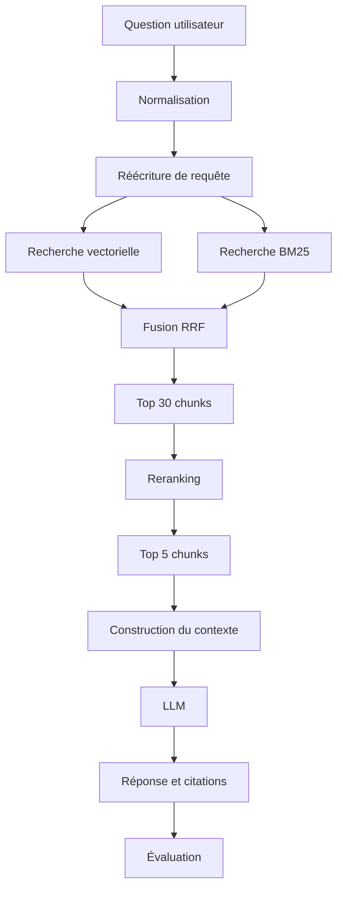

# Advanced RAG Knowledge Assistant

> Un moteur capable d'interroger une base documentaire technique et de produire des réponses traçables avec citations et sources.

## Sommaire

- [Vue d'ensemble](#vue-densemble)
- [État actuel](#état-actuel)
- [Pipeline cible](#pipeline-cible)
- [Stack technique](#stack-technique)
- [Démarrage rapide](#démarrage-rapide)
- [Commandes de développement](#commandes-de-développement)
- [Structure du dépôt](#structure-du-dépôt)
- [Roadmap](#roadmap)
- [Résultats](#résultats)
- [Qualité et CI](#qualité-et-ci)
- [Documentation](#documentation)

## Vue d'ensemble

Advanced RAG Knowledge Assistant est un projet d'apprentissage consacré à la construction progressive d'un système RAG mesurable. Le corpus cible regroupe notamment des documentations Python, FastAPI, Docker et Kubernetes, ainsi que des articles et PDF techniques.

Le projet suit une règle simple : chaque amélioration du retrieval ou de la génération doit être justifiée par des mesures plutôt que par une impression subjective.

## État actuel

**Phase 1, étape 02 — ingestion documentaire.** Le corpus est récupérable et chargeable en objets `RawDocument` validés. Aucun nettoyage, chunking, embedding ni endpoint n'est encore implémenté.

Fonctionnalités disponibles :

- environnement Python 3.12 reproductible avec `uv` ;
- formatage, lint, vérification de types et tests locaux ;
- hooks pre-commit optionnels ;
- instance Qdrant locale persistante avec Docker Compose ;
- récupération du corpus FastAPI (155 fichiers Markdown) via `scripts/fetch_corpus.py` ;
- chargement en `RawDocument` triés et reproductibles via `app.ingestion.loader`.

## Pipeline cible



Ce diagramme représente la cible du projet, pas son état actuel.

## Stack technique

| Domaine | Technologie cible | État |
|---|---|---|
| Langage | Python 3.12+ | Configuré |
| Gestion de projet | uv | Configuré |
| API | FastAPI | Dépendance installée |
| Base vectorielle | Qdrant | Configuré en local |
| Validation | Pydantic | Dépendance installée |
| Tests | pytest | Configuré |
| Qualité | Ruff, mypy, pre-commit | Configuré |
| Orchestration RAG | LangChain | Planifié |
| Recherche lexicale | BM25 | Planifié |
| Évaluation | RAGAS et métriques maison | Planifié |
| Observabilité | LangSmith ou OpenTelemetry | Planifié |
| CI | GitHub Actions | Planifié |

## Démarrage rapide

### Prérequis

- [uv](https://docs.astral.sh/uv/) ;
- Python 3.12, installable automatiquement par uv ;
- Docker avec le plugin Docker Compose.

### Installation

```powershell
git clone git@github.com:Slqzeer/Advanced-RAG-Knowledge-Assistant.git
cd Advanced-RAG-Knowledge-Assistant
Copy-Item .env.example .env
uv sync --frozen
docker compose up -d qdrant --wait
```

Qdrant est alors accessible sur :

- REST et interface Web : <http://localhost:6333/dashboard> ;
- gRPC : `localhost:6334`.

> Cette instance Qdrant n'utilise aucune authentification. Elle est réservée au développement local.

## Commandes de développement

```powershell
# Synchroniser l'environnement
uv sync --frozen

# Vérifier le verrouillage des dépendances
uv lock --check

# Linter et vérifier le formatage
uv run ruff check .
uv run ruff format --check .

# Vérifier les types
uv run mypy app

# Exécuter les tests
uv run pytest

# Installer puis exécuter les hooks locaux
uv run pre-commit install
uv run pre-commit run --all-files

# Récupérer le corpus (écrit dans data/raw/, non versionné)
uv run python scripts/fetch_corpus.py

# Gérer Qdrant
docker compose up -d qdrant --wait
docker compose ps
docker compose down
```

## Structure du dépôt

```text
.
├── app/
│   ├── api/          # future API FastAPI
│   ├── core/         # future configuration partagée
│   ├── evaluation/   # futures métriques RAG
│   ├── generation/   # future génération de réponses
│   ├── ingestion/    # chargement documentaire
│   ├── models/       # modèles de données
│   └── retrieval/    # future recherche documentaire
├── data/
│   ├── raw/          # sources locales non versionnées
│   └── processed/    # données transformées non versionnées
├── docker/           # futurs fichiers de conteneurisation
├── docs/             # spécifications et plans
├── notebooks/        # futures expérimentations
├── scripts/          # outils ponctuels (récupération du corpus)
├── tests/            # tests automatisés
├── compose.yaml      # service Qdrant local
└── pyproject.toml    # projet et outils Python
```

## Roadmap

- [x] **Phase 0 — Préparer le projet** : environnement, qualité, structure et Qdrant local.
- [ ] **Phase 1 — RAG minimal** : ingestion (fait), chunking, embeddings, recherche vectorielle et réponse.
- [ ] **Phase 2 — Chunking** : comparer les stratégies et mesurer leur impact.
- [ ] **Phase 3 — Métadonnées** : filtrer et tracer chaque chunk.
- [ ] **Phase 4 — Évaluation du retrieval** : Recall@K, Precision@K, MRR, Hit Rate et NDCG.
- [ ] **Phase 5 — Recherche hybride** : combiner recherche dense et BM25.
- [ ] **Phase 6 — Reranking** : optimiser la précision des candidats.
- [ ] **Phase 7 — Query rewriting** : rendre les questions conversationnelles autonomes.
- [ ] **Phase 8 — Multi-query retrieval** : augmenter le recall par expansion de requêtes.
- [ ] **Phase 9 — Compression contextuelle** : réduire le contexte aux passages pertinents.
- [ ] **Phase 10 — Citations** : produire des réponses fondées et sourcées.
- [ ] **Phase 11 — Évaluation complète** : mesurer retrieval et génération.
- [ ] **Phase 12 — Guardrails** : gérer le manque de contexte et les entrées hostiles.
- [ ] **Phase 13 — Cache** : réduire latence et coût.
- [ ] **Phase 14 — API professionnelle** : exposer les opérations FastAPI.
- [ ] **Phase 15 — Observabilité** : suivre scores, tokens, latence et coût.
- [ ] **Phase 16 — Dockerisation** : conteneuriser l'application complète.
- [ ] **Phase 17 — Tests et CI/CD** : automatiser les régressions et les builds.

## Résultats

Les résultats seront ajoutés avec les phases correspondantes. Une valeur absente signifie que l'expérience n'a pas encore été exécutée.

| Version | Recall@5 | Recall@10 | MRR | Latence | Coût |
|---|---:|---:|---:|---:|---:|
| Recherche vectorielle naïve | — | — | — | — | — |
| Chunking amélioré | — | — | — | — | — |
| Recherche hybride | — | — | — | — | — |
| Reranking | — | — | — | — | — |

## Qualité et CI

Les contrôles locaux disponibles sont Ruff, mypy, pytest et pre-commit. La CI GitHub Actions sera ajoutée pendant la phase 17 ; aucun badge CI n'est affiché avant l'existence du workflow correspondant.

Chaque future phase doit mettre à jour dans le même changement :

1. l'état actuel ;
2. la roadmap ;
3. les commandes utiles ;
4. les résultats réellement mesurés.

## Documentation

- [Brief initial](information.md)
- [Plan global](docs/roadmap.md) — état actuel, correspondance étapes/phases/versions et index des plans par étape
- [Spécification du socle](docs/superpowers/specs/2026-09-09-project-foundation-design.md)
- [Plan d'implémentation du socle](docs/superpowers/plans/2026-09-09-project-foundation.md)
- [Plans par étape](docs/superpowers/plans/) — étapes 02 à 11 rédigées ; les suivantes sont écrites au début de leur étape
