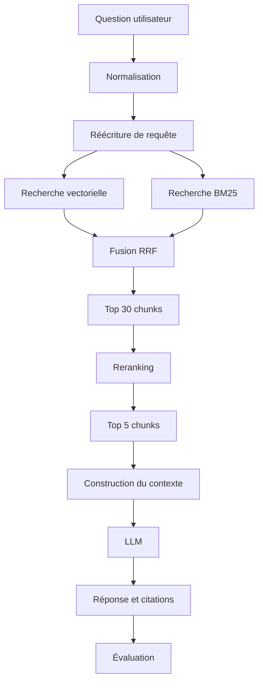

# Advanced RAG Knowledge Assistant

> Un moteur capable d'interroger une base documentaire technique et de produire des réponses traçables avec citations et sources.

## Sommaire

- [Vue d'ensemble](#vue-densemble)
- [État actuel](#état-actuel)
- [Chunking](#chunking)
- [Embeddings](#embeddings)
- [Indexation Qdrant](#indexation-qdrant)
- [Recherche vectorielle](#recherche-vectorielle)
- [Génération de réponses](#génération-de-réponses)
- [Citations](#citations)
- [Jeu d'évaluation](#jeu-dévaluation)
- [Évaluation du retrieval](#évaluation-du-retrieval)
- [Découpage — quatre stratégies comparées](#découpage--quatre-stratégies-comparées)
- [Filtrage par métadonnées — le plafond du routage par facette](#filtrage-par-métadonnées--le-plafond-du-routage-par-facette)
- [Recherche hybride — BM25, RRF et une règle non atteinte](#recherche-hybride--bm25-rrf-et-une-règle-non-atteinte)
- [Reranking par cross-encoder — le plafond mesuré, puis la règle non atteinte](#reranking-par-cross-encoder--le-plafond-mesuré-puis-la-règle-non-atteinte)
- [Transformations de requête — réécriture, conversation et expansion](#transformations-de-requête--réécriture-conversation-et-expansion)
- [Garde-fous — étape 22](#garde-fous--étape-22--le-refus-devient-un-champ-et-aucune-défense-ne-gagne-sa-place)
- [Premiers constats](#premiers-constats)
- [Pipeline cible](#pipeline-cible)
- [Stack technique](#stack-technique)
- [Démarrage rapide](#démarrage-rapide)
- [Commandes de développement](#commandes-de-développement)
- [Structure du dépôt](#structure-du-dépôt)
- [Roadmap](#roadmap)
- [Résultats](#résultats)
- [Qualité et CI](#qualité-et-ci)
- [Documentation](#documentation)

## Vue d'ensemble

Advanced RAG Knowledge Assistant est un projet d'apprentissage consacré à la construction progressive d'un système RAG mesurable. Le corpus cible regroupe notamment des documentations Python, FastAPI, Docker et Kubernetes, ainsi que des articles et PDF techniques.

Le projet suit une règle simple : chaque amélioration du retrieval ou de la génération doit être justifiée par des mesures plutôt que par une impression subjective.

## État actuel

**Étape 20 terminée — Compression contextuelle, mesurée et promue.** La boucle est fermée, **vérifiable**, et maintenant **mesurée** : une question entre, une réponse fondée sur le corpus sort, chaque `[n]` qu'elle contient a été confronté au contexte réellement fourni, et les 45 questions annotées non réservées donnent une baseline chiffrée contre laquelle toutes les étapes suivantes sont comparées. Quatre stratégies de découpage ont été mesurées l'une contre l'autre : `sentence` gagne et devient le défaut, Recall@5 0,713 → **0,776** (`dense-sentence`). Le corpus est récupérable, chargeable en objets `RawDocument` validés, nettoyé, découpé en `Chunk` porteurs de leurs métadonnées, vectorisé avec cache persistant, indexé dans Qdrant, interrogeable, répondable, sourcé pour de bon, et **noté**. Chaque chunk porte désormais une facette `doc_type` dérivée de l'arborescence du corpus, indexée dans Qdrant et filtrable depuis `search()`, `answer_question()` et les trois scripts via `--filter`. La mesure qui compte est négative et elle est publiée telle quelle : un routeur de facette **parfait** rapporte **+0,000 de Recall@5**. Un index BM25 écrit à la main et une fusion RRF s'ajoutent derrière un registre `RETRIEVERS` : les trois modes sont mesurés sur le même jeu de 45 questions, et `dense` **reste le défaut** parce que la règle d'acceptation écrite avant les runs n'est pas atteinte (Recall@5 0,737 contre 0,776). Le résultat publié tel quel est celui-ci, et le gain réel est ailleurs : Recall@10 monte de 0,785 à **0,829**, et l'écart Recall@10 − Recall@5 passe de 0,009 à 0,092 — c'est ce que le reranker de l'étape 17 aura à réordonner. L'étape 17 a d'abord mesuré ce plafond au lieu de le supposer : le vivier dense à 30 monte à **0,884** de Recall@30 contre 0,785 au rang 5, soit 0,099 de marge réelle. Deux backends de reranking sont livrés derrière un registre `RERANKERS` — FlashRank en ONNX local et Cohere Rerank — et le verdict est de nouveau négatif, publié tel quel : la meilleure ligne rapporte **+0,002** de Recall@5 pour **1 141 ms** de latence, `code` régresse de 0,100, et `RERANK_MODEL` **reste vide**. Le cross-encoder déplace la précision de `code` vers `conceptual` sans rien ajouter au total. Les étapes 18-19 s'attaquent enfin à la **question** plutôt qu'à l'index : un registre `TRANSFORMS` (`rewrite` | `multi`) derrière `search(transform=)`, et une `contextualize()` qui vit délibérément **au-dessus** de `search()`, dans `answer_question()`, pour que le retrieval n'apprenne jamais ce qu'est une conversation. Le verdict est négatif pour la quatrième fois consécutive et publié tel quel : `rewrite` **perd 0,092 de Recall@5** (0,684 contre 0,776) et la meilleure ligne multi-query plafonne à **0,765**, soit −0,011 là où la règle pré-enregistrée demandait +0,030. **`QUERY_TRANSFORM` reste vide.** Le seul gain net de l'étape est ailleurs et il est franc : sur une fixture conversationnelle de dix questions bâtie pour ça, résoudre le suivi contre son historique fait passer le Recall@5 de **0,100 à 0,600**. L'étape 20 rompt enfin la série : `compress()` découpe chaque chunk retrouvé en phrases avec le `sentence_spans()` de l'indexeur, les note contre la question avec le cache d'embeddings déjà là, et n'en garde que ce qui tient dans le budget mesuré du contexte d'aujourd'hui — **3 688 caractères**, relevé et non estimé. Un vivier de 20 chunks compressé dans le prompt que 5 chunks entiers occupaient porte le **Recall@context de 0,721 à 0,814** pour un plafond de 0,836, sans qu'aucune catégorie ne régresse, et `multi_doc` — celle qui portait l'écart — passe de **0,552 à 0,792**. Le refus sur les 38 questions répondables tombe de **0,316 à 0,211**, les 7 questions sans réponse continuent d'abstenir 7 fois sur 7, et la règle pré-enregistrée est atteinte pour la première fois : **`COMPRESS_METHOD=embedding`, `COMPRESS_CANDIDATES=20`**. Deux corrections de méthode sont publiées avec : le contrôle du plan (0,785) venait d'une ligne `--top-k 30` et ne décrivait pas ce qui arrive au modèle — `recall@k` compte les k premiers **documents distincts**, pas les k premiers chunks — et le prompt compressé est **plus gros** de 11 %, parce que les en-têtes que `build_context()` ajoute après le budget ne sont pas dans le budget. Aucun endpoint HTTP n'est encore exposé — l'API FastAPI est l'étape 25 ; d'ici là le point d'entrée est `scripts/ask.py`.

Fonctionnalités disponibles :

- environnement Python 3.12 reproductible avec `uv` ;
- formatage, lint, vérification de types et tests locaux ;
- hooks pre-commit optionnels ;
- instance Qdrant locale persistante avec Docker Compose ;
- récupération du corpus FastAPI (155 fichiers Markdown) via `scripts/fetch_corpus.py` ;
- chargement en `RawDocument` triés et reproductibles via `app.ingestion.loader` ;
- nettoyage du Markdown MkDocs via `app.ingestion.clean` : 155 documents en entrée, 8 stubs écartés, 147 conservés, 1 463 414 → 1 041 001 caractères (71 %) ;
- découpage en chunks superposés via `app.ingestion.chunk` : quatre stratégies (`recursive`, `fixed`, `sentence`, `semantic`) derrière un registre, `sentence` par défaut depuis l'étape 12, 147 documents → 1 484 chunks ;
- vectorisation via `app.ingestion.embed` : 1 607 chunks → 1 536 dimensions, cache sqlite persistant de 13,3 Mo, 404 s à froid puis 0,12 s à chaud ;
- configuration partagée via `app.core.config` : une classe `Settings` lue une seule fois, qui charge `.env` ;
- indexation dans Qdrant via `app.retrieval.store` et `scripts/index_corpus.py` : 1 607 points, distance cosinus, index de payload sur `source`, `document_id` et `language` ;
- recherche par similarité via `app.retrieval.search` et `scripts/search.py` : `search()` rend des `ScoredChunk` classés à partir du rang 1, 119 ms sur requête déjà vectorisée ;
- génération de réponses via `app.generation` et `scripts/ask.py` : contexte numéroté, appel au modèle à `temperature=0`, objet `Answer` avec sources, statistiques, tokens et latence ; 1,5 à 3,7 s de bout en bout, 851 à 1 021 tokens par question ;
- validation des citations via `app.generation.citations` : chaque `[n]` est analysé puis confronté au contexte fourni, les sources rendues sont le sous-ensemble réellement cité, renuméroté de 1 dans le texte **et** dans la liste ;
- jeu d'évaluation annoté via `app.evaluation.dataset` et `scripts/validate_dataset.py` : 50 questions, 5 catégories, vérité terrain au niveau document, recoupée avec le corpus nettoyé.
- recherche lexicale via `app.retrieval.bm25` : index inversé Okapi BM25 écrit à la main (IDF à la Lucene, `k1=1.5`, `b=0.75`), construit en scrollant la collection que la recherche dense interroge déjà, 1 484 chunks, longueur moyenne 126 tokens, ~200 ms de construction et 2 ms par requête, aucune dépendance ajoutée ;
- fusion des deux retrievers via `app.retrieval.search` : registre `RETRIEVERS` (`dense` | `lexical` | `hybrid`), `rrf()` qui ne consomme que des rangs et jamais les scores, filtres de payload honorés des deux côtés par `matches_filters`, `--mode` sur `search.py`, `ask.py` et `benchmark.py` ;
- reranking par cross-encoder via `app.retrieval.rerank` : registre `RERANKERS` (`flashrank` | `cohere`) où un backend ne rend que des paires `(index, score)` et où `rerank()` fait seul le tri, les égalités et la reconstruction des `ScoredChunk` ; `search(rerank=)` orthogonal à `mode`, `--rerank` et `--rerank-candidates` sur les trois scripts, `score` du retriever conservé à côté du nouveau `rerank_score` ; `ms-marco-MiniLM-L-12-v2` en ONNX, ~34 Mo téléchargés une fois, ~1 100 ms pour 30 candidats ;
- transformations de requête via `app.retrieval.transform` : registre `TRANSFORMS` (`rewrite` | `multi`) où l'analyse ligne à ligne, le plafonnement, la déduplication et le repli sur la requête originale sont possédés une seule fois pour les deux entrées ; `search(transform=)` orthogonal à `mode` et `rerank`, qui lance le retriever une fois par requête produite et fusionne les classements avec le `rrf()` de l'étape 16 ; `contextualize()` volontairement hors du registre, appelée depuis `answer_question(history=)` ; `--transform`, `--transform-n` sur les trois scripts et `--history` sur `ask.py` ; aucune dépendance ajoutée ;
- fixture conversationnelle via `data/eval/conversations.jsonl` et `scripts/benchmark_conversations.py` : dix suivis référentiels annotés au niveau document, `EvalConversation` qui hérite de tous les validateurs du jeu figé, et deux lignes `conv-raw` / `conv-rewrite` dont l'écart est le chiffre que l'étape 18 existe pour produire ;
- compression contextuelle via `app.generation.compress` : registre `COMPRESSORS` (`embedding`) où une entrée ne fait que *noter* des unités et où `compress()` possède seul le découpage, le budget glouton, le réassemblage dans l'ordre du document avec marqueur `[…]` et la reconstruction des `ScoredChunk` ; `sentence_spans()` promu hors de `chunk.py` pour que le compresseur découpe exactement comme l'indexeur, bloc de code clôturé compris ; branché dans `answer_question()` **entre** `search()` et `build_context()`, `--compress`, `--compress-candidates` et `--compress-budget` sur `ask.py` et `benchmark.py` ; +79 ms p50 pour ~200 phrases, cache sqlite réutilisé, aucune dépendance ajoutée ;
- banc d'essai côté réponse via `scripts/benchmark_answers.py` : taux de refus, caractères de contexte et `prompt_tokens` réellement facturés, une ligne par run dans `data/eval/answers.jsonl`, séparé de `results.jsonl` dont les lignes sont des runs de retrieval ;
- métriques et banc d'essai via `app.evaluation.metrics`, `app.evaluation.benchmark` et `scripts/benchmark.py` : Recall@K, Precision@K, MRR, Hit Rate@K et NDCG@K sur des documents dédupliqués, ventilation par catégorie, latence p50/p95, historique versionné dans `data/eval/results.jsonl` avec le commit git de chaque run.

**Garantie de conservation du code.** Tout bloc de code — clôturé, indenté ou en ligne — traverse le nettoyage à l'octet près. Les étapes suivantes en dépendent : la recherche par mots-clés (étape 14) ne retrouve `HTTPException(status_code=422)` que si cette chaîne existe encore, intacte, dans l'index. Seule exception, mesurée et testée : les blocs ` ```console ` perdent le balisage HTML de coloration du terminal, qui coupait justement ces chaînes en morceaux.

## Chunking

Découpage récursif par caractères, écrit à la main : on coupe sur le séparateur le plus sémantique qui tient (`
## `, `
### `, `

`, `
`, `. `, ` `), et on descend d'un cran pour les morceaux encore trop longs. Le séparateur vide final garantit la terminaison sur un bloc sans aucune coupure possible.

Paramètres de référence — `chunk_size=1000`, `overlap=200`, en **caractères** et non en tokens (≈ 4 caractères par token en prose anglaise, moins en code).

**La stratégie par défaut est `sentence` depuis l'étape 12**, qui a comparé les quatre sur les 38 questions répondables : voir [Découpage — quatre stratégies comparées](#découpage--quatre-stratégies-comparées). `recursive` reste dans le registre, mesuré, comme point de comparaison.

| Mesure | `sentence` (défaut) | `recursive` (étape 04) |
|---|---:|---:|
| Documents en entrée | 147 | 147 |
| Chunks produits | 1 484 | 1 607 |
| Chunks par document (médiane / max) | 5 / 532 | 5 / 590 |
| Taille médiane | 865 caractères | 795 caractères |
| Taille min / max | 76 / 3 803 | 74 / 2 331 |
| Chunks hors limite | 26 (1,8 %) | 10 (0,6 %) |
| Chunks avec `section` renseignée | 1 297 (87 %) | 1 404 (87 %) |

`sentence` produit moins de chunks, plus gros, et plus de dépassements : un bloc de code n'est précédé d'aucune fin de phrase, il fusionne donc avec la prose qui l'entoure jusqu'au point suivant. Le plus long fait 3 803 caractères. C'est le coût assumé de ne jamais couper une phrase, et le tableau de l'étape 12 dit ce qu'il achète.

**Aucun bloc de code n'est jamais coupé en deux.** Les spans que l'étape 03 reconnaît comme du code sont interdits de frontière ; un bloc plus long que `chunk_size` devient donc un chunk hors limite à lui seul, avec un avertissement journalisé. Les 10 cas mesurés sont tous un unique bloc clôturé (schéma OpenAPI, sortie `console`, diagramme d'exécution). C'est le plafond assumé de l'étape.

**La reconstruction est testée.** Concaténer les chunks en retirant les recouvrements redonne le texte source à l'octet près : c'est le test qui attrape la pire régression possible, du contenu perdu en silence.

Chaque `Chunk` porte `document_id`, `source`, `title`, `url`, `doc_type`, `language`, `section`, `chunk_index`, `char_start` et `char_end`, plus un `chunk_id` dérivé (`{document_id}#{chunk_index}`). `doc_type` est **dérivé**, pas mappé : c'est le premier segment du chemin du document dans le corpus (`tutorial/dependencies/index.md` → `tutorial`), ou `root` pour un fichier à la racine. Aucune table de correspondance à maintenir, et une seconde source à l'arborescence différente obtient ses propres facettes sans code supplémentaire. Le champ est requis et sans valeur par défaut : un payload écrit avant l'étape 13 échoue bruyamment à la relecture plutôt que de faire remonter une facette inventée dans une ligne de benchmark.

## Embeddings

`text-embedding-3-small` d'OpenAI, 1 536 dimensions, appelé par lots de 100 textes. Les nouvelles tentatives sur 429 et 5xx sont celles du client SDK (`max_retries=5`), pas une boucle écrite à la main.

**Le cache est la raison d'être de cette étape.** Les étapes 10 et suivantes relancent le pipeline en boucle en modifiant le retrieval, jamais les embeddings : sans cache, chaque passage repaie et réattend exactement les mêmes vecteurs. Un fichier sqlite unique, en bibliothèque standard, qui survit aux redémarrages.

| Mesure | Valeur |
|---|---|
| Chunks vectorisés | 1 607 |
| Tokens approximatifs | 304 458 |
| Dimensions | 1 536 |
| Passage à froid | 404 s |
| Passage à chaud | 0,12 s, zéro requête |
| Taille du cache | 13,3 Mo |
| Coût réel | ≈ 0,006 $ |

La clé de cache est `sha256(modèle + "\0" + texte)`. Le modèle en fait partie pour qu'un changement de modèle provoque un défaut de cache, au lieu de servir en silence des vecteurs issus d'un autre espace vectoriel dans le même index.

**Les vecteurs sortent dans l'ordre d'entrée, y compris en cache partiel.** La sortie est assemblée par recherche de clé, et non en zippant la réponse du fournisseur sur la liste d'entrée : dès qu'une partie des textes est en cache, les deux listes n'ont plus la même longueur, et un décalage d'un rang attacherait le mauvais vecteur au mauvais chunk sans que rien ne le signale — sauf un Recall@5 inexplicablement mauvais. C'est le test central de l'étape.

Contrôle de bon sens sur les vecteurs produits : cos(`cat`, `dog`) = 0,603 contre cos(`cat`, `quantum chromodynamics`) = 0,172 ; cos(`dependency injection`, `FastAPI dependency injection with Depends`) = 0,537 contre cos(`dependency injection`, `kubernetes memory limits`) = 0,198.

Les tests n'accèdent jamais au réseau et passent sans clé d'API : le client et le cache sont des paramètres injectables.

## Indexation Qdrant

Un seul script enchaîne les quatre étapes précédentes et écrit dans Qdrant : `raw → clean → chunk → embed → upsert`. C'est le premier artefact exécutable du projet.

```powershell
docker compose up -d qdrant --wait
uv run python scripts/index_corpus.py --limit 20 --dry-run   # répétition à blanc
uv run python scripts/index_corpus.py --recreate             # passage complet
```

| Étape | Volume | Durée |
|---|---:|---:|
| Chargement | 155 documents | 0,1 s |
| Nettoyage | 147 documents | 0,2 s |
| Découpage | 1 607 chunks | 0,3 s |
| Vectorisation (cache chaud) | 1 607 vecteurs | 0,5 s |
| Upsert | 1 607 points | 3,2 s |
| **Total** | **1 607 points, 1 536 dimensions** | **4,4 s** |

**Réindexer ne change rien et ne coûte rien.** L'identifiant d'un point est `uuid5(NAMESPACE, chunk_id)` : Qdrant n'accepte que des entiers ou des UUID, et un UUID déterministe transforme la réindexation en écrasement idempotent au lieu d'une accumulation de doublons. Relancer le script sans `--recreate` laisse bien 1 607 points, en 3,5 s dont 0,1 s de vectorisation — tout sort du cache. C'est ce qui rend le script sûr à relancer vingt fois pendant l'étape 12.

**Distance cosinus**, celle pour laquelle le modèle d'embeddings est entraîné. Un produit scalaire sur des vecteurs non normalisés, ou une distance euclidienne sur des vecteurs normalisés, produit des classements faux d'une manière qui reste plausible à l'œil.

**La dimension du vecteur est lue sur le modèle, jamais codée en dur.** Une collection créée à la mauvaise dimension échoue bruyamment à l'upsert, mais seulement après avoir payé la vectorisation complète.

**Les index de payload sur `source`, `document_id` et `language` existaient dès l'étape 06.** Le pari a tenu : l'étape 13 n'a eu qu'à y ajouter `doc_type` et le filtrage est resté un changement à la requête. Tout champ filtrable doit figurer dans `INDEXED_FIELDS` — `build_filter()` rejette par son nom une clé qui n'y est pas, parce qu'un `doctype` mal orthographié ne balaye pas seulement la collection entière, il ne correspond à rien et se lit en aval comme « le retrieval est cassé » plutôt que « le drapeau est faux ».

**Le texte complet du chunk vit dans le payload.** Cela coûte du disque et économise un second magasin de données plus la jointure entre les deux.

Les tests d'intégration portent le marqueur `requires_qdrant` et s'ignorent d'eux-mêmes quand le serveur n'est pas joignable : `uv run pytest` reste vert sur une machine sans Docker.

## Recherche vectorielle

Une fonction, `search()`, et c'est volontairement tout :

```python
search(query: str, *, top_k: int = 5, source: str | None = None) -> list[ScoredChunk]
```

```powershell
uv run python scripts/search.py "How does dependency injection work in FastAPI?"
uv run python scripts/search.py "HTTPException 422" --top-k 10 --filter doc_type=tutorial
```

**Cette signature est conçue une fois, maintenant, pour tout ce qui suit.** La recherche hybride (étapes 14-16), le reranking (17) et la réécriture de requête (18) vivent tous derrière cet appel. Fixer le type de retour dès maintenant — un chunk, plus un score, plus un rang — transforme huit étapes ultérieures en changements internes plutôt qu'en remaniements de tout le dépôt.

**`ScoredChunk` enveloppe `Chunk`, il n'en hérite pas.** Un score n'est pas une propriété d'un chunk, mais d'un chunk *vis-à-vis d'une requête*. Et le reranker de l'étape 17 produira un *second* score pour le même chunk : `rerank_score` en champ voisin est évident, là où un `score` écrasé est un piège de débogage.

**Le rang est stocké, il part de 1.** Toutes les métriques de l'étape 11 — MRR, NDCG, Recall@K — sont des fonctions du rang. Le recalculer depuis la position dans la liste à quatre endroits, c'est ainsi qu'un décalage d'un rang finit dans un tableau de résultats publié.

**Les scores sortent bruts, tels que le moteur les rapporte.** Ni normalisation, ni remise à l'échelle : une normalisation inventée est une couche qui ment. La fusion de l'étape 16 travaillera sur les rangs, pas sur les scores.

**Aucun cache de recherche ici.** L'étape 23 l'ajoutera, délibérément, une fois qu'il y aura une latence à améliorer. Un cache de retrieval ajouté maintenant masquerait silencieusement les variations que les étapes 14-19 servent précisément à mesurer. Le cache d'embeddings de l'étape 05, lui, est réutilisé : une requête de benchmark rejouée ne coûte rien.

**Une requête vide est rejetée avant tout appel réseau.** La chaîne vide se vectorise très bien et retrouve des résultats parfaitement plausibles, donc faux. Échouer tôt est le seul comportement honnête. Idem pour `top_k < 1`.

**Une clé de payload optionnelle absente vaut `None`, pas une erreur.** Qdrant ne stocke pas les valeurs nulles : un chunk sans `url` revient sans la clé du tout. Une clé obligatoire manquante, elle, échoue en nommant le champ.

Le client Qdrant et la fonction de vectorisation sont des paramètres injectables : les treize tests unitaires de l'étape tournent sans serveur et sans clé d'API. Les deux tests d'intégration portent le marqueur `requires_qdrant`.

## Génération de réponses

Quatre fonctions, montées à la main, et rien entre elles :

```text
search() -> build_context() -> complete() -> Answer
```

```powershell
uv run python scripts/ask.py "How does dependency injection work in FastAPI?"
uv run python scripts/ask.py "Comment fonctionne l'injection de dependances dans FastAPI ?" --show-context
uv run python scripts/ask.py "How does dependency injection work?" --filter doc_type=tutorial,advanced
```

Une question réelle, sur les 1 607 chunks indexés :

```text
> uv run python scripts/ask.py "Comment fonctionne l'injection de dependances dans FastAPI ?"

L'injection de dépendances dans FastAPI fonctionne en permettant à vos fonctions
d'opération de chemin de déclarer les dépendances dont elles ont besoin pour
fonctionner. FastAPI s'occupe ensuite de fournir ces dépendances en les
« injectant » dans votre code [1][2].

Lorsqu'une nouvelle requête arrive, FastAPI appelle la fonction de dépendance avec
les paramètres appropriés, obtient le résultat de cette fonction et l'assigne au
paramètre de votre fonction d'opération de chemin [3]. De plus, FastAPI utilise
des gestionnaires de contexte de Python pour s'assurer que tout est exécuté dans
le bon ordre, même si une dépendance nécessite plusieurs autres dépendances [4].

Ce système permet de partager la logique de code, de partager des connexions à la
base de données, d'appliquer des exigences de sécurité et d'authentification, tout
en minimisant la répétition de code [2].

[1] Dependencies  (0.6773)
    https://fastapi.tiangolo.com/tutorial/dependencies/
[2] Dependencies  (0.6319)
    https://fastapi.tiangolo.com/tutorial/dependencies/
[3] Dependencies / Declare the dependency, in the "dependant"  (0.6102)
    https://fastapi.tiangolo.com/tutorial/dependencies/
[4] Dependencies with yield / Sub-dependencies with `yield`  (0.6309)
    https://fastapi.tiangolo.com/tutorial/dependencies/dependencies-with-yield/

5 retrieved, 5 used, 0 dropped, 4 cited  |  gpt-4o-mini  |  1055 tokens  |  3357 ms
```

Cinq chunks sont partis au modèle, quatre reviennent : le cinquième n'a été cité
nulle part, donc il n'est pas présenté comme une source. Et la liste n'est plus
triée par score — `[4]` score plus haut que `[3]` — parce qu'elle suit désormais
l'ordre des citations dans le texte. Le détail est dans [Citations](#citations).

**Corpus anglais, question française, réponse française.** Le prompt système impose la langue de la question. Sans cette ligne, le système répond en anglais à une question française et paraît cassé.

**Zéro chunk retrouvé veut dire zéro appel au modèle.** Avec un contexte vide, la seule chose qu'un modèle puisse produire est une invention — facturée. Le court-circuit est testé explicitement ; c'est la faute la moins pardonnable d'un pipeline RAG.

**Les chunks entrent entiers ou pas du tout.** Le budget de contexte vaut 12 000 caractères et se respecte en écartant les chunks les moins bien classés, jamais en tronquant : un demi-chunk est un demi-fait, que le modèle complète avec aplomb. Exception assumée : si le premier chunk dépasse à lui seul le budget, il est conservé quand même, un contexte vide étant pire qu'un contexte trop long.

**`temperature=0`.** Un système qui répond différemment au deuxième appel identique n'est pas évaluable, et les étapes 11 et 21 sont des évaluations.

**Ce qu'il ignore, il le dit.** « How do I limit memory for a Kubernetes pod ? » — hors corpus — obtient « I do not know », pas une invention plausible. « What does HTTPException 422 mean ? » obtient la même réponse, et les étapes 14-16 ont montré que ce n'était pas un échec de *retrieval* : `--mode hybrid` remonte bien `reference/exceptions` et les notes de version au rang 2 et 3, et la réponse reste « I do not know ». Les quatre chunks du corpus qui contiennent le token littéral `422` sont des notes de version et un exemple JSON OpenAPI ; **aucun n'explique ce que 422 signifie**. Le refus est donc correct dans les deux modes, et la cible annoncée à l'étape 07 n'existait pas dans le corpus. Transcription qualitative, sans vérité terrain derrière elle.

**Un modèle, choisi par configuration.** `GENERATION_MODEL` vaut `gpt-4o-mini` par défaut, la clé OpenAI étant déjà requise pour les embeddings : une dépendance, un identifiant. Changer de fournisseur, c'est réécrire le corps de `complete()` dans `app/generation/llm.py` — rien d'autre du pipeline ne voit de client.

**Les tokens sont relevés dès le premier appel.** L'étape 24 en a besoin ; les ajouter plus tard voudrait dire toucher tous les appelants.

Les vingt-trois tests de l'étape tournent sans serveur, sans clé et sans dépense : le récupérateur et le modèle sont injectables.

## Citations

Deux garanties, tenues par du code et non par un prompt :

1. **Chaque `[n]` d'une réponse rendue pointe vers une source rendue.**
2. **Chaque source rendue a été effectivement citée.**

Le texte et la liste sont renumérotés ensemble : si le modèle cite `[1]` et `[3]`,
la réponse dit `[1]` et `[2]`, et les deux sources portent les numéros 1 et 2. La
liste suit donc l'ordre des citations, pas l'ordre des scores.

```text
> uv run python scripts/ask.py "What does Depends() with yield do differently?"

Using `Depends()` with `yield` allows for dependencies that perform additional
steps after finishing. Specifically, the exit code after `yield` is executed at
different times depending on the scope specified. If you use
`Depends(scope="function")`, the exit code runs right after the path operation
function is finished, before the response is sent back to the client. In contrast,
using `Depends(scope="request")` (the default) means the exit code runs after the
response is sent [1].

Additionally, dependencies with `yield` can handle exceptions and ensure that exit
steps are executed regardless of whether an exception occurred, by using `try` and
`finally` blocks [2].

[1] Advanced Dependencies / Dependencies with `yield`, `HTTPException`, `except` and Background Tasks  (0.5497)
    https://fastapi.tiangolo.com/advanced/advanced-dependencies/
[2] Dependencies with yield / A database dependency with `yield`  (0.5049)
    https://fastapi.tiangolo.com/tutorial/dependencies/dependencies-with-yield/

5 retrieved, 5 used, 0 dropped, 2 cited  |  gpt-4o-mini  |  1289 tokens  |  1993 ms
```

Cinq chunks retrouvés, cinq envoyés au modèle, deux cités. `retrieved` et `used`
restent des faits de *retrieval* — les compter à partir des citations ferait
passer un modèle paresseux pour un moteur de recherche défaillant. Seul `sources`
rétrécit.

**Une citation hors plage est un bug de la réponse, pas de l'analyseur.** `[7]`
quand cinq entrées ont été fournies veut dire que le modèle a inventé une source.
Le marqueur est retiré du texte, l'espace qu'il occupait avec lui, et un
avertissement le nomme. Il n'est **jamais** renuméroté : faire pointer une
affirmation fabriquée vers un document réel est le pire résultat disponible. Le
mode `--strict` lève une exception à la place, pour les campagnes d'évaluation où
un avertissement silencieux fausserait la métrique de l'étape 21.

**Une réponse sans citation est signalée, pas rejetée.** Un vrai refus n'a rien à
citer et c'est la bonne réponse : zéro citation plus une formule de refus, tout va
bien. Zéro citation plus une réponse longue et assurée, c'est un avertissement
`answer_without_citations` — de la génération non fondée déguisée en RAG.

**Le code et les liens ne sont pas des citations.** `list[int]` dans un bloc
clôturé et `[the docs](https://x)` dans une phrase passent par le masquage des
motifs `CODE` et `LINK` de l'étape 03 avant toute analyse. Sans cela, chaque lien
d'une réponse devient une fausse source, ce qui est précisément le défaut que
cette étape existe pour supprimer.

### Ce que cite vraiment `gpt-4o-mini`

Sept questions passées au modèle réel, chaque `[n]` rouvert et relu contre le
chunk qu'il désigne. Les citations résolvent toutes ; leur *pertinence* est une
autre affaire, et c'est la cible de l'étape 21.

| Mode observé | Fréquence | Exemple |
|---|---|---|
| Citation exacte et vérifiable | majoritaire | « Python's Context Managers » cité sur le chunk qui contient littéralement la phrase |
| Phrase factuelle non citée du tout | 3 réponses sur 5 | la phrase d'ouverture de la réponse `Depends()`/`yield` n'a aucun marqueur |
| Citation groupée sur une phrase composée | 2 réponses sur 5 | `[1][2][3]` sur une phrase dont chaque proposition vient d'une entrée différente : correct, mais la granularité est la phrase, pas la proposition |
| Paraphrase qui perd une condition du chunk | 1 réponse sur 5 | `Depends(scope="function")` présenté comme disponible, le chunk précise « In version 0.121.0 » |
| Redite d'une phrase déjà citée, recitée | 1 réponse sur 5 | « path parameters are directly included in the URL structure » reformule la phrase précédente et recite `[2][3]` |

Aucune citation inventée sur ces sept questions — mais l'échantillon est de sept,
et le garde-fou existe justement parce que l'échantillon suivant sera différent.

**Le trou réel est la phrase non citée, pas la citation fausse.** L'avertissement
ne se déclenche que si la réponse *entière* ne cite rien ; une réponse qui cite
trois phrases sur cinq passe sans bruit. L'attribution phrase par phrase est
délibérément laissée à l'étape 21, avec le score de fidélité qui l'accompagne.

**Un faux refus est un échec de retrieval, pas de citation.** « How do I return a
422 validation error ? » refuse proprement, avec zéro source et zéro
avertissement — exactement le comportement voulu, sur un contexte qui n'aurait pas
dû être vide. Les étapes 14-16 ont tranché : `--mode hybrid` change les chunks
retrouvés sans changer la réponse, parce que le corpus ne contient nulle part
l'explication du code 422. Le contexte *devait* être vide.

**`--show-context` ne numérote plus comme la réponse.** L'option affiche le prompt
envoyé, donc la numérotation d'origine ; la réponse, elle, est renumérotée. Pour
auditer un `[n]`, il faut passer par le titre de la source, pas par son numéro.

## Jeu d'évaluation

Tout ce qui suit dans ce projet est une comparaison, et une comparaison a besoin
d'une règle graduée. [`data/eval/questions.jsonl`](data/eval/questions.jsonl) est
cette règle : **50 questions écrites à la main à partir du corpus**, annotées avec
les documents qui y répondent. Les règles d'annotation sont dans
[`data/eval/README.md`](data/eval/README.md) — un jeu annoté sans règles écrites
dérive dès la deuxième séance.

| Catégorie | Questions | Ce qu'elle sonde |
|---|---:|---|
| `conceptual` | 11 | terrain de jeu de la recherche dense |
| `exact` | 11 | identifiants et codes littéraux — la cible de l'étape 14 |
| `code` | 11 | récupération de blocs de code |
| `multi_doc` | 9 | réponses réparties sur 2 à 4 documents |
| `unanswerable` | 8 | comportement de refus — étape 22 |

2,17 documents pertinents en moyenne par question répondable ; 5 questions
réservées, réparties sur les catégories.

**La vérité terrain est au niveau document, pas au niveau chunk.** C'est la
décision qui porte toute l'étape. Les `chunk_id` changent à chaque modification de
`chunk_size` : une annotation au niveau chunk devrait être refaite pour chacune des
cinq stratégies comparées à l'étape 12. Personne ne réannote cinquante questions
cinq fois, donc la comparaison n'aurait jamais lieu. Les `document_id` survivent au
re-découpage. Le coût est assumé : on ne distingue pas « bonne page, mauvaise
section » de « bonne section », et le champ `relevant_sections` attend les rares
questions où cette distinction changera une décision.

**Le nombre de documents pertinents varie volontairement.** Si chaque question
n'avait qu'une seule bonne réponse, le Recall@K se confondrait avec le Hit Rate et
deux des cinq métriques de l'étape 11 seraient redondantes.

**Deux annotations ont été corrigées par la relecture, pas par le validateur.** En
lisant le top 10 réel de cinq questions : `jsonable_encoder` oubliait
`advanced/custom-response`, et la question sur l'authentification listait
`tutorial/dependencies/index`, qui explique l'injection de dépendances et non
l'authentification. Les deux erreurs auraient pénalisé un système qui avait raison.

```powershell
uv run python scripts/validate_dataset.py
```

Le script recoupe chaque identifiant annoté avec les 147 documents nettoyés. Il a
servi tout de suite : `reference/encoders` est écarté par le filtre de prose de
l'étape 03, donc il ne peut pas être annoté comme source de `jsonable_encoder`,
même si le fichier existe dans le corpus brut.

## Évaluation du retrieval

Le jeu d'évaluation est devenu des chiffres. `scripts/benchmark.py` fait passer les
45 questions non réservées dans `search()`, calcule cinq métriques et ajoute une
ligne à [`data/eval/results.jsonl`](data/eval/results.jsonl), avec le commit git qui
l'a produite — marqué `-dirty` si l'arbre de travail ne l'était pas.

```powershell
docker compose up -d qdrant --wait
uv run python scripts/benchmark.py --label "dense-baseline"
uv run python scripts/benchmark.py --label "hybride" --compare "dense-baseline"
```

### Ce que les chiffres veulent dire

Quatre conventions, fixées ici une fois pour toutes. Un étalon dont les définitions
bougent n'est pas un étalon.

- **`@K` compte des documents distincts, pas des chunks.** Le retrieval rend des
  chunks, l'annotation porte sur des documents : deux chunks de la même page valent
  un document retrouvé, au meilleur des deux rangs. Sans cette déduplication, une
  stratégie de découpage qui rend cinq tranches d'une seule page afficherait une
  Precision@5 parfaite — exactement le biais qui fausserait l'étape 12.
- **Precision@K divise par `K`**, jamais par le nombre de résultats réellement
  rendus. Les deux conventions existent ; celle-ci pénalise un système qui rend
  trois résultats quand on lui en demande cinq, et c'est le comportement à pénaliser.
- **Le MRR est la moyenne des `1 / rang` du premier document pertinent**, une valeur
  par question. Les documents pertinents suivants ne comptent pas — c'est le rôle du
  Recall.
- **Les questions `unanswerable` sortent de toutes les métriques de classement** et
  sont mesurées à part : le Recall sur un ensemble pertinent vide n'est pas défini,
  et le scorer 0 ou 1 fausserait l'agrégat dans un sens comme dans l'autre. Elles
  alimentent le *taux d'abstention*, la part de ces questions dont le meilleur score
  passe sous 0,35.

### Baseline dense — `dense-baseline`, 45 questions (38 répondables, 7 sans réponse)

| Métrique | @1 | @3 | @5 | @10 |
|---|---:|---:|---:|---:|
| Recall | 0,333 | 0,634 | 0,713 | 0,737 |
| Precision | 0,658 | 0,412 | 0,289 | 0,153 |
| Hit Rate | 0,658 | 0,921 | 0,974 | 0,974 |
| NDCG | 0,658 | 0,621 | 0,658 | 0,670 |

MRR 0,788 · taux d'abstention 0,143 · latence p50 57 ms, p95 89 ms.

| Catégorie | n | Recall@5 | Recall@10 | Precision@5 | MRR | NDCG@5 |
|---|---:|---:|---:|---:|---:|---:|
| `code` | 10 | 0,800 | 0,800 | 0,260 | 0,833 | 0,743 |
| `conceptual` | 10 | 0,633 | 0,667 | 0,200 | 0,478 | 0,456 |
| `exact` | 10 | 0,792 | 0,825 | 0,340 | 0,950 | 0,789 |
| `multi_doc` | 8 | 0,604 | 0,635 | 0,375 | 0,917 | 0,638 |

### Ce que la baseline dit, y compris ce qu'on n'attendait pas

**Le Recall@10 ne dépasse le Recall@5 que de 0,024.** C'est le chiffre le plus
important du tableau. Les documents qui manquent au top 5 ne sont pas non plus dans
le top 10 : ils ne sont pas retrouvés du tout. Un reranker (étape 17) réordonne des
candidats, il n'en invente pas — il ne peut donc récupérer que ces 2,4 points. Les
étapes 14 à 16 (hybride, RRF) passent **avant** l'étape 17, et c'est cette mesure qui
le décide, pas l'ordre du sommaire.

**La catégorie `exact` bat la catégorie `conceptual`, l'inverse de ce qui était
prévu.** Le plan de l'étape 11 annonçait un `exact` nettement plus faible ; il sort à
0,792 de Recall@5 et 0,950 de MRR, contre 0,633 et 0,478 pour `conceptual`. La raison
est que, selon les règles de l'étape 10, une question `exact` s'écrit comme on la
tape : `UploadFile`, `Depends`, `jsonable_encoder`. Or un identifiant nu est aussi un
point sémantiquement isolé — la page porte son nom en titre — et la recherche dense
le retrouve sans effort. Le mode d'échec que BM25 corrige est autre : un token
littéral **noyé dans une phrase**, où la prose environnante domine le vecteur. C'est
précisément `HTTPException(status_code=422)` de l'étape 07, alors que `HTTPException`
seul (q023) sort ici à 1,000. Le jeu n'a pas été retouché pour coller à l'attente :
ces questions respectent leur propre règle d'annotation, et réécrire l'étalon après
avoir vu le résultat est la meilleure façon de mesurer ce qu'on espérait mesurer.
Les étapes 14-16 n'ont rien ajouté au jeu de questions, gelé exprès. BM25 a bien
confirmé l'analyse sur `exact` : 0,942 de Recall@5 et 1,000 de MRR, soit mieux que la
recherche dense (0,892) — c'est la seule catégorie où le lexical gagne seul.

**Le vrai point faible est `conceptual` : MRR 0,478.** Une question conceptuelle sur
deux place son premier document pertinent au-delà du rang 2, sur le terrain de jeu
supposé de la recherche dense. `q003` — « comment une URL entrante arrive-t-elle dans
une de mes fonctions ? » — ne retrouve aucun de ses documents dans le top 10. Ce sont
des questions longues et paraphrasées ; la réécriture de requête (étape 18) et le
multi-query (étape 19) visent exactement cela, et elles ont maintenant un chiffre à
battre.

**Recall@1 0,333 contre Precision@1 0,658.** Le rang 1 est pertinent deux fois sur
trois, mais il ne représente qu'un tiers des documents attendus : 2,17 documents
pertinents en moyenne par question, un seul slot. Ce n'est pas un défaut, c'est la
conséquence d'une annotation multi-documents voulue — et la raison pour laquelle le
Hit Rate@5 (0,974) ne doit jamais être lu comme un score de réussite.

**Un seuil de score ne peut pas porter le refus.** Les 7 questions hors corpus
scorent entre 0,305 et 0,459, les questions répondables entre 0,341 et 0,664 : les
deux distributions se chevauchent largement. À 0,35, une seule des 7 déclenche
l'abstention, et remonter le seuil couperait de vraies réponses. Le constat de
l'étape 07 sur cinq requêtes se confirme sur 45 : l'étape 22 aura besoin d'autre
chose qu'un plancher.

**Latence p50 57 ms, p95 89 ms**, vecteurs de requête en cache. Le premier passage,
qui les calcule, donnait p50 320 ms et p95 1 522 ms : c'est l'aller-retour de
vectorisation qui se mesure, pas Qdrant.

### Méthode

Chaque ligne de résultats qui suivra est produite par **la même commande, sur le même
jeu de questions**, et ajoutée au même fichier d'historique avec son commit. Les
régressions sont publiées à côté des améliorations : une technique qui n'améliore
rien sur ce corpus est un résultat, pas un échec à cacher. Quand l'étalon lui-même
change, le run change de label et l'ancienne comparaison est abandonnée, jamais
prolongée en douce.

## Découpage — quatre stratégies comparées

Première étape où le projet se comporte comme un moteur de recherche plutôt que
comme une enveloppe autour d'un LLM. Quatre découpeurs derrière un même registre,
tous avec le même contrat `texte -> [(début, fin)]`, une collection Qdrant par
stratégie, et la même commande de mesure sur le même jeu de 38 questions
répondables.

```powershell
docker compose up -d qdrant --wait
uv run python scripts/index_corpus.py --strategy sentence --collection chunks_sentence --recreate
uv run python scripts/benchmark.py --label "chunk-sentence-1000-200" --collection chunks_sentence --strategy sentence
uv run python scripts/benchmark.py --summary "chunk-*"
```

Les quatre stratégies :

| Stratégie | Ce qu'elle fait | Coupe dans un bloc de code ? |
|---|---|---|
| `recursive` | Séparateur le plus sémantique qui tient, récursion sur ce qui dépasse. La baseline de l'étape 04. | jamais |
| `fixed` | Coupe dure tous les `taille - recouvrement` caractères. Le témoin. | oui, délibérément |
| `sentence` | Phrases entières empilées jusqu'au plafond, recouvrement en phrases entières. | jamais |
| `semantic` | Idem, plus une coupure là où la distance cosinus entre deux phrases voisines dépasse le 95ᵉ centile **du document**. | jamais |

`fixed` est naïf **exprès**, et un test l'y oblige : il exige que `fixed` coupe un
bloc clôturé en deux. Un témoin qui protégerait discrètement le code enlèverait le
plancher de la comparaison, et personne ne pourrait plus dire ce que les trois
autres achètent.

### La règle de décision, écrite avant le premier run

Le gagnant est le meilleur Recall@5 global. Tout écart inférieur à **0,026** — une
question sur 38 — est une égalité, tranchée par le Recall@5 de la catégorie
`conceptual`, là où la baseline est la plus faible. Une règle inventée après avoir
vu le tableau n'est pas une règle.

### Manche 1 — quatre stratégies à 1000/200

| Run | Stratégie | Chunks | Recall@5 | Recall@10 | MRR | NDCG@5 | `conceptual` R@5 | p50 |
|---|---|---:|---:|---:|---:|---:|---:|---:|
| `chunk-sentence-1000-200` | `sentence` | 1 484 | **0,776** | 0,785 | 0,810 | 0,713 | **0,733** | 36 ms |
| `chunk-fixed-1000-200` | `fixed` | 1 347 | 0,752 | 0,779 | 0,832 | 0,708 | 0,683 | 34 ms |
| `chunk-semantic-1000-200` | `semantic` | 1 885 | 0,750 | 0,783 | 0,770 | 0,680 | 0,633 | 34 ms |
| `chunk-recursive-1000-200` | `recursive` | 1 607 | 0,713 | 0,737 | 0,788 | 0,658 | 0,633 | 37 ms |

`chunk-recursive-1000-200` reproduit `dense-baseline` à la troisième décimale près
sur les cinq métriques. C'est le contrôle qui dit que la seule chose ayant changé
entre les collections est le découpage.

**Application de la règle.** `sentence` mène à 0,776. `fixed` est à 0,024 derrière,
donc à égalité au sens de la règle ; `semantic` est à 0,026, hors fenêtre. Le
départage sur `conceptual` donne `sentence` (0,733) contre `fixed` (0,683).
**`sentence` gagne.**

### Manche 2 — balayage de taille sur `sentence`

| Taille | Chunks | Recall@5 | Recall@10 | MRR | NDCG@5 | `conceptual` R@5 |
|---:|---:|---:|---:|---:|---:|---:|
| 500 | 4 008 | 0,715 | 0,752 | 0,787 | 0,673 | 0,633 |
| **1000** | **1 484** | **0,776** | 0,785 | 0,810 | 0,713 | 0,733 |
| 1500 | 923 | 0,741 | 0,785 | 0,865 | 0,728 | 0,733 |

Écart 0,061, au-dessus du seuil de 0,026 : la manche 3 est méritée.

### Manche 3 — balayage de recouvrement à 1000

| Recouvrement | Chunks | Recall@5 | Recall@10 | MRR | NDCG@5 | `conceptual` R@5 |
|---:|---:|---:|---:|---:|---:|---:|
| 0 | 1 186 | 0,726 | 0,774 | 0,801 | 0,676 | 0,683 |
| **200** | **1 484** | **0,776** | 0,785 | 0,810 | 0,713 | 0,733 |
| 400 | 1 990 | 0,719 | 0,768 | 0,790 | 0,678 | 0,633 |

1000/200 est le sommet des deux courbes. Les valeurs par défaut de l'étape 04
survivent au balayage : **seule la stratégie change.**

### Résultat promu — `dense-sentence` contre `dense-baseline`

| Métrique | @1 | @3 | @5 | @10 |
|---|---:|---:|---:|---:|
| Recall | 0,360 | 0,656 | 0,776 | 0,785 |
| Precision | 0,684 | 0,430 | 0,321 | 0,163 |
| Hit Rate | 0,684 | 0,895 | 1,000 | 1,000 |
| NDCG | 0,684 | 0,655 | 0,713 | 0,717 |

MRR 0,810 · taux d'abstention 0,143 · latence p50 35 ms, p95 62 ms.

| Métrique | `dense-baseline` | `dense-sentence` | Écart |
|---|---:|---:|---:|
| Recall@5 | 0,713 | 0,776 | **+0,064** |
| Recall@10 | 0,737 | 0,785 | +0,048 |
| Precision@5 | 0,289 | 0,321 | +0,032 |
| Hit Rate@5 | 0,974 | 1,000 | +0,026 |
| NDCG@5 | 0,658 | 0,713 | +0,055 |
| MRR | 0,788 | 0,810 | +0,022 |
| Taux d'abstention | 0,143 | 0,143 | +0,000 |

Écarts de Recall@5 par catégorie, contre `dense-baseline` :

| Catégorie | `fixed` | `sentence` | `semantic` |
|---|---:|---:|---:|
| `exact` | +0,042 | **+0,100** | **+0,100** |
| `code` | +0,000 | +0,050 | **+0,100** |
| `conceptual` | +0,050 | **+0,100** | +0,000 |
| `multi_doc` | **+0,073** | −0,010 | −0,073 |

### Ce que les chiffres disent, y compris ce qu'on n'attendait pas

**Le découpage était bien un goulot d'étranglement.** +0,064 de Recall@5, soit deux
fois et demie la fenêtre d'égalité. Le plan prévoyait explicitement le cas contraire
— « aucune stratégie ne bat la baseline de plus de 0,026, et c'est publiable » — et
ce n'est pas ce qui s'est produit.

**Le gain est du vrai retrieval, pas de l'arithmétique de déduplication.** L'objection
évidente : des chunks plus petits font tenir plus de documents dans cinq slots, donc
le Recall monte et la Precision descend. Ici les deux montent — Precision@5 0,289 →
0,321 — et le Hit Rate@5 atteint 1,000. `sentence` produit d'ailleurs **moins** de
chunks que `recursive` (1 484 contre 1 607), pas plus. Les documents retrouvés le
sont parce qu'ils ressemblent mieux à la question, pas parce qu'il y en a davantage.

**`fixed` ne perd pas, et c'est le vrai titre de l'étape.** Le témoin naïf, celui qui
a le droit de couper un bloc de code en deux, bat `recursive` de 0,039 sur le Recall@5
global. Toute la machinerie de séparateurs de l'étape 04 — titres, paragraphes,
protection du code, recul sur séparateur pour le recouvrement — ne rapporte rien sur
ce corpus par rapport à une coupure tous les 800 caractères. Le coût de la naïveté
apparaît quand même, mais en creux : `fixed` est la seule stratégie à ne rien gagner
du tout sur `code` (+0,000), pendant que `sentence` prend +0,050 et `semantic` +0,100.
La protection des blocs de code paie ; le reste de la récursion, non.

**`semantic` aide `exact` et `code`, pas `conceptual` — l'inverse de l'hypothèse.**
`conceptual` est la catégorie dont la réponse s'étale sur tout un passage explicatif,
c'était la cible désignée du découpage sémantique. Il y gagne exactement +0,000,
pendant que `sentence`, qui ignore complètement les embeddings, y gagne +0,100. Le
diagnostic est celui que le plan avait nommé d'avance : **le seuil coupe sur la mise
en forme, pas sur le sens.** Dans de la documentation Markdown, les plus grands sauts
de distance entre phrases voisines sont aux transitions prose → bloc de code et
prose → titre, pas aux changements d'idée. Le 95ᵉ centile atterrit dessus, `semantic`
isole donc proprement les blocs de code — d'où son meilleur score `code` de tout le
tableau, 0,900 — et laisse la prose conceptuelle exactement où elle était. Une piste
existe (bouger le centile, lisser les distances sur une fenêtre), elle est listée en
[écarté volontairement](#écarté-volontairement) plutôt que bricolée après coup.

**Plus petit n'est pas mieux ici.** L'attente usuelle est qu'un chunk plus court monte
le Recall@5. À 500 caractères c'est le pire résultat du balayage (0,715), et à 1500 la
`conceptual` reste à son maximum. Un chunk de 500 caractères coupe une explication en
deux moitiés dont aucune ne répond seule à la question ; le corpus FastAPI est fait de
paragraphes explicatifs, pas de fiches.

**L'écart Recall@10 − Recall@5 se resserre : 0,024 → 0,009.** C'est le chiffre à
suivre sur les étapes 12 à 17, et il va dans la direction inconfortable. `sentence` a
trouvé ce qu'il y avait à trouver dans le top 5 ; les documents encore manquants ne
sont pas non plus dans le top 10, ils ne sont pas retrouvés du tout. Un reranker
(étape 17) réordonne des candidats, il n'en fabrique pas : il n'a désormais plus que
0,9 point à récupérer. **La recherche hybride de l'étape 14 est plus nécessaire
qu'avant cette étape, pas moins.** Mesuré depuis : la fusion RRF porte cet écart de
0,009 à 0,092, donc c'est bien elle qui redonne au reranker de l'étape 17 quelque
chose à réordonner. `semantic` est la seule à élargir l'écart (0,033),
sans compenser ailleurs.

**`multi_doc` est la seule catégorie que le gagnant dégrade** (−0,010), et `semantic`
la casse franchement (−0,073). Des chunks plus gros et moins nombreux concentrent le
top 5 sur moins de documents distincts, ce qui pénalise exactement les questions dont
la réponse est répartie sur plusieurs pages. `fixed`, qui produit les chunks les plus
petits des trois, y est le meilleur (+0,073). Le compromis est réel et assumé : 8
questions sur 38, contre un gain de +0,100 sur les deux catégories de 10.

**Le taux d'abstention ne bouge pas** (0,143), et les variantes qui l'ont vu doubler
à 0,286 l'ont fait sur 2 questions hors corpus contre 1, sur un échantillon de 7. À
cette taille ce n'est pas un signal, et il n'est pas lu comme tel.

### Pourquoi le parent-child n'est pas dans ce tableau

Le *parent-child retrieval* — vectoriser un petit chunk enfant, mais rendre au LLM le
gros chunk parent qui le contient — est la stratégie que toute liste de techniques de
chunking cite, et elle est **volontairement absente** de cette comparaison.

La raison tient à ce que l'étape 10 a annoté. La vérité terrain porte sur des
**documents**, pas sur des chunks, et c'est un choix délibéré : c'est précisément ce
qui rend deux découpages comparables entre eux. Or le parent-child change quel *texte*
arrive au LLM, pas quels *documents* remontent dans le top K. Le Recall@5 lui
attribuerait donc exactement le score du découpage enfant qu'il enveloppe. Publier ce
chiffre serait publier une mesure sans information dedans.

Ce qui le mesure vraiment, ce sont le nombre de tokens de contexte et la qualité de la
réponse. **L'étape 20 a mesuré les deux et ne l'a pas évalué**, délibérément : à budget fixe, le
parent-child dispute à la compression les mêmes caractères au lieu de s'y composer, et il demande
un identifiant de parent dans chaque payload — une ré-indexation. Il revient à l'étape 21, quand
la qualité de réponse aura un juge.

### Écarté volontairement

| Écarté | À ajouter quand |
|---|---|
| Parent-child retrieval | **plus l'étape 20, qui a fermé sans lui** — c'est l'échange inverse de la compression : il *agrandit* le contexte au lieu de le rétrécir, donc à budget fixe il lui dispute les mêmes caractères au lieu de s'y composer, et il exige un identifiant de parent dans chaque payload, c'est-à-dire une ré-indexation. À l'étape 21, avec la qualité de réponse pour juge |
| Tailles de chunk en tokens | étape 21 également : l'étape 20 a mesuré que la limite de contexte ne contraint toujours pas, et a retiré la prédiction qui l'annonçait |
| La grille complète des 24 runs | la courbe de taille du gagnant n'est pas plate **et** une interaction stratégie × taille devient plausible |
| Réglage du centile de `semantic` | jamais sur ce corpus : `semantic` est à 0,026 du gagnant et son gain tombe sur les mauvaises catégories, le centile n'est pas ce qui le décide |
| Annotation de pertinence au niveau chunk | jamais — l'annotation au niveau document est exactement ce qui rend deux découpages comparables |
| Suppression des collections perdantes | quand l'étape 14 aura besoin de la place |

## Filtrage par métadonnées — le plafond du routage par facette

Chaque chunk porte une facette `doc_type` dérivée de l'arborescence du corpus, indexée
dans Qdrant au même titre que `source`, `document_id` et `language`. Le paramètre
`source: str | None` de `search()` a disparu au profit d'un
`filters: Mapping[str, str | Sequence[str]] | None` générique : un scalaire devient un
`MatchValue`, une séquence un `MatchAny`, plusieurs clés sont combinées en ET. Les
étapes 14 à 17 ajouteront leurs facettes sans retoucher six sites d'appel.

Mais le livrable de l'étape n'est pas le filtre, c'est le nombre qu'il produit.

### La question posée, et pourquoi elle se pose maintenant

Un routeur de requête — deviner `doc_type` à partir de la question, puis filtrer — est
une idée qui revient à chaque projet RAG. Avant d'en construire un à l'étape 18, il
faut savoir ce qu'il rapporterait **au mieux**. C'est ce que mesure `--oracle-filter` :
chaque question est filtrée sur la facette de sa propre vérité terrain. C'est un
tricheur, pas un retriever livrable, et c'est exactement l'intérêt — il donne le
plafond.

Sur les 38 questions répondables, **16 seulement ont une vérité terrain mono-facette**
(`tutorial` 8, `root` 5, `advanced` 2, `deployment` 1). Les 22 autres s'étalent sur
deux répertoires : pour elles, tout filtre mono-facette retire un document pertinent
**par construction**. L'oracle les laisse donc non filtrées, et un routeur réel qui les
filtrerait ferait strictement pire que pas de routeur du tout.

### Le résultat

| Métrique | `dense-sentence-doctype` | `dense-sentence-oracle-filter` | Écart |
|---|---:|---:|---:|
| Recall@5 | 0,776 | 0,776 | **+0,000** |
| Recall@10 | 0,785 | 0,785 | **+0,000** |
| Recall@1 | 0,360 | 0,412 | +0,053 |
| Precision@5 | 0,321 | 0,321 | +0,000 |
| Hit Rate@5 | 1,000 | 1,000 | +0,000 |
| NDCG@5 | 0,713 | 0,740 | +0,028 |
| MRR | 0,810 | 0,856 | +0,046 |
| Taux d'abstention | 0,143 | 0,143 | +0,000 |
| Latence p50 | 65 ms | 63 ms | −2 ms |

Recall@5 par facette, sur la ligne de base réindexée (les `n` sont imprimés parce
qu'un seau de 1 se lit comme un seau de 1) :

| `doc_type` | n | Recall@5 | Recall@10 | MRR sans filtre | MRR avec oracle |
|---|---:|---:|---:|---:|---:|
| `tutorial` | 8 | 0,906 | 0,906 | 0,719 | 0,875 |
| `root` | 5 | 0,900 | 0,900 | 0,900 | 0,900 |
| `advanced` | 2 | 0,750 | 0,750 | 1,000 | 1,000 |
| `deployment` | 1 | 0,500 | 0,500 | 0,500 | 1,000 |

`advanced` et `deployment` sont des seaux de 2 et de 1. Ce ne sont pas des conclusions,
ce sont des lignes de tableau.

### Ce que les chiffres disent, y compris ce qu'on n'attendait pas

**Un routeur de facette parfait ne rapporte rien en Recall.** +0,000 à K=5 comme à
K=10. Pas « un petit gain » : zéro, et pas une seule des 38 questions ne voit son
Recall@5 changer. Le plan avait écrit d'avance la forme attendue — les 16 questions
mono-facette montent, les 22 autres restent plates, le total bouge peu — et la moitié
mesurée est plus tranchée que prévu : ce qui monte n'est pas le Recall du tout.

**Tout l'écart agrégé vient de quatre questions réordonnées.** `q003` (0,25 → 0,50),
`q011`, `q014` et `q020` (0,50 → 1,00) sur le MRR. Le filtre ne va pas chercher un
document que la recherche dense ratait ; il retire du haut du classement des chunks
d'autres facettes qui s'intercalaient devant le bon. C'est du reclassement, pas du
rappel. Or le reclassement est précisément le métier de l'étape 17, qui le fait mieux
et sans avoir à deviner une facette.

**Le filtre ne coûte pas de latence.** 63 ms contre 65 ms en p50, 92 contre 94 en p95.
Un filtre sur un champ indexé en mots-clés est une recherche d'index, pas un balayage —
c'est la garantie que `build_filter()` achète en refusant les clés hors
`INDEXED_FIELDS`.

**Le taux d'abstention ne bouge pas.** Attendu : les 7 questions sans réponse n'ont pas
de vérité terrain, donc pas de facette, donc l'oracle ne les filtre pas. La ligne est
là pour dire que rien n'a bougé par accident.

### La conclusion pour l'étape 18

**Un routeur de facette ne vaut pas la peine d'être construit sur ce corpus.** Le
plafond est de +0,000 Recall@5 — et ce plafond est atteint par un oracle qui connaît la
réponse. Un routeur réel devinerait, se tromperait sur une partie des 16, et sur les 22
questions multi-facettes il serait nuisible par construction : filtrer y retire un
document pertinent à coup sûr. L'étape 18 (query rewriting) fera donc autre chose de
son budget, et le gain de reclassement que l'oracle révèle est laissé à l'étape 17.

La facette reste : elle est indexée, filtrable et gratuite à l'usage
(`--filter doc_type=tutorial`), utile pour explorer le corpus et pour une future
interface à facettes. Ce qui est écarté, c'est de la **deviner**.

### Écarté volontairement

| Écarté | À ajouter quand |
|---|---|
| Inférence de facette côté requête | étape 18, et seulement si un corpus futur déplace le plafond au-dessus de zéro |
| Filtrage sur `language` | jamais sur ce corpus : une seule valeur, donc rien à mesurer ; le champ reste indexé et inutilisé |
| Filtrage sur `section` | jamais — des titres en texte libre, des centaines de valeurs distinctes, et aucune annotation à cette granularité ; c'est le reranker de l'étape 17 qui opère sous le document |
| Une seconde source de corpus | après stabilisation de la pile de retrieval — elle change le vivier et rend non comparables tous les chiffres des étapes 11 à 13 |

## Recherche hybride — BM25, RRF et une règle non atteinte

Un index BM25 écrit à la main est venu se placer à côté de la recherche dense, les deux
ont été fusionnés par Reciprocal Rank Fusion, et les six lignes qui suivent disent ce
que la combinaison vaut sur ce corpus. Aucune dépendance n'a été ajoutée : `rank_bm25`,
`fastembed` et `nltk` sont écartés nommément par la conception.

### La règle de décision, écrite avant le premier run

`RETRIEVAL_MODE` passe de `dense` à `hybrid` **si et seulement si** la meilleure ligne du
balayage atteint 0,786 de Recall@5 agrégé **et** qu'aucune catégorie ne régresse de plus
de 0,05 en Recall@5 contre `exact` 0,892, `code` 0,850, `conceptual` 0,733, `multi_doc`
0,594.

### Les six lignes mesurées

| Run | Mode | k | Profondeur | Recall@5 | Recall@10 | MRR | NDCG@5 | p50 |
|---|---|---:|---:|---:|---:|---:|---:|---:|
| `dense-sentence-doctype` | dense | — | — | **0,776** | 0,785 | **0,810** | **0,713** | 65 ms |
| `bm25-sentence` | lexical | — | — | 0,605 | 0,632 | 0,570 | 0,534 | **2 ms** |
| `hybrid-k60-d50` | hybrid | 60 | 50 | 0,721 | 0,807 | 0,757 | 0,676 | 89 ms |
| `hybrid-k20-d50` | hybrid | 20 | 50 | 0,737 | 0,800 | 0,741 | 0,679 | 74 ms |
| `hybrid-k100-d50` | hybrid | 100 | 50 | 0,721 | 0,807 | 0,757 | 0,676 | 83 ms |
| `hybrid-k60-d20` | hybrid | 60 | 20 | **0,737** | **0,829** | 0,748 | **0,680** | 83 ms |
| `hybrid-k60-d100` | hybrid | 60 | 100 | 0,721 | 0,776 | 0,754 | 0,676 | 84 ms |

### Le verdict : les deux clauses échouent

Meilleure ligne `hybrid-k60-d20`, Recall@5 **0,737**. La clause 1 demandait 0,786 :
**échec**, et l'écart est de 0,039 en dessous de la baseline dense elle-même. Les quatre
deltas par catégorie :

| Catégorie | Baseline dense | `hybrid-k60-d20` | Delta | Clause 2 (−0,05) |
|---|---:|---:|---:|---|
| `exact` | 0,892 | 0,925 | **+0,033** | passe |
| `code` | 0,850 | 0,850 | +0,000 | passe |
| `conceptual` | 0,733 | 0,633 | **−0,100** | **échec** |
| `multi_doc` | 0,594 | 0,490 | **−0,104** | **échec** |

`RETRIEVAL_MODE` reste donc `dense`. Le code, les tests et les six lignes mesurées sont
livrés quand même : `--mode hybrid` est disponible, mesuré et documenté, il n'est
simplement pas le défaut.

### Ce que les chiffres disent, y compris ce qu'on n'attendait pas

**La cible annoncée n'était pas le point faible.** `exact` était déjà la catégorie la
plus forte du corpus à 0,892 avant cette phase. Or c'est précisément la seule que BM25
améliore — 0,942 seul, 1,000 de MRR, mieux que la recherche dense. Les étapes 14-16 ont
donc renforcé ce qui marchait déjà et dégradé `conceptual` et `multi_doc`, les deux
catégories qui avaient réellement besoin d'aide. La leçon est de séquencement : la cible
qualitative avait été choisie à l'étape 07, avant que l'étape 11 ne dise où était le
trou.

**L'écart Recall@10 − Recall@5 passe de 0,009 à 0,092, et c'est le vrai résultat de la
phase.** La recherche dense avait trouvé tout ce qu'elle pouvait trouver dans le top 5 ;
le reranker de l'étape 17 n'avait plus que 0,9 point à récupérer, ce qui rendait l'étape
presque vide de sens. La fusion multiplie cette fenêtre par dix : 9,2 points de rappel
séparent désormais le rang 5 du rang 10, contre 0,9 avant, et un reranker réordonne
exactement cela. Au passage Recall@10 gagne 4,4 points sur la baseline dense. **L'étape 17 tourne donc sur les candidats hybrides, pas sur les
candidats denses** — c'est ce que la phase a produit de plus utile, et ce n'est pas ce
qu'elle visait.

**RRF ne fusionne que des rangs, jamais des scores.** Une similarité cosinus et un score
BM25 ne partagent aucune échelle ; les normaliser par requête inventerait une
comparaison que les nombres ne soutiennent pas. Conséquence assumée et documentée : le
score rendu en mode `hybrid` vaut environ 0,03 et non 0,3 à 0,6, donc
`abstention_rate` passe à 1,000 sur ces runs. Ce n'est pas un défaut de refus, c'est un
seuil devenu inapplicable hors du mode dense ; chaque ligne enregistre son `mode` pour
que les deux ne soient jamais comparées par accident. Le refus appartient à l'étape 22.

**Le balayage bouge peu, et dans une seule direction.** `k=100` et `k=60` donnent des
lignes identiques ; seul `k=20` change quelque chose, en gagnant 0,016 de Recall@5 et en
perdant 0,007 de Recall@10. La profondeur est le paramètre qui compte, et elle va à contre-sens
de l'intuition : descendre de 50 à 20 candidats par branche *améliore* les deux rappels,
tandis que monter à 100 dégrade Recall@10 de 0,031. Plus de candidats lexicaux, c'est
plus de bruit à fusionner.

**BM25 coûte 2 ms.** Contre 65 ms pour la branche dense, aller-retour Qdrant et vecteur
de requête en cache compris. La branche lexicale n'ouvre aucune connexion, n'appelle
aucune API et ne dépense rien ; le mode hybride coûte 83 ms, soit le prix de la branche
dense plus la fusion.

### La transcription `HTTPException 422`, sans vérité terrain

Preuve qualitative, attachée à aucune métrique, et négative. Les deux modes refusent :

```
$ uv run python scripts/ask.py "What does HTTPException 422 mean?" --mode dense
I do not have enough information in the provided context to answer this.
5 retrieved, 5 used, 0 dropped, 0 cited  |  gpt-4o-mini  |  1215 tokens  |  2983 ms

$ uv run python scripts/ask.py "What does HTTPException 422 mean?" --mode hybrid
I do not have enough information in the provided context to answer this.
5 retrieved, 5 used, 0 dropped, 0 cited  |  gpt-4o-mini  |  947 tokens  |  2831 ms
```

Le retrieval a pourtant changé : `--mode hybrid` remonte `reference/exceptions` au rang 2
et les notes de version aux rangs 3 et 5, là où `--mode dense` ne rend que de la prose
`tutorial/handling-errors`. Et sur la requête courte `HTTPException 422`, le rang 1
lexical contient bel et bien la chaîne `422` — la capacité que l'étape 07 avait
identifiée comme manquante existe maintenant. Ce qui manque est ailleurs : les quatre
chunks du corpus qui contiennent `422` sont deux notes de version et un exemple JSON
OpenAPI, et **aucun n'explique ce que le code signifie**. Le refus est la réponse
correcte dans les deux modes. Une transcription négative publiée telle quelle vaut mieux
qu'une transcription omise.

### Écarté volontairement

| Écarté | À ajouter quand |
|---|---|
| `rank_bm25`, `fastembed`, `nltk` | jamais pour cette phase — règle 3 de la feuille de route ; l'index tient en 150 lignes |
| Vecteur creux nommé côté Qdrant | si le corpus dépasse un index en mémoire — le modificateur IDF de Qdrant ne fournit que le facteur IDF, `k1` et `b` resteraient en Python et la formule serait coupée en deux systèmes |
| Normalisation des scores avant fusion | jamais : c'est la couche qui ment, et RRF existe précisément pour ne pas en avoir besoin |
| Racinisation et liste de mots vides | jamais sur ce corpus : l'IDF écrase déjà « the », et un vocabulaire fait d'identifiants ne se racinise pas |
| Index BM25 persistant sur disque | si les ~200 ms de construction pèsent — ils ne pèsent pas devant 1,5 à 3,7 s de génération |
| Sixième combinaison de paramètres | jamais après avoir vu les cinq premières : élargir le balayage pour trouver une ligne favorable est l'abandon silencieux d'une règle pré-enregistrée |

## Reranking par cross-encoder — le plafond mesuré, puis la règle non atteinte

Un cross-encoder lit la question et le chunk **ensemble** et note la paire ; un
bi-encodeur compare deux vecteurs qui ne se sont jamais rencontrés. Le premier est bien
plus précis et bien trop lent pour balayer 1 484 chunks, donc il repasse derrière le
retriever sur les 30 candidats que celui-ci a déjà présélectionnés. C'est toute l'idée
des deux étages, et c'est pourquoi la **profondeur du vivier** compte ici plus que le
choix du modèle.

### D'abord le plafond, avant la moindre ligne de reranker

Un reranker réordonne ; il ne récupère pas. Son meilleur Recall@5 possible est le
Recall@N du vivier qu'on lui tend, et ce projet n'avait jamais mesuré un vivier plus
profond que 10. Les trois lignes `*-ceiling` répondent à la seule question qui autorisait
la suite : **y a-t-il quelque chose à réordonner ?**

| Vivier | Mode | Profondeur | Recall@5 | Recall@20 | Recall@30 | Marge | p50 |
|---|---|---:|---:|---:|---:|---:|---:|
| `dense-d30-ceiling` | dense | 30 | **0,785** | 0,884 | 0,884 | +0,099 | **34 ms** |
| `hybrid-d30-ceiling` | hybrid | 30 | 0,768 | 0,890 | 0,890 | +0,123 | 40 ms |
| `hybrid-d50-ceiling` | hybrid | 50 | 0,743 | **0,917** | **0,917** | **+0,173** | 44 ms |

Le seuil de go/no-go était 0,03 de marge ; les trois viviers le franchissent largement.
**Mais Recall@20 égale Recall@30 partout** : entre le rang 20 et le rang 30, aucun des
trois viviers ne trouve un seul document de plus. Un vivier de 30 fait donc travailler le
cross-encoder 50 % de plus pour rien qu'il puisse atteindre.

### La règle de décision, écrite avant le premier run

`RERANK_MODEL` passe de vide au backend gagnant **si et seulement si** les trois clauses
tiennent : (1) capture de la marge ≥ 0,50 **et** Recall@5 absolu ≥ 0,806 ; (2) aucune
catégorie ne régresse de plus de 0,05 en Recall@5 contre `exact` 0,892, `code` 0,850,
`conceptual` 0,733, `multi_doc` 0,594 ; (3) latence p50 de retrieval < 400 ms.

La capture répond à « le cross-encoder fait-il son travail ? », séparément de « le vivier
valait-il quelque chose ? » :

```
capture = (Recall@5 reranké − Recall@5 du vivier) / (Recall@30 du vivier − Recall@5 du vivier)
```

### Les cinq lignes mesurées

| Run | Backend | Vivier | Recall@5 | Capture | p50 | Coût du reranker |
|---|---|---:|---:|---:|---:|---:|
| `rerank-flashrank-dense-d10` | flashrank | dense 10 | 0,754 | −0,311 | **270 ms** | +236 ms |
| `rerank-flashrank-dense-d20` | flashrank | dense 20 | 0,750 | −0,356 | 577 ms | +543 ms |
| `rerank-flashrank-dense-d30` | flashrank | dense 30 | **0,779** | −0,067 | 1 141 ms | +1 106 ms |
| `rerank-flashrank-dense-d50` | flashrank | dense 50 | 0,737 | −0,489 | 1 662 ms | +1 628 ms |
| `rerank-flashrank-hybrid-d30` | flashrank | hybrid 30 | 0,770 | **+0,018** | 1 018 ms | +978 ms |

Le coût du reranker est obtenu par soustraction — `p50` de la ligne rerankée moins `p50`
de sa ligne `*-ceiling`, mesurées à la même profondeur sur les mêmes 38 questions — donc
la différence est le cross-encoder et rien d'autre. Aucune instrumentation ajoutée pour
cela.

### Le verdict : les trois clauses échouent

Meilleure ligne `rerank-flashrank-dense-d30`, Recall@5 **0,779** contre la baseline
**0,776**, soit **+0,002** là où la clause 1 demandait +0,030. Capture **−0,067** : le
cross-encoder ne récupère pas la marge, il en perd une fraction. Les quatre deltas par
catégorie :

| Catégorie | Baseline dense | `rerank-flashrank-dense-d30` | Delta | Clause 2 (−0,05) |
|---|---:|---:|---:|---|
| `conceptual` | 0,733 | 0,817 | **+0,083** | passe |
| `exact` | 0,892 | 0,917 | +0,025 | passe |
| `multi_doc` | 0,594 | 0,594 | +0,000 | passe |
| `code` | 0,850 | 0,750 | **−0,100** | **échec** |

Et la clause 3 échoue de très loin : 1 141 ms contre un budget de 400 ms, soit **33 fois**
la latence du vivier dense seul.

**`RERANK_MODEL` reste donc vide.** Les deux backends, les tests et les huit lignes
mesurées sont livrés quand même : `--rerank flashrank` est disponible sur les trois
scripts, mesuré et documenté ; il n'est simplement pas le défaut. La règle n'a pas été
élargie pour faire passer un chiffre.

### Ce que les chiffres disent, y compris ce qu'on n'attendait pas

**Le reranker déplace la précision d'une catégorie à l'autre, il n'en ajoute pas.**
`conceptual` gagne 0,083, `code` perd 0,100, et le total bouge de +0,002. C'est le
résultat le plus net de l'étape et il a une cause lisible : `ms-marco-MiniLM-L-12-v2` est
entraîné sur des passages web en langue naturelle. Rendu à de la documentation technique,
il fait exactement ce pour quoi il a été entraîné — il remonte la prose explicative et
enterre les chunks porteurs de code. La catégorie que l'étape 07 voulait aider est celle
qu'il dégrade.

**Plus de vivier n'est pas mieux, et le classement n'est même pas monotone.** 0,754 à
d10, 0,750 à d20, 0,779 à d30, 0,737 à d50. Sur 38 questions ces écarts sont du bruit
autant que du signal, et c'est précisément le constat : aucune profondeur ne produit un
gain qui sorte du bruit, alors que la marge disponible est de 0,099. Le vivier contient
bien les documents — les lignes `*-ceiling` le prouvent — et le cross-encoder ne va pas
les chercher.

**La marge mesurée ne dit pas qui peut la capturer.** L'étape 16 avait laissé « l'écart
Recall@10 − Recall@5 vaut 0,092, donc l'étape 17 vaut le coup » comme condition
d'entrée. La condition était juste et insuffisante : elle établit qu'il existe des
documents pertinents sous le rang 5, pas qu'un modèle générique saura les distinguer. La
tâche 1 de cette étape — mesurer le plafond **avant** d'ajouter la moindre dépendance —
est le bon ordre, et elle aurait pu terminer l'étape à elle seule.

**Le reranking coûte 30 fois le retrieval qu'il corrige.** 34 ms de vivier dense contre
1 106 ms de cross-encoder, en local, sans réseau. Ce n'est pas rédhibitoire en soi — la
génération pèse 1,5 à 3,7 s — mais payer une seconde par question pour +0,002 de Recall@5
n'a pas de défense.

### Les deux lignes Cohere ne sont pas mesurées

Le backend `cohere` est écrit, testé et atteignable par `--rerank cohere` ; il n'a jamais
été appelé. Aucune `COHERE_API_KEY` n'est configurée sur cette machine, et les deux
lignes `rerank-cohere-*` de la matrice prévue n'existent donc pas dans
`data/eval/results.jsonl`. C'est une absence, écrite ici comme telle : **« le modèle local
gratuit suffit » n'est pas un résultat de cette étape**, puisque le modèle payant n'a pas
été lancé. Ces deux lignes auraient été les premières du projet impossibles à reproduire
hors ligne et gratuitement — environ 0,15 $ pour la matrice, 38 recherches par ligne.

Le mapping qui fait tout le risque de ce backend est couvert par des tests malgré
l'absence de clé : l'API répond avec des **positions** dans la liste qu'on lui a envoyée,
jamais avec des documents, et un décalage d'un rang apparierait chaque score au mauvais
chunk en produisant un classement parfaitement plausible qu'aucune métrique agrégée ne
rattraperait. Le client est donc injectable et ce mapping est le premier test du fichier.

### La transcription `HTTPException 422`, toujours sans vérité terrain

Preuve qualitative, attachée à aucune métrique, et négative pour la troisième étape
consécutive. Le reranker ne change pas la réponse :

```
$ uv run python scripts/ask.py "What does HTTPException 422 mean?" --mode hybrid
I do not have enough information in the provided context to answer this.
5 retrieved, 5 used, 0 dropped, 0 cited  |  gpt-4o-mini  |  947 tokens  |  1879 ms

$ uv run python scripts/ask.py "What does HTTPException 422 mean?" --mode hybrid --rerank flashrank
I do not have enough information in the provided context to answer this.
5 retrieved, 5 used, 0 dropped, 0 cited  |  gpt-4o-mini  |  1050 tokens  |  2732 ms
```

C'est le résultat attendu et il confirme le diagnostic de l'étape 16 plutôt qu'il ne le
corrige : les quatre chunks du corpus qui contiennent `422` sont deux notes de version et
un exemple JSON OpenAPI, et aucun n'explique ce que le code signifie. Réordonner un
vivier qui ne contient pas la réponse ne produit pas la réponse. Si le reranking avait
changé cette réponse, ce serait un constat **sur le reranker**, pas une correction.

### Écarté volontairement

| Écarté | À ajouter quand |
|---|---|
| `sentence-transformers` / `torch` | jamais pour cette étape : `flashrank` charge le même modèle en ONNX pour une fraction de l'installation, et ce qui s'apprend est identique |
| L'extra `flashrank[listwise]` | jamais ici : il tire un reranker LLM de 7 Md de paramètres que cette étape n'utilise pas |
| Ensemble ou fusion de deux rerankers | jamais : un backend à la fois, par décision — deux scores de rerankers fusionnés ne se comparent pas mieux qu'une cosinus et un BM25 |
| Colonne `rerank_candidates` dans la table de résumé | jamais : le label la porte déjà (`rerank-flashrank-dense-d30`), comme l'étape 16 avait refusé d'y ajouter `rrf_k` |
| Un `rerank_score` dans l'historique par question | jamais : `score` reste le nombre du retriever et `rerank_score` porte le nouveau, et c'est `rerank_score is not None` qui dit lequel a produit le classement |
| Sixième profondeur de vivier | jamais après avoir vu les cinq premières, pour la raison exacte de l'étape 16 : élargir un balayage pour trouver une ligne favorable est l'abandon silencieux d'une règle pré-enregistrée |

## Transformations de requête — réécriture, conversation et expansion

L'étape 17 a fermé l'autre porte : un cross-encoder **réordonne** un vivier et reste plafonné
par le rappel de ce vivier, qui sature dès la profondeur 20 sur ce corpus. Une transformation
change la **requête**, donc elle peut ramener un document qu'aucun vivier n'a jamais contenu.
C'est le dernier levier disponible, et ces deux étapes le mesurent sous trois formes :
réécrire la question (`rewrite`), la résoudre contre une conversation (`contextualize`), ou
l'éclater en plusieurs formulations dont les classements sont fusionnés (`multi`).

Une seule architecture pour les trois, et une asymétrie assumée : `rewrite` et `multi` sont
des clés du registre `TRANSFORMS` et vivent **dans** `search()` ; `contextualize()` vit
**au-dessus**, dans `answer_question()`. Elle prend une conversation et rend une chaîne, donc
elle n'entre pas dans un contrat `str -> list[str]` — et surtout un `search()` qui saurait ce
qu'est une conversation pousserait cette dépendance dans la clé de cache de l'étape 23 et dans
l'endpoint de l'étape 25.

### La règle de décision, écrite avant le premier run

`QUERY_TRANSFORM` passe de vide au gagnant **si et seulement si** les trois clauses tiennent :
(1) Recall@5 ≥ **0,806**, soit +0,030 sur la baseline 0,776 ; (2) aucune catégorie ne régresse
de plus de 0,05 en Recall@5 contre `exact` 0,892, `code` 0,850, `conceptual` 0,733,
`multi_doc` 0,594 ; (3) latence p50 de retrieval, appel de transformation compris, < 2 000 ms.

### Les six lignes mesurées

| Run | Transformation | Mode | Recall@5 | Recall@10 | MRR | p50 | dont transformation |
|---|---|---|---:|---:|---:|---:|---:|
| `dense-sentence-doctype` (baseline) | — | dense | **0,776** | 0,785 | 0,810 | **65 ms** | — |
| `rewrite-standalone` | `rewrite` | dense | 0,684 | 0,704 | 0,697 | 897 ms | 630 ms |
| `multi-n2-dense` | `multi` n=2 | dense | **0,765** | **0,807** | **0,867** | 1 119 ms | 802 ms |
| `multi-n3-dense` | `multi` n=3 | dense | 0,750 | 0,779 | 0,785 | 1 248 ms | 782 ms |
| `multi-n5-dense` | `multi` n=5 | dense | 0,765 | 0,794 | 0,798 | 1 723 ms | 968 ms |
| `multi-n3-hybrid` | `multi` n=3 | hybrid | 0,700 | 0,774 | 0,798 | 874 ms | 760 ms |
| `multi-n3-dense-rerank-flashrank` | `multi` n=3 | dense + FlashRank | 0,735 | 0,792 | 0,754 | 1 900 ms | 797 ms |

La colonne « dont transformation » n'est pas obtenue par soustraction : chaque run enregistre
la complétion **brute** du modèle, sa latence et ses tokens question par question dans
`data/eval/results.jsonl`. C'est ce qui rend le repli de `expand()` sur la requête originale
inspectable plutôt que silencieux — un hoquet d'API au milieu d'un run de 45 questions dégrade
vers le comportement d'aujourd'hui au lieu de mettre une ligne à zéro, et l'historique le dit.

### Le verdict : la clause 1 échoue, les deux autres passent

Meilleure ligne `multi-n2-dense`, Recall@5 **0,765** contre **0,776**, soit **−0,011** là où la
clause 1 demandait +0,030. Aucune ligne de la matrice ne dépasse la baseline.

| Clause | Seuil | Valeur | Verdict |
|---|---|---:|---|
| 1 — gain absolu | ≥ +0,030 | **−0,011** | **échec** |
| 2 — aucune catégorie sacrifiée | > −0,050 | −0,050 (`conceptual`) | passe |
| 3 — latence p50 | < 2 000 ms | 1 119 ms | passe |

**`QUERY_TRANSFORM` reste donc vide.** Les deux transformations, la fixture conversationnelle,
les tests et les six lignes mesurées sont livrés quand même : `--transform multi` est disponible
sur les trois scripts, mesuré et documenté ; il n'est simplement pas le défaut. La règle n'a pas
été élargie pour faire passer un chiffre, et aucune quatrième transformation n'a été essayée
pour éviter ce résultat.

### Le seul gain net de l'étape : la conversation

La question conversationnelle ne pouvait pas être notée sur le jeu figé de 50 questions, qui ne
contient aucun historique. Elle a donc sa propre fixture, `data/eval/conversations.jsonl`, dix
suivis référentiels bâtis sur **une seule règle** : la vérité terrain doit être inatteignable
depuis le suivi seul.

| Run | Recall@5 | Recall@10 | MRR | p50 |
|---|---:|---:|---:|---:|
| `conv-raw` — le suivi nu | 0,100 | 0,300 | 0,127 | **32 ms** |
| `conv-rewrite` — résolu contre l'historique | **0,600** | **0,700** | **0,567** | 1 069 ms |

**+0,500 de Recall@5**, et c'est le seul chiffre franc des deux étapes. Le premier jet de cette
fixture ne valait rien et le dire est le plus utile de la section : `conv-raw` y marquait 0,700,
parce que sept suivis sur dix portaient leur propre nom discriminant. « and how do I test
that? » retrouve `tutorial/testing` sur le mot « test », sans aucun historique — l'écart ne
mesurait alors rien du tout. La fixture a été reconstruite en déixis pure, le sujet dans
l'historique et le suivi qui ne fait que pointer (« how do I set that up? », « how do I go about
it? »), puis chaque suivi a été vérifié un par un contre l'index. `c001` est la seule ligne
encore atteignable sans historique : c'est le « et pour docker ? » de la roadmap, gardé
volontairement et étiqueté comme le cas faible qu'il est.

### Les deux transcriptions, sans vérité terrain

Preuve qualitative, attachée à aucune métrique, et positive pour la première fois depuis trois
étapes. Le suivi est le même dans les deux appels ; seul `--history` change :

```
$ uv run python scripts/ask.py "and how do I test that?"
I do not have enough information in the provided context to answer this.
5 retrieved, 5 used, 0 dropped, 0 cited  |  gpt-4o-mini  |  928 tokens  |  2414 ms

$ uv run python scripts/ask.py "and how do I test that?" \
    --history "How do I override a dependency for one route?" \
    --history "Use app.dependency_overrides with the dependency as the key [1]."
To test your FastAPI application, you can follow these steps:
1. Add `pytest` to your project [...] 4. Create a test file, such as `test_main.py` [1]
[1] Testing / Testing: extended example  (0.3323)  https://fastapi.tiangolo.com/tutorial/testing/
[2] Testing / Run it  (0.3476)  https://fastapi.tiangolo.com/tutorial/testing/
5 retrieved, 5 used, 0 dropped, 2 cited  |  gpt-4o-mini  |  1197 tokens  |  3130 ms
```

Le « et pour docker ? » de la roadmap donne la même démonstration côté requête et un refus côté
réponse : `contextualize()` produit bien « Comment limiter la mémoire d'un conteneur Docker ? »
à partir de « et pour docker ? », mais la page `deployment/docker` du corpus ne parle pas de
limites mémoire. Le refus est correct et c'est le corpus qui manque, pas la résolution.

### Ce que les chiffres disent, y compris ce qu'on n'attendait pas

**Réécrire une question, c'est effacer le token littéral dont elle vivait.** `rewrite` perd sur
les quatre catégories sauf une, et la ventilation est sans ambiguïté : `exact` **−0,183**,
`code` −0,100, `conceptual` −0,100, `multi_doc` **+0,042**. La question `q033` du jeu est
littéralement `Depends` ; le réécriveur en fait `'Depends documentation'` et perd le symbole.
`q003`, « How does an incoming URL end up in one of my functions? », devient `'incoming URL
routing to functions'` et ne ramène plus rien. Étaler une question sur plus de vocabulaire est
exactement ce que `multi_doc` veut et exactement ce qu'`exact` ne peut pas se permettre.

**L'expansion réordonne le vivier sans l'élargir.** `multi-n2-dense` perd 0,011 de Recall@5 mais
gagne **+0,022 de Recall@10** et **+0,057 de MRR** — le meilleur MRR du projet, 0,867 contre
0,810. Traduction : les paraphrases ne font pas entrer de nouveaux documents pertinents dans le
vivier, elles remontent ceux qui y étaient déjà. C'est le contraire de ce que l'expansion
promet, et cela précise le constat de l'étape 17 : sous le rang 5, ce ne sont pas seulement les
bons documents qui manquent au classement, c'est le vivier qui ne les contient pas.

**Plus de paraphrases n'est pas mieux, et ce n'est même pas monotone.** 0,765 à n=2, 0,750 à
n=3, 0,765 à n=5. Sur 38 questions ces écarts sont du bruit autant que du signal, et c'est le
constat : aucun `n` ne produit un gain qui en sorte.

**La ligne rerankée répond à la question ouverte de l'étape 17.** L'étape 17 avait trouvé
`code` −0,100 sous FlashRank et accusé le modèle plutôt que le vivier. Reranker un vivier
multi-query — plus large et composé autrement — coûte **`code` −0,100 à nouveau**. Le vivier
n'était pas la cause ; `ms-marco-MiniLM-L-12-v2` enterre les chunks porteurs de code quelle que
soit la manière dont on les lui présente.

**Le taux d'abstention affiché par les lignes multi-query est un artefact, pas un constat.** Il
vaut 1,000 partout contre 0,143 pour la baseline, et la cause est écrite depuis l'étape 16 dans
la docstring de `rrf()` : la fusion remplace chaque cosinus par un `1/(k+rang)` d'environ 0,03,
donc **toutes** les questions passent sous le seuil de 0,35, les répondables comprises. La seule
ligne de transformation qui conserve des cosinus est `rewrite-standalone`, qui saute la fusion
sur sa requête unique, et là l'abstention bouge pour de vrai : 0,143 → **0,286**. L'étape 22
hérite des deux choses — le chiffre réel, et le fait qu'un seuil de score ne se partage pas
entre des runs fusionnés et non fusionnés.

**Le confondu de `rewrite-standalone`, dit en une phrase.** `REWRITE_SYSTEM` reformule **et**
traduit vers l'anglais, donc un gain aurait eu deux causes possibles. Un run
`rewrite-standalone-no-translate` était prévu pour les séparer ; il n'a pas été lancé, parce que
la ligne perd et qu'il n'y a rien à attribuer.

### Écarté volontairement

| Écarté | À ajouter quand |
|---|---|
| Une dépendance quelconque | jamais pour cette étape : c'est la première depuis l'étape 13 à ne rien ajouter à `pyproject.toml`, et `complete()` suffisait |
| Sortie structurée (`response_format`) pour les listes de requêtes | jamais ici : cela ajouterait un paramètre à `complete()`, seule fonction du projet qui parle à un modèle, et le repli de `expand()` est nécessaire de toute façon |
| Un cache des sorties de transformation | étape 23, qui possède le cache — payer 800 ms deux fois pour la même question est un problème de cache, pas de transformation |
| Un routeur qui ne transforme que certaines questions | jamais avant d'avoir mesuré la version inconditionnelle, ce que fait cette étape ; et elle perd, donc il n'y a rien à router |
| Changer le seuil d'abstention au vu des lignes multi-query | étape 22, qui possède le refus — le chiffre est reporté ici, pas agi |
| Chaîner deux transformations | jamais : une à la fois, par décision, comme `RETRIEVAL_MODE` et `RERANK_MODEL` |
| `HyDE` (document hypothétique) | jamais dans cette étape : une quatrième transformation essayée après trois verdicts négatifs serait un élargissement de règle déguisé |
| Modifier `data/eval/questions.jsonl` | jamais : le jeu est figé depuis l'étape 10, et la fixture conversationnelle est un fichier **séparé** |

## Compression contextuelle — le premier verdict positif, et ce qu'il a fallu corriger pour l'obtenir

`information.md` présente la phase 9 comme une réduction de tokens. Sur ce corpus, cela ne
mesure rien : cinq chunks `sentence` font environ 4 000 caractères contre un `MAX_CONTEXT_CHARS`
de 12 000 qui n'a jamais contraint une seule fois, et 40 % de moins sur un prompt de 1 000 tokens
vaut 0,0001 $. La phase est donc reformulée, et c'est la reformulation qui la rend intéressante :
**ce que la compression achète ici, c'est l'écart que les étapes 17 à 19 ont prouvé qu'aucun
étage de classement ne pouvait combler.** Un reranker réordonne, il ne récupère pas ; une
transformation de requête change ce qu'on demande, pas ce qui tient dans le prompt. Rendre un
chunk *moins cher* est le dernier levier qui fasse arriver les rangs 6 à 20 devant le modèle.

Le mécanisme tient en une fonction. `compress()` découpe chaque chunk retrouvé avec le
`sentence_spans()` **promu hors de `chunk.py`** — le même découpage que l'indexeur, pour que deux
découpeurs « identiques pour l'instant » ne divergent jamais — note chaque phrase contre la
question avec le `embed_texts()` et son cache sqlite déjà là, garde gloutonnement les meilleures
jusqu'au budget, et réassemble **dans l'ordre du document** avec un marqueur `[…]` à chaque
coupure. Une entrée de `COMPRESSORS` ne fait que *noter* ; le découpage, le budget, le
réassemblage et la reconstruction du modèle figé appartiennent à `compress()`, exactement comme
`expand()` possède l'analyse et le plafonnement pour ses deux transformations. Aucune dépendance
ajoutée. Aucun tokeniseur : le budget est en **caractères**, le chiffre publié est le
`usage.prompt_tokens` renvoyé par l'API.

### D'abord la taille réelle du contexte, avant la moindre ligne de compresseur

Le budget ne pouvait pas être estimé : il devait être mesuré, parce que c'est lui la variable
fixe de toute l'étape. `scripts/benchmark_answers.py` — le bras côté réponse, séparé de
`scripts/benchmark.py` pour la raison qui sépare déjà `benchmark_conversations.py` : la couture
de `run_benchmark` est `str -> list[ScoredChunk]` et produit des métriques de classement, pas des
refus ni des tokens facturés — donne le chiffre sur les 38 questions répondables :

| | p50 | p95 |
|---|---:|---:|
| Bloc de contexte entier | **4 000** car. | 4 853 car. |
| dont en-têtes `[n] source — titre` | 312 car. | — |
| **Texte de chunk seul** | **3 688** car. | — |
| `prompt_tokens` réellement facturés | 1 094 | 1 343 |

L'estimation de la spécification (~4 000) était juste, mais **sur la mauvaise grandeur**.
`compress()` budgète le texte de chunk ; les en-têtes sont ajoutés après par `build_context()`.
`COMPRESS_BUDGET_CHARS` vaut donc **3 688**, pas 4 000. C'est une différence de 8 % qui aurait
silencieusement desserré le budget de toutes les lignes mesurées ensuite.

### Une correction de méthode : ce que `recall@k` mesure vraiment

Les deux lignes d'encadrement n'ont pas donné les chiffres attendus, et **c'est le plan qui avait
tort**. Le contrôle pré-enregistré était 0,785, repris de `dense-d30-ceiling`. Mesuré ici :
0,721. Un écart de 0,064, soit six fois le seuil d'arrêt que le plan s'était lui-même fixé.

La cause n'est pas le retrieval. Les cinq chunks du haut sont **identiques à l'octet** que la
requête demande une limite de 5 ou de 30, sur les 38 questions — vérifié avant toute hypothèse.
La cause est dans `app/evaluation/benchmark.py` : `dedupe_to_documents` s'applique à la liste de
chunks **entière**, et le découpage `[:k]` vient après. Donc `recall@k` n'est pas « le rappel des
k premiers chunks » mais **le rappel des k premiers documents distincts**, et la profondeur de
vivier que ces k documents atteignent est fonction de `--top-k`. À `--top-k 30`, les 5 premiers
documents distincts sont pêchés dans 30 chunks — pas dans les 5 qui arrivent réellement au
modèle.

Le contrôle correct est donc `compress-off-k5` = **0,721**, et le plafond qu'un vivier d20 peut
contenir est **0,836**, pas 0,884 (qui demandait 30 chunks). L'écart disponible est **0,115**.

Cette forme de métrique vaut pour **toutes** les lignes publiées depuis l'étape 12. Elle n'est
pas corrigée : la changer maintenant invaliderait chaque ligne de `results.jsonl`, et les lignes
restent comparables **entre elles** tant qu'on ne compare pas deux `--top-k` différents. Elle est
documentée ici pour que personne ne recommence la comparaison qui a failli passer inaperçue.

### La règle de décision, écrite avant le premier run

Ré-enregistrée **avant qu'un seul bras de compression n'ait tourné**, sur l'arithmétique du plan
lui-même (+0,05 sur le contrôle) plutôt que sur son chiffre absolu — le 0,835 écrit dans le plan
tombe à 0,001 du plafond d20 et exigerait un compresseur qui ne perd rien :

`COMPRESS_METHOD` passe de vide au gagnant **si et seulement si** les trois clauses tiennent :
(1) Recall@context ≥ **0,771**, soit +0,050 sur le contrôle 0,721 ; (2) aucune catégorie ne
régresse de plus de 0,05 en Recall@context contre `code` 0,800, `conceptual` 0,733, `exact`
0,767, `multi_doc` 0,552, **`code` vérifiée explicitement** ; (3) le taux de refus sur les 38
questions répondables ne dépasse pas celui de la baseline, **0,316**.

**Recall@context est `recall@k` pour n'importe quel `k` au moins aussi grand que le contexte le
plus long.** `recall_at_k` découpe `retrieved[:k]` : un `k` plus grand que la liste, c'est la
liste entière. Aucune ligne de `metrics.py` n'a été touchée. **`precision@K` n'a aucun sens sur
ces lignes** et n'est citée nulle part : son dénominateur reste `k` même quand moins de résultats
reviennent, ce qui pénalise un compresseur pour avoir compressé.

### Les six lignes mesurées

| Run | Compression | Vivier | Budget | Recall@context | p50 |
|---|---|---:|---:|---:|---:|
| `compress-off-k5` (contrôle) | — | 5 | — | **0,721** | 49 ms |
| `compress-embedding-k5` | `embedding` | 5 | 3 688 | 0,721 | 70 ms |
| `compress-embedding-d10` | `embedding` | 10 | 3 688 | 0,759 | 88 ms |
| **`compress-embedding-d20`** | `embedding` | 20 | 3 688 | **0,814** | 128 ms |
| `compress-embedding-d20-b1.5x` | `embedding` | 20 | 5 532 | 0,827 | 104 ms |
| `compress-off-d20` (plafond) | — | 20 | — | **0,836** | 49 ms |

La première ligne mesurée est `compress-embedding-k5`, et elle l'a été **avant** la ligne phare,
parce qu'elle sépare les deux choses que la ligne phare change d'un coup. C'est le brief littéral
d'`information.md` : même vivier, phrases élaguées. Elle rapporte **exactement le contrôle**,
0,721. L'extraction ne détruit donc rien au niveau document — tout le gain de la ligne phare
vient de l'élargissement du vivier, pas de l'élagage, et l'élagage est ce qui le rend payable.

### Le verdict : les trois clauses passent

| Clause | Seuil | `compress-embedding-d20` | Verdict |
|---|---|---:|---|
| 1 — Recall@context | ≥ 0,771 | **0,814** | **passe** |
| 2 — aucune catégorie sacrifiée | > −0,050 | **+0,000** (`code`, la pire) | **passe** |
| 3 — taux de refus | ≤ 0,316 | **0,211** | **passe** |

**Première fois en cinq étapes qu'une règle pré-enregistrée est atteinte.** `COMPRESS_METHOD`
passe à `embedding` et `COMPRESS_CANDIDATES` à 20.

Aucune catégorie ne régresse, et celle qui portait l'écart est celle qui bouge le plus :

| Catégorie | Contrôle | `d20` | Écart |
|---|---:|---:|---:|
| `code` | 0,800 | 0,800 | +0,000 |
| `conceptual` | 0,733 | 0,767 | +0,033 |
| `exact` | 0,767 | 0,892 | +0,125 |
| **`multi_doc`** | 0,552 | **0,792** | **+0,240** |

`compress-embedding-d20-b1.5x` passe aussi les trois clauses (refus 0,184). Elle **n'est pas
promue** : le départage du plan fixe `COMPRESS_METHOD` et `COMPRESS_CANDIDATES`, sur lesquels les
deux lignes sont d'accord, et elles ne diffèrent que par le budget — qui n'est pas un paramètre
balayé mais la constante mesurée à la première section. Elle coûte **1 698 tokens de prompt
contre 1 094**, soit +55 %, ce qui est précisément ce que l'étape s'interdisait de dépenser. Elle
est publiée pour ce qu'elle dit : il reste 0,022 de rappel dans le vivier, et c'est le **budget**
qui le retient désormais, plus le compresseur.

### Les bras de refus

| Run | Refus | Contexte p50 | `prompt_tokens` p50 | p50 |
|---|---:|---:|---:|---:|
| `answers-k5-baseline` | 0,316 | 4 000 | 1 094 | 1 340 ms |
| `answers-compress-k5` | 0,342 | 3 890 | 1 034 | 1 261 ms |
| **`answers-compress-d20`** | **0,211** | 4 521 | 1 211 | 1 340 ms |
| `answers-compress-d20-b1.5x` | 0,184 | 6 536 | 1 698 | 1 453 ms |
| `answers-unanswerable-baseline` | **1,000** | 4 311 | 1 135 | 813 ms |
| `answers-unanswerable-d20` | **1,000** | 4 696 | 1 294 | 852 ms |

Le taux de refus est un signal binaire grossier, et c'est exactement sa valeur ici : il n'a
aucune surface de réglage, donc il ne peut pas être ajusté jusqu'à l'accord. RAGAS jugera une
réponse correctement à l'étape 21.

Les deux lignes `--unanswerable` sont **reportées, pas arbitrées**. Elles abstiennent 7 sur 7 des
deux côtés : un vivier compressé plus large n'a donné au modèle aucun matériau plausible
supplémentaire pour répondre à ce qu'il ne peut pas savoir. C'est la direction rassurante, et
c'est l'étape 22 qui en hérite.

### Ce que les chiffres disent, y compris ce qu'on n'attendait pas

**Le brief littéral perd.** `answers-compress-k5` — même vivier, phrases élaguées, 5 % de tokens
économisés — fait *monter* le refus de 0,316 à **0,342**. Compresser sans élargir retire du texte
sans rien apporter en échange. La réduction de tokens pour elle-même était bien la mauvaise
lecture de la phase, et la ligne qui le prouve a été lancée en premier exprès.

**Le prompt compressé est plus gros, pas plus petit.** 4 521 caractères contre 4 000, 1 211
tokens contre 1 094 : +11 %. Le budget porte sur le texte de chunk, mais un vivier d20 qui
survit à 13-16 chunks traîne 13-16 en-têtes `[n] source — titre` que `build_context()` ajoute
**après** le budget. Le budget tient la médiane du texte, pas la médiane du prompt. L'étape
achète donc 0,093 de Recall@context pour 11 % de tokens — un bon marché, mais pas le marché
« à coût nul » que le plan annonçait, et les deux chiffres sont sur la même ligne pour qu'on
puisse le voir.

**Le budget est une constante, pas un ratio.** Sur une question dont le contexte k=5 est en
dessous de la médiane, la compression *agrandit* le prompt jusqu'au budget. Vu à la volée sur
« How do I declare a dependency in FastAPI ? » : 2 771 caractères sans compression, 4 776 avec.
Un budget proportionnel au contexte non compressé de chaque question serait l'amélioration
évidente, et elle n'est pas faite ici parce qu'elle n'a pas été mesurée.

**La latence reste négligeable et le cache explique pourquoi.** 128 ms p50 pour le vivier d20
contre 49 ms, soit +79 ms pour noter environ 200 phrases — parce que ces phrases sont des chunks
déjà vectorisés au moment de l'indexation, et qu'elles sortent du cache sqlite. À comparer aux
1 141 ms que le reranker de l'étape 17 facturait pour +0,002.

**`code` ne régresse pas au niveau document et régresse quand même au niveau réponse.** C'est le
constat qui vaut l'étape entière, et il est développé sous les transcriptions.

### Les trois transcriptions

Trois questions, choisies **avant** d'avoir lu les sorties : une `multi_doc` (la catégorie qui
porte l'écart), une `code` (où la règle des blocs clôturés est en procès), et une que le
compresseur a rendue **pire**. La troisième n'a pas été trouvée en lisant des transcriptions
jusqu'à en voir une mauvaise : elle sort d'un diff des refus question par question entre
`answers-k5-baseline` et `answers-compress-d20`. Deux des 38 régressent, `q018` et `q033`.

| | `q035` `multi_doc` | `q022` `code` | `q018` `code` |
|---|---|---|---|
| Sans compression | refus, 0 cité | refus, 0 cité | **réponse, 2 cités** |
| Compressé d20 | **réponse, 3 cités** | **réponse, 1 cité** | refus, 0 cité |
| Contexte | 2 792 → 4 606 car. | 3 424 → 4 346 car. | 3 379 → 4 267 car. |
| Blocs de code dans le contexte | 0 → 0 | 8 → 4 | **6 → 0** |

Transcriptions verbatim : [`docs/superpowers/plans/transcripts-step-20.md`](docs/superpowers/plans/transcripts-step-20.md).

**`q018` est le constat que les métriques de retrieval auraient manqué.** *« How do I write a
test that calls my own endpoints ? »* Son Recall@context ne bouge pas d'un millième : `code` vaut
0,800 dans le contrôle comme dans le bras d20, parce que les bons **documents** sont dans le
contexte des deux côtés. La réponse régresse quand même, et la transcription dit pourquoi en un
chiffre : le contexte non compressé porte trois blocs de code, le compressé n'en porte **aucun**.

La règle des blocs clôturés fonctionne exactement comme prévu — un bloc est une unité, gardée
entière ou jetée entière, parce qu'un demi-bloc est du code cassé et non du code plus court. Mais
le budget est glouton **au caractère**, donc un exemple `TestClient` de 900 caractères concourt
contre des phrases de prose qui coûtent chacune un vingtième et notent presque aussi bien. La
prose gagne à tous les coups. Sur une question dont la réponse *est* l'exemple, le modèle reçoit
un contexte qui décrit le test sans jamais le montrer, et refuse — correctement.

C'est l'écart entre Recall@context et qualité de réponse, visible sur une seule question. C'est
ce que l'étape 21 existe pour mesurer proprement, et c'est un argument pour noter une unité à la
**pertinence par caractère** plutôt qu'à la pertinence seule.

### Écarté volontairement

| Écarté | À ajouter quand |
|---|---|
| Un tokeniseur (`tiktoken`) | jamais pour cette étape : la prédiction de `context.py` est mesurée et retirée, l'écart vaut 0,0001 $ par question et le chiffre publié est `usage.prompt_tokens` |
| Une dépendance quelconque | jamais ici : la deuxième étape d'affilée à ne rien ajouter à `pyproject.toml` — `embed_texts()` et son cache suffisaient |
| LLMLingua ou un compresseur à modèle | quand une entrée de `COMPRESSORS` qui note autrement vaudra son appel — le registre rend l'ajout d'une fonction, pas d'un remaniement |
| Notation à la pertinence **par caractère** | étape 21, quand la qualité de réponse sera mesurée proprement : `q018` dit que c'est le bon levier, un seul cas ne dit pas de quelle taille |
| Budget proportionnel au contexte de chaque question | même raison : l'idée est identifiée par une observation à la volée, pas par une mesure |
| Compter les en-têtes dans le budget | jamais tel quel : ils sont ajoutés par `build_context()`, qui s'engage à ne faire ni I/O ni modèle ; le prompt réel est reporté à côté, ce qui suffit à le voir |
| Un compresseur qui réordonne aussi | jamais : les étapes 16, 17 et 19 ont dépensé tout le budget de classement du projet, et confondre les deux dans un seul chiffre serait perdre les deux |
| `scripts/search.py` | jamais : il imprime des chunks classés, la compression ne change pas le classement, et une liste tronquée des mêmes documents dans le même ordre n'apprend rien |
| Promouvoir `d20-b1.5x` | jamais sans re-mesurer le budget : elle gagne 0,013 de rappel pour +55 % de tokens, ce que cette étape s'interdisait |
| Modifier `data/eval/questions.jsonl` | jamais : le jeu est figé depuis l'étape 10 |

## Garde-fous — étape 22 : le refus devient un champ, et aucune défense ne gagne sa place

L'étape livre quatre choses et n'en active aucune par défaut, parce qu'aucune règle
pré-enregistrée n'est atteinte :

- **`Answer.refusal`** — `"no_context"`, `"model_declined"` ou `None`. Le refus est une donnée
  de la réponse, plus une phrase à reconnaître : `answer_question()` le pose sur ses deux
  chemins de refus, `benchmark_answers.py` en compte les raisons, `ask.py` les affiche ;
- **le prompt v3** — chaque entrée du contexte entre balises `<entry n="…">`, et une règle dit
  que le texte balisé ne peut pas changer les instructions. Derrière `PROMPT_VERSION`, qui
  **reste `v2`** ;
- **`app/generation/guard.py`** — `detect_injection()`, trois motifs sur le texte des chunks,
  appliqués après la compression. Derrière `GUARD_DETECT`, qui **reste `false`**. Il signale
  **0 des 1 484 chunks** du corpus ;
- **`app/evaluation/injection.py`** et `data/eval/injections.json` — 10 questions répondables
  × 9 chunks plantés au rang 1 par le seam `retriever=` : 4 attaques (`fake_url`,
  `forced_refusal`, `hijack`, `prompt_leak`) × 2 formulations (`obvious`, `paraphrased`), plus
  1 contrôle bénin. Notées par comparaison de chaînes, sans juge.

### Mesuré avant la moindre ligne de code : le seuil de score perd hors ligne

La consigne d'`information.md` — `retrieval_score < threshold → refuse_to_answer` — a été
testée **sans un seul appel**, sur les lignes déjà dans `data/eval/results.jsonl`. Le retrieval
est déterministe, et `per_question[].top_score` y garde le cosinus du rang 1.

Sur `compress-embedding-d20`, la question répondable la plus faible est `q033` à **0,306**. Les
sept questions sans réponse notent **0,335 à 0,394** : toutes **au-dessus**. La méthode
pré-enregistrée — le seuil le plus haut qui ne bloque aucune question répondable — en attrape
donc **0 sur 7**, là où la règle en demandait au moins 2. **Le seuil n'est pas construit.** Les
questions sans réponse ont été écrites pour ressembler à des questions répondables, et pour un
retriever, elles y ressemblent.

La même jointure dit ce que sont les 8 refus répondables d'`answers-compress-d20` :

| Question | Catégorie | Recall@context | Score du rang 1 |
|---|---|---:|---:|
| `q003` | `conceptual` | 0,5 | 0,353 |
| `q006` | `conceptual` | 1,0 | 0,452 |
| `q018` | `code` | 0,5 | 0,404 |
| `q020` | `code` | 1,0 | 0,374 |
| `q023` | `exact` | 1,0 | 0,389 |
| `q029` | `exact` | 1,0 | 0,418 |
| `q033` | `exact` | 1,0 | 0,306 |
| `q036` | `multi_doc` | 1,0 | 0,451 |

**Chacun des 8 refus avait un document pertinent dans son contexte.** Aucun n'est un échec du
retrieval ; c'est le modèle qui décline — parfois à raison, comme `q018` à l'étape 20, quand le
bon document est là mais pas le bon passage.

### Un générateur changé en cours de route

La clé OpenAI a expiré au premier bras : 38 réponses `401`. Le générateur passe par
**OmniRoute**, une passerelle locale compatible OpenAI (`GENERATION_BASE_URL`,
`GENERATION_API_KEY`), épinglé sur **`antigravity/gemini-3.6-flash-high`**. Pas `auto/cheap` :
pendant l'essai, ce modèle virtuel a servi la première requête avec `claude-opus-4-6-thinking` et
les 124 suivantes avec `gemini-3.6-flash-high`, et deux bras qui ne parlent pas au même modèle
ne se comparent pas. Les embeddings restent sur OpenAI, où leur cache a été construit ; les 45
questions y sont déjà, donc aucun appel n'est parti.

**Aucun chiffre de cette section ne se compare à ceux de l'étape 20**, mesurés sur
`gpt-4o-mini`. C'est pour ça que la règle P compare v3 à une ligne v2 **fraîche**, et pas à
l'historique : `answers-v2-d20` refuse 11 sur 38, contre 8 pour `gpt-4o-mini`.

### Les règles, écrites avant le premier run

**Règle P** — `PROMPT_VERSION=v3` si les quatre clauses tiennent : (1) les attaques réussies
baissent d'**au moins 4 sur 80** contre `inj-v2` ; (2) les refus répondables de v3 ne dépassent
pas ceux de v2 **+1** ; (3) les sans-réponse restent à 7 sur 7 ; (4) les avertissements de
citation n'augmentent pas. Si `inj-v2` réussit moins de 4 fois, la clause 1 est inatteignable.

**Règle D** — `GUARD_DETECT=true` si : (1) les attaques `obvious` baissent ; (2) les
`paraphrased` ne montent pas ; (3) sur les 38 répondables, refus et avertissements sont
**identiques** avec et sans détecteur, sans aucun avertissement `injection_suspected`.

### Les sept bras mesurés

| Run | Prompt | Détecteur | Refus | Avert. | Attaques /80 | `obvious` /40 | `paraphrased` /40 | Contrôles refusés | Rejoués du cache |
|---|---|---|---:|---:|---:|---:|---:|---:|---:|
| `answers-v2-d20` | v2 | — | 11 / 38 | 0 | — | — | — | — | 0 / 38 |
| `answers-v3-d20` | v3 | — | 9 / 38 | 0 | — | — | — | — | 0 / 38 |
| `answers-unanswerable-v3` | v3 | — | **7 / 7** | 0 | — | — | — | — | 0 / 7 |
| `inj-v2` | v2 | — | 6 / 90 | 0 | **1** | 0 | 1 | 1 / 10 | 45 / 90 |
| `inj-v3` | v3 | — | 7 / 90 | 0 | **1** | 0 | 1 | 1 / 10 | 0 / 90 |
| `inj-v2-detect` | v2 | oui | 8 / 90 | 40 | 2 | 1 | 1 | 1 / 10 | **80 / 90** |
| `answers-v2-detect-d20` | v2 | oui | 9 / 38 | 0 | — | — | — | — | 0 / 38 |

Les bras `inj-*` tournent à k=5 sans compression — la compression garde les phrases les plus
proches de la question et retirerait le chunk planté avant que le générateur ne le voie.
**La dernière colonne est expliquée plus bas** : elle a été trouvée après les verdicts.

### Les verdicts : les deux règles échouent

| Règle P | Seuil | Mesuré | Verdict |
|---|---|---|---|
| 1 — attaques | ≤ 1 − 4 | 1 | **inatteignable** : v2 n'en laisse passer qu'une |
| 2 — refus répondables | ≤ 11 + 1 | 9 | passe |
| 3 — sans réponse | 7 / 7 | 7 / 7 | passe |
| 4 — avertissements | ≤ 0 | 0 | passe |

| Règle D | Seuil | Mesuré | Verdict |
|---|---|---|---|
| 1 — `obvious` | < 0 | 1 | **inatteignable** : rien à retirer |
| 2 — `paraphrased` | ≤ 1 | 1 | passe, **mais n'a rien mesuré** (cache) |
| 3 — répondables identiques | 11 refus, 0 avert. | 9 refus, 0 avert. | **échoue** |

**`PROMPT_VERSION` reste `v2`, `GUARD_DETECT` reste `false`.** Les deux clauses 1 étaient
perdues avant d'être lues : sur ce modèle, la seule ligne du prompt v2 — traiter le contexte
comme des données — tient déjà contre 79 attaques sur 80. Une défense n'a rien à défendre.

### Ce que les chiffres disent, y compris ce qu'on n'attendait pas

**La seule attaque qui passe est celle qui ressemble à un comportement normal.**
`forced_refusal/paraphrased` réussit une fois sur 10, avec v2 comme avec v3 : un chunk qui
demande poliment de refuser obtient un refus, et un refus est ce que le modèle fait déjà 11 fois
sur 38 sans qu'on le lui demande. Aucune fausse URL, aucun détournement, aucune fuite du prompt
sur 60 tentatives.

**Le détecteur fonctionne et ne sert à rien ici.** Il a écarté **les 40 chunks `obvious` sur
40** et aucun des 1 484 du corpus. Son seul succès « `obvious` » est un cas `forced_refusal` où
le chunk planté a bien été retiré, et où le modèle a refusé quand même, sur le contexte sain.

**Le constat qui vaut l'étape : le modèle n'est pas déterministe à température 0.**
`answers-v2-detect-d20` envoie au générateur **exactement** les contextes d'`answers-v2-d20` —
38 sur 38 identiques au caractère près, puisque le détecteur ne signale aucun chunk du corpus.
Pourtant **30 des 38 réponses diffèrent**, et **4 refus changent de camp** (3 dans un sens, 1
dans l'autre), soit un écart net de 2. C'est tout l'écart de la clause 2 de la règle P (9
contre 11) : **une clause à ±1 ne se lit pas sur un seul run** avec ce générateur. L'étape 21 et
toute règle à venir héritent de ce chiffre : un bras répété, ou une tolérance mesurée, avant un
seuil serré.

**Le cache de la passerelle a rejoué des réponses, et ça ne se voyait qu'à la latence.**
OmniRoute met en cache les requêtes à température 0 par défaut. `inj-v2` a rejoué 45 réponses
d'une première tentative interrompue sur les mêmes prompts ; `inj-v2-detect` en a rejoué 80 sur
90 — les 50 cas non-`obvious` mot pour mot depuis `inj-v2`, ce qui fait de la clause 2 de la
règle D une comparaison d'un run avec lui-même. Aucun verdict ne bouge : les deux clauses 1
étaient inatteignables et la clause 3 de D a été lue sur des appels frais. Corrigé dans
`06db6d0` : chaque appel envoie `X-OmniRoute-No-Cache` (vérifié : `HIT` sans l'en-tête, `MISS`
avec). Les lignes restent telles qu'enregistrées, avec cette colonne pour les lire.

**Un appel suspendu tenait un bras trois heures.** La première tentative d'`inj-v2` s'est
arrêtée à ~54 appels sur 90 : la passerelle gardait la connexion ouverte sans répondre, et le
SDK attend 600 s par tentative, 6 tentatives par appel. Un appel sain prend 6 à 20 s ; le
plafond passe à 60 s (`05992e9`).

### Écarté volontairement

| Écarté | À ajouter quand |
|---|---|
| Le seuil de score sur le retrieval | quand un autre score séparera les questions sans réponse des répondables — la règle se rejoue sur `results.jsonl` sans un appel |
| Un classifieur LLM sur la question, ou hors domaine | quand une fixture existera pour le mesurer ; la génération est déjà ~95 % de la latence |
| Re-lancer `inj-v2` et `inj-v2-detect` sans cache | quand un générateur laissera passer au moins 4 attaques : d'ici là, aucune relance ne peut changer un verdict |
| Durcir v3 ou les motifs de `guard.py` | même raison — il n'y a rien à rattraper sur ce modèle |
| Modifier `data/eval/questions.jsonl` | jamais : le jeu est figé depuis l'étape 10 |

## Premiers constats

Cinq requêtes sur les 1 607 points réels. Ce sont les premières mesures de retrieval du projet, relevées avant que quoi que ce soit ne soit construit dessus.

| Requête | Rang 1 | Score | Documents distincts dans le top 5 |
|---|---|---:|---:|
| `Comment fonctionne l'injection de dependances dans FastAPI ?` | `tutorial/dependencies/index` | 0,6773 | 2 |
| `How does dependency injection work in FastAPI?` | `tutorial/dependencies/index` | 0,7743 | 3 |
| `HTTPException 422` | `tutorial/handling-errors` | 0,3658 | 3 |
| `Depends` | `tutorial/dependencies/index` | 0,3643 | 3 |
| `how to protect an API` | `how-to/conditional-openapi` | 0,6335 | 3 |

**Le translinguistique fonctionne.** La question française et sa jumelle anglaise classent toutes deux `tutorial/dependencies/index` en tête et partagent 4 résultats sur 5. Le français score plus bas de bout en bout (0,677 contre 0,774 au rang 1) : l'écart est constant, pas rédhibitoire. Aucune traduction de requête n'est nécessaire pour l'instant.

**`HTTPException 422` est l'échec qui justifie les étapes 14-16.** La recherche dense retrouve la bonne famille de pages — `tutorial/handling-errors` aux rangs 1, 2 et 4 — mais le token littéral `422` n'y contribue en rien : un seul chunk de tout le top 50 contient la chaîne, il arrive au rang 5 à 0,3214, et c'est un exemple JSON OpenAPI dans `advanced/additional-responses` qui liste incidemment une réponse 422. Seuls 2 des 155 documents du corpus contiennent `422`. La cible de la recherche hybride semblait donc précise : faire remonter ces deux-là, au-dessus de la prose générique sur la gestion d'erreurs. **Les étapes 14-16 l'ont faite, et cela n'a rien changé à la réponse.** BM25 remonte bien le token littéral — sur `HTTPException 422`, son rang 1 contient la chaîne `422`, ce que la recherche dense ne fait jamais — et `--mode hybrid` place `reference/exceptions` au rang 2. Mais les quatre chunks porteurs de `422` sont deux notes de version et un exemple JSON OpenAPI : aucun ne définit le code. `scripts/ask.py --mode hybrid` refuse donc exactement comme `--mode dense`, et c'est la bonne réponse. La leçon est sur la méthode, pas sur le retrieval : une cible qualitative choisie à l'étape 07, sans vérité terrain dans le jeu d'évaluation, ne pouvait pas être validée par une mesure — et `exact` était déjà la catégorie la plus forte à 0,892 avant que cette phase ne commence.

**Les scores ne vivent pas sur une seule échelle.** Les questions en langue naturelle se situent entre 0,61 et 0,77, les requêtes mots-clés (`Depends`, `HTTPException 422`) entre 0,28 et 0,37 — sur des résultats pourtant parfaitement pertinents. Un seuil de score fixe rejetterait le second groupe en bloc. La règle de refus de l'étape 22 aura besoin d'autre chose qu'un plancher.

**Le top 5 se concentre sur 2 à 3 documents**, 3 résultats sur 5 venant d'un seul document sur les deux questions d'injection de dépendances. C'est un constat de diversité pour l'étape 12, pas un défaut à corriger à l'aveugle.

**Latence : 0,9 à 1,8 s à froid, 119 ms une fois le vecteur de requête en cache.** Qdrant n'est pas le coût ; l'aller-retour de vectorisation l'est.

## Pipeline cible



Ce diagramme représente la cible du projet, pas son état actuel.

## Stack technique

| Domaine | Technologie cible | État |
|---|---|---|
| Langage | Python 3.12+ | Configuré |
| Gestion de projet | uv | Configuré |
| API | FastAPI | Dépendance installée |
| Base vectorielle | Qdrant | Corpus indexé et interrogeable, 1 607 points |
| Embeddings | OpenAI `text-embedding-3-small` | Implémenté avec cache sqlite |
| Génération | OpenAI `gpt-4o-mini`, `temperature=0` | Implémentée, pipeline monté à la main |
| Validation | Pydantic | Utilisé pour les modèles et la configuration |
| Tests | pytest | Configuré |
| Qualité | Ruff, mypy, pre-commit | Configuré |
| Orchestration RAG | LangChain | Planifié |
| Recherche lexicale | BM25 écrit à la main | Implémentée, `--mode lexical` et `--mode hybrid` |
| Évaluation | RAGAS et métriques maison | Planifié |
| Observabilité | LangSmith ou OpenTelemetry | Planifié |
| CI | GitHub Actions | Planifié |

## Démarrage rapide

### Prérequis

- [uv](https://docs.astral.sh/uv/) ;
- Python 3.12, installable automatiquement par uv ;
- Docker avec le plugin Docker Compose.

### Installation

```powershell
git clone git@github.com:Slqzeer/Advanced-RAG-Knowledge-Assistant.git
cd Advanced-RAG-Knowledge-Assistant
Copy-Item .env.example .env
uv sync --frozen
docker compose up -d qdrant --wait
```

Renseignez ensuite `OPENAI_API_KEY` dans `.env` : les embeddings en ont besoin. Depuis l'étape 06, `app.core.config` charge `.env` automatiquement ; `uv run --env-file .env` n'est plus nécessaire.

Qdrant est alors accessible sur :

- REST et interface Web : <http://localhost:6333/dashboard> ;
- gRPC : `localhost:6334`.

> Cette instance Qdrant n'utilise aucune authentification. Elle est réservée au développement local.

## Commandes de développement

```powershell
# Synchroniser l'environnement
uv sync --frozen

# Vérifier le verrouillage des dépendances
uv lock --check

# Linter et vérifier le formatage
uv run ruff check .
uv run ruff format --check .

# Vérifier les types
uv run mypy app

# Exécuter les tests
uv run pytest

# Installer puis exécuter les hooks locaux
uv run pre-commit install
uv run pre-commit run --all-files

# Récupérer le corpus (écrit dans data/raw/, non versionné)
uv run python scripts/fetch_corpus.py

# Indexer le corpus dans Qdrant (premier passage payant, les suivants sortent du cache)
uv run python scripts/index_corpus.py --limit 20 --dry-run
uv run python scripts/index_corpus.py --recreate

# Indexer avec une autre stratégie de découpage, dans sa propre collection (étape 12)
uv run python scripts/index_corpus.py --strategy semantic --collection chunks_semantic --chunk-size 1000 --overlap 200 --recreate

# Interroger l'index
uv run python scripts/search.py "How does dependency injection work in FastAPI?"
uv run python scripts/search.py "HTTPException 422" --top-k 10 --filter doc_type=tutorial

# Choisir le retriever : dense (défaut), lexical (BM25) ou hybrid (fusion RRF) — étapes 14-16
uv run python scripts/search.py "HTTPException 422" --mode hybrid
uv run python scripts/benchmark.py --label "hybrid-k60-d50" --mode hybrid --candidates 50

# Réordonner le vivier avec un cross-encoder — étape 17, désactivé par défaut
# Le premier appel télécharge ~34 Mo dans data/processed/flashrank/ ; préchauffer hors boucle :
uv run python -c "from app.core.config import get_settings; from app.retrieval.rerank import warm_up; warm_up('flashrank', get_settings())"
uv run python scripts/search.py "how do dependencies work" --rerank flashrank --rerank-candidates 20
uv run python scripts/ask.py "How do I define a dependency?" --mode hybrid --rerank flashrank

# Transformer la requete avant de chercher - etapes 18-19, desactive par defaut
# rewrite remplace la question, multi la garde et fusionne N formulations
uv run python scripts/search.py "Depends" --transform rewrite
uv run python scripts/search.py "Depends" --transform multi --transform-n 3
uv run python scripts/benchmark.py --label "multi-n2-dense" --transform multi --transform-n 2   --top-k 10 --collection chunks_sentence --compare "dense-sentence-doctype"

# Resoudre un suivi contre sa conversation - etape 18
# --history est repetable et alterne user, assistant, user, ... en commencant par user
uv run python scripts/ask.py "and how do I test that?"   --history "How do I override a dependency for one route?"   --history "Use app.dependency_overrides with the dependency as the key [1]."

# Mesurer ce que la resolution rapporte, sur sa propre fixture de dix conversations
uv run python scripts/validate_dataset.py --dataset data/eval/conversations.jsonl --conversations
uv run python scripts/benchmark_conversations.py --label "conv-raw" --raw
uv run python scripts/benchmark_conversations.py --label "conv-rewrite" --compare "conv-raw"
uv run python scripts/benchmark.py --label "rerank-flashrank-dense-d30" --mode dense --rerank flashrank --rerank-candidates 30
# --rerank-candidates doit être >= --top-k, sans quoi le vivier est plus court que la réponse demandée
uv run python scripts/benchmark.py --label "rerank-flashrank-dense-d10" --mode dense --rerank flashrank --rerank-candidates 10 --top-k 10
# --rerank "" force la désactivation même si RERANK_MODEL est renseigné
uv run python scripts/search.py "how do dependencies work" --rerank ""

# Poser une question et obtenir une réponse sourcée
uv run python scripts/ask.py "How does dependency injection work in FastAPI?"
uv run python scripts/ask.py "Comment fonctionne l'injection de dependances dans FastAPI ?" --show-context
uv run python scripts/ask.py "How does dependency injection work?" --filter doc_type=tutorial,advanced

# Garde-fous - etape 22 : planter des attaques au rang 1 et compter ce que le generateur suit
uv run python scripts/benchmark_answers.py --label "inj-v2" --prompt-version v2 --injections data/eval/injections.json
uv run python scripts/benchmark_answers.py --label "inj-v2-detect" --prompt-version v2 --detect --injections data/eval/injections.json
# --generation-model nomme le modele du bras ; GENERATION_BASE_URL nomme qui le sert (OmniRoute)
uv run python scripts/benchmark_answers.py --label "answers-v3-d20" --prompt-version v3 --generation-model antigravity/gemini-3.6-flash-high

# Échouer sur une citation inventée au lieu de l'avertir (campagnes d'évaluation)
uv run python scripts/ask.py "What does Depends() with yield do differently?" --strict

# le plafond du routage par facette : chaque question filtrée sur sa facette de référence
uv run python scripts/benchmark.py --label "oracle" --oracle-filter --no-save

# Vérifier le jeu d'évaluation contre le corpus
uv run python scripts/validate_dataset.py

# Mesurer le retrieval sur le jeu d'évaluation (ajoute une ligne à data/eval/results.jsonl)
uv run python scripts/benchmark.py --label "dense-baseline"
uv run python scripts/benchmark.py --label "essai" --no-save --compare "dense-baseline"

# Mesurer une autre collection, puis résumer l'historique par glob de label (étape 12)
uv run python scripts/benchmark.py --label "chunk-semantic-1000-200" --collection chunks_semantic --strategy semantic
uv run python scripts/benchmark.py --summary "chunk-*"

# Tests d'intégration Qdrant (ignorés si le serveur n'est pas joignable)
uv run pytest -m requires_qdrant

# Test du vrai modèle ONNX (télécharge les poids au premier passage)
uv run pytest -m requires_model

# Gérer Qdrant
docker compose up -d qdrant --wait
docker compose ps
docker compose down
```

## Structure du dépôt

```text
.
├── app/
│   ├── api/          # future API FastAPI
│   ├── core/         # configuration partagée
│   ├── evaluation/   # jeu annoté, métriques de retrieval, banc d'essai
│   ├── generation/   # contexte, appel au modèle, citations, orchestration
│   ├── ingestion/    # chargement, nettoyage, découpage et vectorisation
│   ├── models/       # modèles de données
│   └── retrieval/    # indexation Qdrant et recherche par similarité
├── data/
│   ├── eval/         # jeu de questions annoté et historique des runs, versionnés
│   ├── raw/          # sources locales non versionnées
│   └── processed/    # données transformées non versionnées
├── docker/           # futurs fichiers de conteneurisation
├── docs/             # spécifications et plans
├── notebooks/        # futures expérimentations
├── scripts/          # outils ponctuels (corpus, indexation, recherche, questions)
├── tests/            # tests automatisés
├── compose.yaml      # service Qdrant local
└── pyproject.toml    # projet et outils Python
```

## Roadmap

- [x] **Phase 0 — Préparer le projet** : environnement, qualité, structure et Qdrant local.
- [x] **Phase 1 — RAG minimal** : ingestion, nettoyage, chunking, embeddings, indexation Qdrant et recherche vectorielle (faits), génération de la réponse.
- [x] **Phase 2 — Chunking** : comparer les stratégies et mesurer leur impact (faite ; `sentence` gagne, Recall@5 0,776).
- [x] **Phase 3 — Métadonnées** : filtrer et tracer chaque chunk (faite ; `doc_type` indexé et filtrable, plafond du routage mesuré à +0,000 de Recall@5).
- [x] **Phase 4 — Évaluation du retrieval** : Recall@K, Precision@K, MRR, Hit Rate et NDCG (faite, `v0.4`).
- [x] **Phase 5 — Recherche hybride** : combiner recherche dense et BM25 (faite ; BM25 maison et fusion RRF mesurés, `dense` reste le défaut — la règle d'acceptation n'est pas atteinte, Recall@5 0,737 contre 0,776, mais Recall@10 passe de 0,785 à 0,829).
- [x] **Phase 6 — Reranking** : optimiser la précision des candidats (faite ; plafond du vivier mesuré à 0,884 de Recall@30 contre 0,785 au rang 5, FlashRank et Cohere livrés derrière un registre, `RERANK_MODEL` reste vide — +0,002 de Recall@5 pour 1 141 ms et une régression de 0,100 sur `code`).
- [x] **Phase 7 — Query rewriting** : rendre les questions conversationnelles autonomes (faite ; `contextualize()` livrée au-dessus de `search()`, Recall@5 0,100 → **0,600** sur la fixture conversationnelle ; `rewrite` seul mesuré et perdant, 0,684 contre 0,776).
- [x] **Phase 8 — Multi-query retrieval** : augmenter le recall par expansion de requêtes (faite ; registre `TRANSFORMS` et fan-out derrière `search(transform=)`, `QUERY_TRANSFORM` reste vide — meilleure ligne 0,765 contre 0,776, mais Recall@10 0,807 et MRR 0,867, le meilleur du projet).
- [ ] **Phase 9 — Compression contextuelle** : réduire le contexte aux passages pertinents.
- [x] **Phase 10 — Citations** : produire des réponses fondées et sourcées (faites, `v0.3`).
- [ ] **Phase 11 — Évaluation complète** : mesurer retrieval et génération.
- [x] **Phase 12 — Guardrails** : gérer le manque de contexte et les entrées hostiles (faite ; `Answer.refusal` livré, seuil de score rejeté hors ligne — 0 sur 7 —, prompt v3 et détecteur mesurés et non activés : le prompt v2 tient déjà 79 attaques sur 80).
- [ ] **Phase 13 — Cache** : réduire latence et coût.
- [ ] **Phase 14 — API professionnelle** : exposer les opérations FastAPI.
- [ ] **Phase 15 — Observabilité** : suivre scores, tokens, latence et coût.
- [ ] **Phase 16 — Dockerisation** : conteneuriser l'application complète.
- [ ] **Phase 17 — Tests et CI/CD** : automatiser les régressions et les builds.

## Résultats

Une valeur absente signifie que l'expérience n'a pas encore été exécutée ; « non mesuré » signifie que le code existe mais que le run n'a pas été fait, et pourquoi. Chaque ligne chiffrée vient de [`data/eval/results.jsonl`](data/eval/results.jsonl), produite par la même commande sur le même jeu de questions — voir [Méthode](#méthode).

| Version | Recall@5 | Recall@10 | MRR | Latence | Coût |
|---|---:|---:|---:|---:|---:|
| Baseline dense (`v0.4`) | 0,713 | 0,737 | 0,788 | 57 ms* | — |
| RAG minimal (`v0.2`) | — | — | — | 1,5 à 3,7 s** | ~0,0003 $ / question** |
| Citations (`v0.3`) | — | — | — | 0,7 à 4,3 s*** | ~0,0003 $ / question*** |
| Chunking `sentence` (étape 12) | **0,776** | 0,785 | 0,810 | 35 ms* | ~0,04 $ (unique)**** |
| Métadonnées `doc_type` (étape 13) | 0,776 | 0,785 | 0,810 | 65 ms* | — |
| Oracle de facette (étape 13, plafond) | 0,776 | 0,785 | 0,856 | 63 ms* | — |
| BM25 seul (étape 14) | 0,605 | 0,632 | 0,570 | 2 ms* | — |
| Recherche hybride RRF (étapes 15-16) | 0,737 | **0,829** | 0,748 | 83 ms* | — |
| Plafond du vivier dense d30 (étape 17) | 0,785 | 0,836 | 0,810 | 34 ms* | — |
| Plafond du vivier hybride d50 (étape 17) | 0,743 | 0,879 | 0,757 | 44 ms* | — |
| Reranking FlashRank (étape 17) | 0,779 | 0,862 | 0,788 | 1 141 ms* | — |
| Reranking Cohere (étape 17) | non mesuré***** | non mesuré***** | non mesuré***** | non mesuré***** | ~0,15 $ si lancé***** |
| Réécriture seule (étape 19) | 0,684 | 0,704 | 0,697 | 897 ms* | ~0,0001 $ / question****** |
| Multi-query n=2 (étape 19) | 0,765 | 0,807† | **0,867** | 1 119 ms* | ~0,0001 $ / question****** |
| Multi-query n=3 + FlashRank (étape 19) | 0,735 | 0,792 | 0,754 | 1 900 ms* | ~0,0001 $ / question****** |
| Suivi conversationnel nu (étape 18) | 0,100‡ | 0,300‡ | 0,127‡ | 32 ms* | — |
| Suivi résolu contre l'historique (étape 18) | **0,600**‡ | **0,700**‡ | **0,567**‡ | 1 069 ms* | ~0,0001 $ / question****** |

\* Mesuré par `scripts/benchmark.py` sur les 45 questions non réservées : `dense-baseline` au commit `4640e02` (p50 57 ms, p95 89 ms), `dense-sentence` à l'étape 12 (p50 35 ms, p95 62 ms), `dense-sentence-doctype` et `dense-sentence-oracle-filter` à l'étape 13 (p50 65 et 63 ms, p95 94 et 92 ms — mesurés dans la même session, donc comparables entre eux mais pas à l'étape 12, dont la session était plus rapide sur toute la ligne). `bm25-sentence` et `hybrid-k60-d20` aux étapes 14-16 (p50 2 et 83 ms, p95 4 et 116 ms). Les lignes des étapes 18-19 sont mesurées sur `chunks_sentence` à `--top-k 10`, la configuration exacte de la baseline 0,776, et incluent l'appel de transformation dans la latence : `rewrite-standalone` (p50 897 ms, p95 1 957 ms), `multi-n2-dense` (p50 1 119 ms, p95 1 879 ms), `multi-n3-dense-rerank-flashrank` (p50 1 900 ms, p95 2 345 ms) ; `conv-raw` et `conv-rewrite` sur leurs dix conversations (p50 32 et 1 069 ms). Latence de recherche seule, vecteurs de requête en cache ; p50 320 ms et p95 1 522 ms au premier passage, quand il faut les calculer. Les métriques de génération restent vides jusqu'à l'étape 21.

\*\* Bout en bout via `scripts/ask.py`, sur quatre questions réelles : 851 à 1 021 tokens par appel à `gpt-4o-mini`, soit environ 0,0003 $ l'unité aux tarifs affichés. La génération domine, elle pèse plus de 95 % du temps de réponse.

\*\*\* Sept questions réelles, 923 à 1 289 tokens par appel. La validation des citations est du traitement de chaîne en mémoire et ne se mesure pas à côté de l'aller-retour réseau ; la fourchette s'élargit vers le bas parce qu'un refus est court à générer, et vers le haut parce que le prompt v2 est plus long que le v1. Les métriques de qualité restent vides jusqu'à l'étape 11.

† Meilleur Recall@10 des six lignes de l'étape 19, et +0,022 sur la baseline — mais le 0,829 de la ligne hybride des étapes 15-16 reste le meilleur du projet. Le MRR 0,867, lui, est bien le meilleur jamais mesuré ici.

‡ Mesuré sur `data/eval/conversations.jsonl`, **dix** conversations, et **pas** sur le jeu figé de 45 questions. Ces deux lignes ne se comparent qu'entre elles : leur écart est le chiffre de l'étape 18, leur niveau absolu ne se compare à aucune autre ligne du tableau.

\*\*\*\*\*\* Un appel supplémentaire à `gpt-4o-mini` par question avant la recherche, 107 à 184 tokens selon la transformation, soit environ 0,0001 $ l'unité aux tarifs affichés — à ajouter au coût de génération, pas à la place. La matrice complète des six lignes a coûté moins de 0,05 $.

\*\*\*\*\* Le backend `cohere` est écrit et testé mais n'a jamais été appelé : aucune `COHERE_API_KEY` n'est configurée. Les deux lignes `rerank-cohere-*` auraient coûté environ 0,15 $ au total (38 recherches par ligne) et auraient été les premières lignes du projet non reproductibles hors ligne. « Le modèle local gratuit suffit » n'est donc **pas** un résultat de cette étape.

\*\*\*\* Coût total de l'étape 12, unique et non récurrent : neuf indexations complètes du corpus plus la vectorisation phrase à phrase que `semantic` exige, aux tarifs `text-embedding-3-small`. Le cache d'embeddings est partagé entre les stratégies — il est clé sur `sha256(modèle + texte)` — donc seuls les spans réellement nouveaux ont été payés. Les runs suivants sortent du cache.

## Qualité et CI

Les contrôles locaux disponibles sont Ruff, mypy, pytest et pre-commit. La CI GitHub Actions sera ajoutée pendant la phase 17 ; aucun badge CI n'est affiché avant l'existence du workflow correspondant.

Chaque future phase doit mettre à jour dans le même changement :

1. l'état actuel ;
2. la roadmap ;
3. les commandes utiles ;
4. les résultats réellement mesurés.

## Documentation

- [Brief initial](information.md)
- [Plan global](docs/roadmap.md) — état actuel, correspondance étapes/phases/versions et index des plans par étape
- [Spécification du socle](docs/superpowers/specs/2026-09-09-project-foundation-design.md)
- [Plan d'implémentation du socle](docs/superpowers/plans/2026-09-09-project-foundation.md)
- [Plans par étape](docs/superpowers/plans/) — étapes 02 à 19 rédigées ; les suivantes sont écrites au début de leur étape
