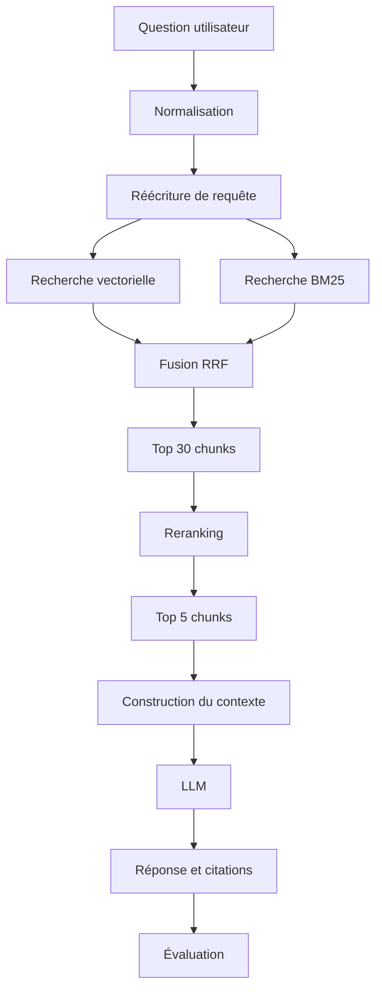

# Advanced RAG Knowledge Assistant

> Un moteur capable d'interroger une base documentaire technique et de produire des réponses traçables avec citations et sources.

## Sommaire

- [Vue d'ensemble](#vue-densemble)
- [État actuel](#état-actuel)
- [Chunking](#chunking)
- [Embeddings](#embeddings)
- [Indexation Qdrant](#indexation-qdrant)
- [Recherche vectorielle](#recherche-vectorielle)
- [Génération de réponses](#génération-de-réponses)
- [Citations](#citations)
- [Premiers constats](#premiers-constats)
- [Pipeline cible](#pipeline-cible)
- [Stack technique](#stack-technique)
- [Démarrage rapide](#démarrage-rapide)
- [Commandes de développement](#commandes-de-développement)
- [Structure du dépôt](#structure-du-dépôt)
- [Roadmap](#roadmap)
- [Résultats](#résultats)
- [Qualité et CI](#qualité-et-ci)
- [Documentation](#documentation)

## Vue d'ensemble

Advanced RAG Knowledge Assistant est un projet d'apprentissage consacré à la construction progressive d'un système RAG mesurable. Le corpus cible regroupe notamment des documentations Python, FastAPI, Docker et Kubernetes, ainsi que des articles et PDF techniques.

Le projet suit une règle simple : chaque amélioration du retrieval ou de la génération doit être justifiée par des mesures plutôt que par une impression subjective.

## État actuel

**Phase 10 terminée, étape 09 — Citations (`v0.3`).** La boucle est fermée et désormais **vérifiable** : une question entre, une réponse fondée sur le corpus sort, et chaque `[n]` qu'elle contient a été confronté au contexte réellement fourni. Le corpus est récupérable, chargeable en objets `RawDocument` validés, nettoyé, découpé en `Chunk` porteurs de leurs métadonnées, vectorisé avec cache persistant, indexé dans Qdrant, interrogeable, répondable, et **sourcé pour de bon**. Aucun endpoint HTTP n'est encore exposé — l'API FastAPI est l'étape 25 ; d'ici là le point d'entrée est `scripts/ask.py`.

Fonctionnalités disponibles :

- environnement Python 3.12 reproductible avec `uv` ;
- formatage, lint, vérification de types et tests locaux ;
- hooks pre-commit optionnels ;
- instance Qdrant locale persistante avec Docker Compose ;
- récupération du corpus FastAPI (155 fichiers Markdown) via `scripts/fetch_corpus.py` ;
- chargement en `RawDocument` triés et reproductibles via `app.ingestion.loader` ;
- nettoyage du Markdown MkDocs via `app.ingestion.clean` : 155 documents en entrée, 8 stubs écartés, 147 conservés, 1 463 414 → 1 041 001 caractères (71 %) ;
- découpage en chunks superposés via `app.ingestion.chunk` : 147 documents → 1 607 chunks ;
- vectorisation via `app.ingestion.embed` : 1 607 chunks → 1 536 dimensions, cache sqlite persistant de 13,3 Mo, 404 s à froid puis 0,12 s à chaud ;
- configuration partagée via `app.core.config` : une classe `Settings` lue une seule fois, qui charge `.env` ;
- indexation dans Qdrant via `app.retrieval.store` et `scripts/index_corpus.py` : 1 607 points, distance cosinus, index de payload sur `source`, `document_id` et `language` ;
- recherche par similarité via `app.retrieval.search` et `scripts/search.py` : `search()` rend des `ScoredChunk` classés à partir du rang 1, 119 ms sur requête déjà vectorisée ;
- génération de réponses via `app.generation` et `scripts/ask.py` : contexte numéroté, appel au modèle à `temperature=0`, objet `Answer` avec sources, statistiques, tokens et latence ; 1,5 à 3,7 s de bout en bout, 851 à 1 021 tokens par question ;
- validation des citations via `app.generation.citations` : chaque `[n]` est analysé puis confronté au contexte fourni, les sources rendues sont le sous-ensemble réellement cité, renuméroté de 1 dans le texte **et** dans la liste.

**Garantie de conservation du code.** Tout bloc de code — clôturé, indenté ou en ligne — traverse le nettoyage à l'octet près. Les étapes suivantes en dépendent : la recherche par mots-clés (étape 14) ne retrouve `HTTPException(status_code=422)` que si cette chaîne existe encore, intacte, dans l'index. Seule exception, mesurée et testée : les blocs ` ```console ` perdent le balisage HTML de coloration du terminal, qui coupait justement ces chaînes en morceaux.

## Chunking

Découpage récursif par caractères, écrit à la main : on coupe sur le séparateur le plus sémantique qui tient (`
## `, `
### `, `

`, `
`, `. `, ` `), et on descend d'un cran pour les morceaux encore trop longs. Le séparateur vide final garantit la terminaison sur un bloc sans aucune coupure possible.

Paramètres de référence — `chunk_size=1000`, `overlap=200`, en **caractères** et non en tokens (≈ 4 caractères par token en prose anglaise, moins en code). La phase 2 comparera d'autres stratégies contre exactement ces chiffres.

| Mesure | Valeur |
|---|---|
| Documents en entrée | 147 |
| Chunks produits | 1 607 |
| Chunks par document (médiane / max) | 5 / 590 |
| Taille médiane | 795 caractères |
| Taille min / max | 74 / 2 331 |
| Chunks hors limite | 10 (0,6 %) |
| Chunks avec `section` renseignée | 1 404 (87 %) |

**Aucun bloc de code n'est jamais coupé en deux.** Les spans que l'étape 03 reconnaît comme du code sont interdits de frontière ; un bloc plus long que `chunk_size` devient donc un chunk hors limite à lui seul, avec un avertissement journalisé. Les 10 cas mesurés sont tous un unique bloc clôturé (schéma OpenAPI, sortie `console`, diagramme d'exécution). C'est le plafond assumé de l'étape.

**La reconstruction est testée.** Concaténer les chunks en retirant les recouvrements redonne le texte source à l'octet près : c'est le test qui attrape la pire régression possible, du contenu perdu en silence.

Chaque `Chunk` porte `document_id`, `source`, `title`, `url`, `language`, `section`, `chunk_index`, `char_start` et `char_end`, plus un `chunk_id` dérivé (`{document_id}#{chunk_index}`). Les métadonnées sont attachées maintenant même si l'étape 13 seule les filtrera : les ajouter plus tard voudrait dire réindexer.

## Embeddings

`text-embedding-3-small` d'OpenAI, 1 536 dimensions, appelé par lots de 100 textes. Les nouvelles tentatives sur 429 et 5xx sont celles du client SDK (`max_retries=5`), pas une boucle écrite à la main.

**Le cache est la raison d'être de cette étape.** Les étapes 10 et suivantes relancent le pipeline en boucle en modifiant le retrieval, jamais les embeddings : sans cache, chaque passage repaie et réattend exactement les mêmes vecteurs. Un fichier sqlite unique, en bibliothèque standard, qui survit aux redémarrages.

| Mesure | Valeur |
|---|---|
| Chunks vectorisés | 1 607 |
| Tokens approximatifs | 304 458 |
| Dimensions | 1 536 |
| Passage à froid | 404 s |
| Passage à chaud | 0,12 s, zéro requête |
| Taille du cache | 13,3 Mo |
| Coût réel | ≈ 0,006 $ |

La clé de cache est `sha256(modèle + "\0" + texte)`. Le modèle en fait partie pour qu'un changement de modèle provoque un défaut de cache, au lieu de servir en silence des vecteurs issus d'un autre espace vectoriel dans le même index.

**Les vecteurs sortent dans l'ordre d'entrée, y compris en cache partiel.** La sortie est assemblée par recherche de clé, et non en zippant la réponse du fournisseur sur la liste d'entrée : dès qu'une partie des textes est en cache, les deux listes n'ont plus la même longueur, et un décalage d'un rang attacherait le mauvais vecteur au mauvais chunk sans que rien ne le signale — sauf un Recall@5 inexplicablement mauvais. C'est le test central de l'étape.

Contrôle de bon sens sur les vecteurs produits : cos(`cat`, `dog`) = 0,603 contre cos(`cat`, `quantum chromodynamics`) = 0,172 ; cos(`dependency injection`, `FastAPI dependency injection with Depends`) = 0,537 contre cos(`dependency injection`, `kubernetes memory limits`) = 0,198.

Les tests n'accèdent jamais au réseau et passent sans clé d'API : le client et le cache sont des paramètres injectables.

## Indexation Qdrant

Un seul script enchaîne les quatre étapes précédentes et écrit dans Qdrant : `raw → clean → chunk → embed → upsert`. C'est le premier artefact exécutable du projet.

```powershell
docker compose up -d qdrant --wait
uv run python scripts/index_corpus.py --limit 20 --dry-run   # répétition à blanc
uv run python scripts/index_corpus.py --recreate             # passage complet
```

| Étape | Volume | Durée |
|---|---:|---:|
| Chargement | 155 documents | 0,1 s |
| Nettoyage | 147 documents | 0,2 s |
| Découpage | 1 607 chunks | 0,3 s |
| Vectorisation (cache chaud) | 1 607 vecteurs | 0,5 s |
| Upsert | 1 607 points | 3,2 s |
| **Total** | **1 607 points, 1 536 dimensions** | **4,4 s** |

**Réindexer ne change rien et ne coûte rien.** L'identifiant d'un point est `uuid5(NAMESPACE, chunk_id)` : Qdrant n'accepte que des entiers ou des UUID, et un UUID déterministe transforme la réindexation en écrasement idempotent au lieu d'une accumulation de doublons. Relancer le script sans `--recreate` laisse bien 1 607 points, en 3,5 s dont 0,1 s de vectorisation — tout sort du cache. C'est ce qui rend le script sûr à relancer vingt fois pendant l'étape 12.

**Distance cosinus**, celle pour laquelle le modèle d'embeddings est entraîné. Un produit scalaire sur des vecteurs non normalisés, ou une distance euclidienne sur des vecteurs normalisés, produit des classements faux d'une manière qui reste plausible à l'œil.

**La dimension du vecteur est lue sur le modèle, jamais codée en dur.** Une collection créée à la mauvaise dimension échoue bruyamment à l'upsert, mais seulement après avoir payé la vectorisation complète.

**Les index de payload sur `source`, `document_id` et `language` existent dès maintenant.** Deux lignes, et le filtrage par métadonnées de l'étape 13 devient un changement à la requête plutôt qu'une réindexation. Un filtre sans index fonctionne quand même, mais en balayage.

**Le texte complet du chunk vit dans le payload.** Cela coûte du disque et économise un second magasin de données plus la jointure entre les deux.

Les tests d'intégration portent le marqueur `requires_qdrant` et s'ignorent d'eux-mêmes quand le serveur n'est pas joignable : `uv run pytest` reste vert sur une machine sans Docker.

## Recherche vectorielle

Une fonction, `search()`, et c'est volontairement tout :

```python
search(query: str, *, top_k: int = 5, source: str | None = None) -> list[ScoredChunk]
```

```powershell
uv run python scripts/search.py "How does dependency injection work in FastAPI?"
uv run python scripts/search.py "HTTPException 422" --top-k 10 --source fastapi
```

**Cette signature est conçue une fois, maintenant, pour tout ce qui suit.** La recherche hybride (étapes 14-16), le reranking (17) et la réécriture de requête (18) vivent tous derrière cet appel. Fixer le type de retour dès maintenant — un chunk, plus un score, plus un rang — transforme huit étapes ultérieures en changements internes plutôt qu'en remaniements de tout le dépôt.

**`ScoredChunk` enveloppe `Chunk`, il n'en hérite pas.** Un score n'est pas une propriété d'un chunk, mais d'un chunk *vis-à-vis d'une requête*. Et le reranker de l'étape 17 produira un *second* score pour le même chunk : `rerank_score` en champ voisin est évident, là où un `score` écrasé est un piège de débogage.

**Le rang est stocké, il part de 1.** Toutes les métriques de l'étape 11 — MRR, NDCG, Recall@K — sont des fonctions du rang. Le recalculer depuis la position dans la liste à quatre endroits, c'est ainsi qu'un décalage d'un rang finit dans un tableau de résultats publié.

**Les scores sortent bruts, tels que le moteur les rapporte.** Ni normalisation, ni remise à l'échelle : une normalisation inventée est une couche qui ment. La fusion de l'étape 16 travaillera sur les rangs, pas sur les scores.

**Aucun cache de recherche ici.** L'étape 23 l'ajoutera, délibérément, une fois qu'il y aura une latence à améliorer. Un cache de retrieval ajouté maintenant masquerait silencieusement les variations que les étapes 14-19 servent précisément à mesurer. Le cache d'embeddings de l'étape 05, lui, est réutilisé : une requête de benchmark rejouée ne coûte rien.

**Une requête vide est rejetée avant tout appel réseau.** La chaîne vide se vectorise très bien et retrouve des résultats parfaitement plausibles, donc faux. Échouer tôt est le seul comportement honnête. Idem pour `top_k < 1`.

**Une clé de payload optionnelle absente vaut `None`, pas une erreur.** Qdrant ne stocke pas les valeurs nulles : un chunk sans `url` revient sans la clé du tout. Une clé obligatoire manquante, elle, échoue en nommant le champ.

Le client Qdrant et la fonction de vectorisation sont des paramètres injectables : les treize tests unitaires de l'étape tournent sans serveur et sans clé d'API. Les deux tests d'intégration portent le marqueur `requires_qdrant`.

## Génération de réponses

Quatre fonctions, montées à la main, et rien entre elles :

```text
search() -> build_context() -> complete() -> Answer
```

```powershell
uv run python scripts/ask.py "How does dependency injection work in FastAPI?"
uv run python scripts/ask.py "Comment fonctionne l'injection de dependances dans FastAPI ?" --show-context
```

Une question réelle, sur les 1 607 chunks indexés :

```text
> uv run python scripts/ask.py "Comment fonctionne l'injection de dependances dans FastAPI ?"

L'injection de dépendances dans FastAPI fonctionne en permettant à vos fonctions
d'opération de chemin de déclarer les dépendances dont elles ont besoin pour
fonctionner. FastAPI s'occupe ensuite de fournir ces dépendances en les
« injectant » dans votre code [1][2].

Lorsqu'une nouvelle requête arrive, FastAPI appelle la fonction de dépendance avec
les paramètres appropriés, obtient le résultat de cette fonction et l'assigne au
paramètre de votre fonction d'opération de chemin [3]. De plus, FastAPI utilise
des gestionnaires de contexte de Python pour s'assurer que tout est exécuté dans
le bon ordre, même si une dépendance nécessite plusieurs autres dépendances [4].

Ce système permet de partager la logique de code, de partager des connexions à la
base de données, d'appliquer des exigences de sécurité et d'authentification, tout
en minimisant la répétition de code [2].

[1] Dependencies  (0.6773)
    https://fastapi.tiangolo.com/tutorial/dependencies/
[2] Dependencies  (0.6319)
    https://fastapi.tiangolo.com/tutorial/dependencies/
[3] Dependencies / Declare the dependency, in the "dependant"  (0.6102)
    https://fastapi.tiangolo.com/tutorial/dependencies/
[4] Dependencies with yield / Sub-dependencies with `yield`  (0.6309)
    https://fastapi.tiangolo.com/tutorial/dependencies/dependencies-with-yield/

5 retrieved, 5 used, 0 dropped, 4 cited  |  gpt-4o-mini  |  1055 tokens  |  3357 ms
```

Cinq chunks sont partis au modèle, quatre reviennent : le cinquième n'a été cité
nulle part, donc il n'est pas présenté comme une source. Et la liste n'est plus
triée par score — `[4]` score plus haut que `[3]` — parce qu'elle suit désormais
l'ordre des citations dans le texte. Le détail est dans [Citations](#citations).

**Corpus anglais, question française, réponse française.** Le prompt système impose la langue de la question. Sans cette ligne, le système répond en anglais à une question française et paraît cassé.

**Zéro chunk retrouvé veut dire zéro appel au modèle.** Avec un contexte vide, la seule chose qu'un modèle puisse produire est une invention — facturée. Le court-circuit est testé explicitement ; c'est la faute la moins pardonnable d'un pipeline RAG.

**Les chunks entrent entiers ou pas du tout.** Le budget de contexte vaut 12 000 caractères et se respecte en écartant les chunks les moins bien classés, jamais en tronquant : un demi-chunk est un demi-fait, que le modèle complète avec aplomb. Exception assumée : si le premier chunk dépasse à lui seul le budget, il est conservé quand même, un contexte vide étant pire qu'un contexte trop long.

**`temperature=0`.** Un système qui répond différemment au deuxième appel identique n'est pas évaluable, et les étapes 11 et 21 sont des évaluations.

**Ce qu'il ignore, il le dit.** « How do I limit memory for a Kubernetes pod ? » — hors corpus — obtient « I do not know », pas une invention plausible. « What does HTTPException 422 mean ? » obtient la même réponse, et c'est cette fois un échec de *retrieval* : la recherche dense remonte la bonne famille de pages entre 0,32 et 0,41, jamais le paragraphe qui définit 422. Le constat de l'étape 07 se paie ici, et c'est exactement ce que la recherche hybride de l'étape 14 doit corriger.

**Un modèle, choisi par configuration.** `GENERATION_MODEL` vaut `gpt-4o-mini` par défaut, la clé OpenAI étant déjà requise pour les embeddings : une dépendance, un identifiant. Changer de fournisseur, c'est réécrire le corps de `complete()` dans `app/generation/llm.py` — rien d'autre du pipeline ne voit de client.

**Les tokens sont relevés dès le premier appel.** L'étape 24 en a besoin ; les ajouter plus tard voudrait dire toucher tous les appelants.

Les vingt-trois tests de l'étape tournent sans serveur, sans clé et sans dépense : le récupérateur et le modèle sont injectables.

## Citations

Deux garanties, tenues par du code et non par un prompt :

1. **Chaque `[n]` d'une réponse rendue pointe vers une source rendue.**
2. **Chaque source rendue a été effectivement citée.**

Le texte et la liste sont renumérotés ensemble : si le modèle cite `[1]` et `[3]`,
la réponse dit `[1]` et `[2]`, et les deux sources portent les numéros 1 et 2. La
liste suit donc l'ordre des citations, pas l'ordre des scores.

```text
> uv run python scripts/ask.py "What does Depends() with yield do differently?"

Using `Depends()` with `yield` allows for dependencies that perform additional
steps after finishing. Specifically, the exit code after `yield` is executed at
different times depending on the scope specified. If you use
`Depends(scope="function")`, the exit code runs right after the path operation
function is finished, before the response is sent back to the client. In contrast,
using `Depends(scope="request")` (the default) means the exit code runs after the
response is sent [1].

Additionally, dependencies with `yield` can handle exceptions and ensure that exit
steps are executed regardless of whether an exception occurred, by using `try` and
`finally` blocks [2].

[1] Advanced Dependencies / Dependencies with `yield`, `HTTPException`, `except` and Background Tasks  (0.5497)
    https://fastapi.tiangolo.com/advanced/advanced-dependencies/
[2] Dependencies with yield / A database dependency with `yield`  (0.5049)
    https://fastapi.tiangolo.com/tutorial/dependencies/dependencies-with-yield/

5 retrieved, 5 used, 0 dropped, 2 cited  |  gpt-4o-mini  |  1289 tokens  |  1993 ms
```

Cinq chunks retrouvés, cinq envoyés au modèle, deux cités. `retrieved` et `used`
restent des faits de *retrieval* — les compter à partir des citations ferait
passer un modèle paresseux pour un moteur de recherche défaillant. Seul `sources`
rétrécit.

**Une citation hors plage est un bug de la réponse, pas de l'analyseur.** `[7]`
quand cinq entrées ont été fournies veut dire que le modèle a inventé une source.
Le marqueur est retiré du texte, l'espace qu'il occupait avec lui, et un
avertissement le nomme. Il n'est **jamais** renuméroté : faire pointer une
affirmation fabriquée vers un document réel est le pire résultat disponible. Le
mode `--strict` lève une exception à la place, pour les campagnes d'évaluation où
un avertissement silencieux fausserait la métrique de l'étape 21.

**Une réponse sans citation est signalée, pas rejetée.** Un vrai refus n'a rien à
citer et c'est la bonne réponse : zéro citation plus une formule de refus, tout va
bien. Zéro citation plus une réponse longue et assurée, c'est un avertissement
`answer_without_citations` — de la génération non fondée déguisée en RAG.

**Le code et les liens ne sont pas des citations.** `list[int]` dans un bloc
clôturé et `[the docs](https://x)` dans une phrase passent par le masquage des
motifs `CODE` et `LINK` de l'étape 03 avant toute analyse. Sans cela, chaque lien
d'une réponse devient une fausse source, ce qui est précisément le défaut que
cette étape existe pour supprimer.

### Ce que cite vraiment `gpt-4o-mini`

Sept questions passées au modèle réel, chaque `[n]` rouvert et relu contre le
chunk qu'il désigne. Les citations résolvent toutes ; leur *pertinence* est une
autre affaire, et c'est la cible de l'étape 21.

| Mode observé | Fréquence | Exemple |
|---|---|---|
| Citation exacte et vérifiable | majoritaire | « Python's Context Managers » cité sur le chunk qui contient littéralement la phrase |
| Phrase factuelle non citée du tout | 3 réponses sur 5 | la phrase d'ouverture de la réponse `Depends()`/`yield` n'a aucun marqueur |
| Citation groupée sur une phrase composée | 2 réponses sur 5 | `[1][2][3]` sur une phrase dont chaque proposition vient d'une entrée différente : correct, mais la granularité est la phrase, pas la proposition |
| Paraphrase qui perd une condition du chunk | 1 réponse sur 5 | `Depends(scope="function")` présenté comme disponible, le chunk précise « In version 0.121.0 » |
| Redite d'une phrase déjà citée, recitée | 1 réponse sur 5 | « path parameters are directly included in the URL structure » reformule la phrase précédente et recite `[2][3]` |

Aucune citation inventée sur ces sept questions — mais l'échantillon est de sept,
et le garde-fou existe justement parce que l'échantillon suivant sera différent.

**Le trou réel est la phrase non citée, pas la citation fausse.** L'avertissement
ne se déclenche que si la réponse *entière* ne cite rien ; une réponse qui cite
trois phrases sur cinq passe sans bruit. L'attribution phrase par phrase est
délibérément laissée à l'étape 21, avec le score de fidélité qui l'accompagne.

**Un faux refus est un échec de retrieval, pas de citation.** « How do I return a
422 validation error ? » refuse proprement, avec zéro source et zéro
avertissement — exactement le comportement voulu, sur un contexte qui n'aurait pas
dû être vide. C'est le constat `HTTPException 422` de l'étape 07 qui se repaie, et
la cible de la recherche hybride de l'étape 14.

**`--show-context` ne numérote plus comme la réponse.** L'option affiche le prompt
envoyé, donc la numérotation d'origine ; la réponse, elle, est renumérotée. Pour
auditer un `[n]`, il faut passer par le titre de la source, pas par son numéro.

## Premiers constats

Cinq requêtes sur les 1 607 points réels. Ce sont les premières mesures de retrieval du projet, relevées avant que quoi que ce soit ne soit construit dessus.

| Requête | Rang 1 | Score | Documents distincts dans le top 5 |
|---|---|---:|---:|
| `Comment fonctionne l'injection de dependances dans FastAPI ?` | `tutorial/dependencies/index` | 0,6773 | 2 |
| `How does dependency injection work in FastAPI?` | `tutorial/dependencies/index` | 0,7743 | 3 |
| `HTTPException 422` | `tutorial/handling-errors` | 0,3658 | 3 |
| `Depends` | `tutorial/dependencies/index` | 0,3643 | 3 |
| `how to protect an API` | `how-to/conditional-openapi` | 0,6335 | 3 |

**Le translinguistique fonctionne.** La question française et sa jumelle anglaise classent toutes deux `tutorial/dependencies/index` en tête et partagent 4 résultats sur 5. Le français score plus bas de bout en bout (0,677 contre 0,774 au rang 1) : l'écart est constant, pas rédhibitoire. Aucune traduction de requête n'est nécessaire pour l'instant.

**`HTTPException 422` est l'échec qui justifie les étapes 14-16.** La recherche dense retrouve la bonne famille de pages — `tutorial/handling-errors` aux rangs 1, 2 et 4 — mais le token littéral `422` n'y contribue en rien : un seul chunk de tout le top 50 contient la chaîne, il arrive au rang 5 à 0,3214, et c'est un exemple JSON OpenAPI dans `advanced/additional-responses` qui liste incidemment une réponse 422. Seuls 2 des 155 documents du corpus contiennent `422`. La cible de la recherche hybride est donc précise : faire remonter ces deux-là, au-dessus de la prose générique sur la gestion d'erreurs.

**Les scores ne vivent pas sur une seule échelle.** Les questions en langue naturelle se situent entre 0,61 et 0,77, les requêtes mots-clés (`Depends`, `HTTPException 422`) entre 0,28 et 0,37 — sur des résultats pourtant parfaitement pertinents. Un seuil de score fixe rejetterait le second groupe en bloc. La règle de refus de l'étape 22 aura besoin d'autre chose qu'un plancher.

**Le top 5 se concentre sur 2 à 3 documents**, 3 résultats sur 5 venant d'un seul document sur les deux questions d'injection de dépendances. C'est un constat de diversité pour l'étape 12, pas un défaut à corriger à l'aveugle.

**Latence : 0,9 à 1,8 s à froid, 119 ms une fois le vecteur de requête en cache.** Qdrant n'est pas le coût ; l'aller-retour de vectorisation l'est.

## Pipeline cible



Ce diagramme représente la cible du projet, pas son état actuel.

## Stack technique

| Domaine | Technologie cible | État |
|---|---|---|
| Langage | Python 3.12+ | Configuré |
| Gestion de projet | uv | Configuré |
| API | FastAPI | Dépendance installée |
| Base vectorielle | Qdrant | Corpus indexé et interrogeable, 1 607 points |
| Embeddings | OpenAI `text-embedding-3-small` | Implémenté avec cache sqlite |
| Génération | OpenAI `gpt-4o-mini`, `temperature=0` | Implémentée, pipeline monté à la main |
| Validation | Pydantic | Utilisé pour les modèles et la configuration |
| Tests | pytest | Configuré |
| Qualité | Ruff, mypy, pre-commit | Configuré |
| Orchestration RAG | LangChain | Planifié |
| Recherche lexicale | BM25 | Planifié |
| Évaluation | RAGAS et métriques maison | Planifié |
| Observabilité | LangSmith ou OpenTelemetry | Planifié |
| CI | GitHub Actions | Planifié |

## Démarrage rapide

### Prérequis

- [uv](https://docs.astral.sh/uv/) ;
- Python 3.12, installable automatiquement par uv ;
- Docker avec le plugin Docker Compose.

### Installation

```powershell
git clone git@github.com:Slqzeer/Advanced-RAG-Knowledge-Assistant.git
cd Advanced-RAG-Knowledge-Assistant
Copy-Item .env.example .env
uv sync --frozen
docker compose up -d qdrant --wait
```

Renseignez ensuite `OPENAI_API_KEY` dans `.env` : les embeddings en ont besoin. Depuis l'étape 06, `app.core.config` charge `.env` automatiquement ; `uv run --env-file .env` n'est plus nécessaire.

Qdrant est alors accessible sur :

- REST et interface Web : <http://localhost:6333/dashboard> ;
- gRPC : `localhost:6334`.

> Cette instance Qdrant n'utilise aucune authentification. Elle est réservée au développement local.

## Commandes de développement

```powershell
# Synchroniser l'environnement
uv sync --frozen

# Vérifier le verrouillage des dépendances
uv lock --check

# Linter et vérifier le formatage
uv run ruff check .
uv run ruff format --check .

# Vérifier les types
uv run mypy app

# Exécuter les tests
uv run pytest

# Installer puis exécuter les hooks locaux
uv run pre-commit install
uv run pre-commit run --all-files

# Récupérer le corpus (écrit dans data/raw/, non versionné)
uv run python scripts/fetch_corpus.py

# Indexer le corpus dans Qdrant (premier passage payant, les suivants sortent du cache)
uv run python scripts/index_corpus.py --limit 20 --dry-run
uv run python scripts/index_corpus.py --recreate

# Interroger l'index
uv run python scripts/search.py "How does dependency injection work in FastAPI?"
uv run python scripts/search.py "HTTPException 422" --top-k 10 --source fastapi

# Poser une question et obtenir une réponse sourcée
uv run python scripts/ask.py "How does dependency injection work in FastAPI?"
uv run python scripts/ask.py "Comment fonctionne l'injection de dependances dans FastAPI ?" --show-context

# Échouer sur une citation inventée au lieu de l'avertir (campagnes d'évaluation)
uv run python scripts/ask.py "What does Depends() with yield do differently?" --strict

# Tests d'intégration Qdrant (ignorés si le serveur n'est pas joignable)
uv run pytest -m requires_qdrant

# Gérer Qdrant
docker compose up -d qdrant --wait
docker compose ps
docker compose down
```

## Structure du dépôt

```text
.
├── app/
│   ├── api/          # future API FastAPI
│   ├── core/         # configuration partagée
│   ├── evaluation/   # futures métriques RAG
│   ├── generation/   # contexte, appel au modèle, citations, orchestration
│   ├── ingestion/    # chargement, nettoyage, découpage et vectorisation
│   ├── models/       # modèles de données
│   └── retrieval/    # indexation Qdrant et recherche par similarité
├── data/
│   ├── raw/          # sources locales non versionnées
│   └── processed/    # données transformées non versionnées
├── docker/           # futurs fichiers de conteneurisation
├── docs/             # spécifications et plans
├── notebooks/        # futures expérimentations
├── scripts/          # outils ponctuels (corpus, indexation, recherche, questions)
├── tests/            # tests automatisés
├── compose.yaml      # service Qdrant local
└── pyproject.toml    # projet et outils Python
```

## Roadmap

- [x] **Phase 0 — Préparer le projet** : environnement, qualité, structure et Qdrant local.
- [x] **Phase 1 — RAG minimal** : ingestion, nettoyage, chunking, embeddings, indexation Qdrant et recherche vectorielle (faits), génération de la réponse.
- [ ] **Phase 2 — Chunking** : comparer les stratégies et mesurer leur impact.
- [ ] **Phase 3 — Métadonnées** : filtrer et tracer chaque chunk.
- [ ] **Phase 4 — Évaluation du retrieval** : Recall@K, Precision@K, MRR, Hit Rate et NDCG.
- [ ] **Phase 5 — Recherche hybride** : combiner recherche dense et BM25.
- [ ] **Phase 6 — Reranking** : optimiser la précision des candidats.
- [ ] **Phase 7 — Query rewriting** : rendre les questions conversationnelles autonomes.
- [ ] **Phase 8 — Multi-query retrieval** : augmenter le recall par expansion de requêtes.
- [ ] **Phase 9 — Compression contextuelle** : réduire le contexte aux passages pertinents.
- [x] **Phase 10 — Citations** : produire des réponses fondées et sourcées (faites, `v0.3`).
- [ ] **Phase 11 — Évaluation complète** : mesurer retrieval et génération.
- [ ] **Phase 12 — Guardrails** : gérer le manque de contexte et les entrées hostiles.
- [ ] **Phase 13 — Cache** : réduire latence et coût.
- [ ] **Phase 14 — API professionnelle** : exposer les opérations FastAPI.
- [ ] **Phase 15 — Observabilité** : suivre scores, tokens, latence et coût.
- [ ] **Phase 16 — Dockerisation** : conteneuriser l'application complète.
- [ ] **Phase 17 — Tests et CI/CD** : automatiser les régressions et les builds.

## Résultats

Les résultats seront ajoutés avec les phases correspondantes. Une valeur absente signifie que l'expérience n'a pas encore été exécutée.

| Version | Recall@5 | Recall@10 | MRR | Latence | Coût |
|---|---:|---:|---:|---:|---:|
| Recherche vectorielle naïve | — | — | — | 119 ms* | — |
| RAG minimal (`v0.2`) | — | — | — | 1,5 à 3,7 s** | ~0,0003 $ / question** |
| Citations (`v0.3`) | — | — | — | 0,7 à 4,3 s*** | ~0,0003 $ / question*** |
| Chunking amélioré | — | — | — | — | — |
| Recherche hybride | — | — | — | — | — |
| Reranking | — | — | — | — | — |

\* Latence de recherche seule, vecteur de requête déjà en cache ; 0,9 à 1,8 s quand il faut le calculer. Les métriques de qualité arrivent avec l'étape 11, qui construit le jeu d'évaluation.

\*\* Bout en bout via `scripts/ask.py`, sur quatre questions réelles : 851 à 1 021 tokens par appel à `gpt-4o-mini`, soit environ 0,0003 $ l'unité aux tarifs affichés. La génération domine, elle pèse plus de 95 % du temps de réponse.

\*\*\* Sept questions réelles, 923 à 1 289 tokens par appel. La validation des citations est du traitement de chaîne en mémoire et ne se mesure pas à côté de l'aller-retour réseau ; la fourchette s'élargit vers le bas parce qu'un refus est court à générer, et vers le haut parce que le prompt v2 est plus long que le v1. Les métriques de qualité restent vides jusqu'à l'étape 11.

## Qualité et CI

Les contrôles locaux disponibles sont Ruff, mypy, pytest et pre-commit. La CI GitHub Actions sera ajoutée pendant la phase 17 ; aucun badge CI n'est affiché avant l'existence du workflow correspondant.

Chaque future phase doit mettre à jour dans le même changement :

1. l'état actuel ;
2. la roadmap ;
3. les commandes utiles ;
4. les résultats réellement mesurés.

## Documentation

- [Brief initial](information.md)
- [Plan global](docs/roadmap.md) — état actuel, correspondance étapes/phases/versions et index des plans par étape
- [Spécification du socle](docs/superpowers/specs/2026-09-09-project-foundation-design.md)
- [Plan d'implémentation du socle](docs/superpowers/plans/2026-09-09-project-foundation.md)
- [Plans par étape](docs/superpowers/plans/) — étapes 02 à 11 rédigées ; les suivantes sont écrites au début de leur étape
