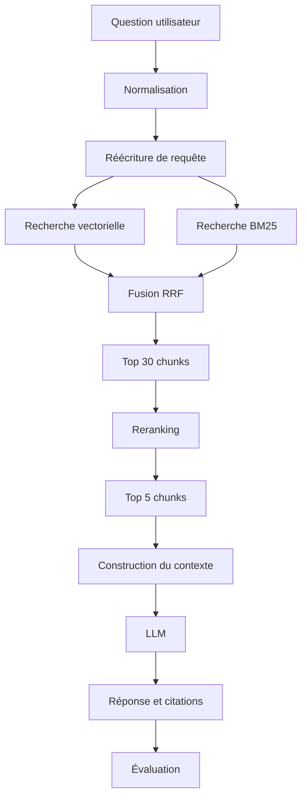

# Project Foundation Implementation Plan

> **For agentic workers:** REQUIRED SUB-SKILL: Use superpowers:subagent-driven-development (recommended) or superpowers:executing-plans to implement this plan task-by-task. Steps use checkbox (`- [ ]`) syntax for tracking.

**Goal:** Create a reproducible Python 3.12 development foundation with local quality tooling, a healthy Qdrant service, and an evolutionary French README, without implementing application behavior.

**Architecture:** Keep the flat `app/` package layout defined by the project brief and manage the environment with `uv`. Separate the Python workspace, repository hygiene, local infrastructure, and documentation into independently reviewable commits. Qdrant is the only running service; every application package remains empty except for package markers.

**Tech Stack:** Python 3.12, uv, FastAPI, Pydantic Settings, Qdrant client/server, Uvicorn, Ruff, mypy, pytest, pre-commit, Docker Compose

**Spec:** `docs/superpowers/specs/2026-09-09-project-foundation-design.md`

## Global Constraints

- Use Python 3.12 and require Python `>=3.12`.
- Use `uv` for dependency resolution, environment synchronization, and command execution.
- Commit `uv.lock` and verify it with `uv lock --check`.
- Do not add routes, RAG logic, ingestion, embeddings, collections, LLM calls, Redis, CI workflows, an application Dockerfile, or deployment configuration.
- Keep Qdrant unauthenticated for local development only and pin its image to `qdrant/qdrant:v1.19.1`.
- Keep all secrets out of Git; `.env.example` contains empty provider keys only.
- Write the README in French and never describe planned behavior as implemented.

## File Map

- `pyproject.toml`: project metadata, runtime/dev dependencies, and Ruff, mypy, and pytest configuration.
- `uv.lock`: exact resolved Python dependency graph.
- `.python-version`: Python 3.12 selection for uv and compatible version managers.
- `app/**/__init__.py`: package boundaries only; no application behavior.
- `tests/test_environment.py`: smoke test for the package and runtime dependency imports.
- `.editorconfig`: cross-editor whitespace and encoding defaults.
- `.gitignore`: local environments, caches, secrets, editor files, and generated data exclusions.
- `.env.example`: documented local Qdrant settings and empty future provider keys.
- `.pre-commit-config.yaml`: pinned repository, Ruff, and uv lock checks.
- `data/**/.gitkeep`, `docker/.gitkeep`, `notebooks/.gitkeep`, `scripts/.gitkeep`: retain intentionally empty project directories.
- `compose.yaml`: version-pinned single-node Qdrant with persistent storage and readiness healthcheck.
- `README.md`: navigable project front page, current status, setup, roadmap, and result framework.
- `information.md`: original project brief, tracked unchanged.

---

### Task 1: Python Workspace and Package Boundaries

**Files:**

- Create: `.python-version`
- Create: `pyproject.toml`
- Create: `uv.lock`
- Create: `app/__init__.py`
- Create: `app/api/__init__.py`
- Create: `app/core/__init__.py`
- Create: `app/evaluation/__init__.py`
- Create: `app/generation/__init__.py`
- Create: `app/ingestion/__init__.py`
- Create: `app/models/__init__.py`
- Create: `app/retrieval/__init__.py`
- Create: `tests/test_environment.py`
- Add unchanged: `information.md`

**Interfaces:**

- Consumes: Python 3.12 and the package boundaries from `information.md`.
- Produces: a synchronized `.venv`, importable `app` package, locked runtime dependencies, and the commands used by every later task.

- [ ] **Step 1: Write the environment smoke test**

Create `tests/test_environment.py`:

```python
from importlib.util import find_spec


RUNTIME_MODULES = (
    "app",
    "fastapi",
    "pydantic_settings",
    "qdrant_client",
    "uvicorn",
)


def test_runtime_modules_are_importable() -> None:
    missing = [name for name in RUNTIME_MODULES if find_spec(name) is None]

    assert missing == [], f"Modules introuvables : {', '.join(missing)}"
```

- [ ] **Step 2: Run the smoke test before creating the workspace**

Run:

```powershell
uvx --from pytest pytest tests/test_environment.py -q
```

Expected: FAIL because `app` and the project runtime dependencies are not installed.

- [ ] **Step 3: Create the package boundaries**

Create these empty package markers:

```text
app/__init__.py
app/api/__init__.py
app/core/__init__.py
app/evaluation/__init__.py
app/generation/__init__.py
app/ingestion/__init__.py
app/models/__init__.py
app/retrieval/__init__.py
```

Create `.python-version`:

```text
3.12
```

- [ ] **Step 4: Define the project and tool configuration**

Create `pyproject.toml`:

```toml
[project]
name = "advanced-rag-knowledge-assistant"
version = "0.1.0"
description = "Assistant documentaire technique fondé sur une architecture RAG avancée."
requires-python = ">=3.12"
dependencies = [
    "fastapi>=0.116,<1",
    "pydantic-settings>=2.10,<3",
    "qdrant-client>=1.15,<2",
    "uvicorn[standard]>=0.35,<1",
]

[dependency-groups]
dev = [
    "mypy>=1.17,<2",
    "pre-commit>=4.3,<5",
    "pytest>=8.4,<9",
    "ruff>=0.16,<1",
]

[tool.uv]
package = false

[tool.ruff]
line-length = 100
target-version = "py312"

[tool.ruff.lint]
select = ["B", "E", "F", "I", "SIM", "UP"]

[tool.mypy]
python_version = "3.12"
strict = true
ignore_missing_imports = true

[tool.pytest.ini_options]
addopts = "-ra"
testpaths = ["tests"]
```

- [ ] **Step 5: Lock and synchronize the environment**

Run:

```powershell
uv lock
uv sync
```

Expected: `uv.lock` and `.venv` are created, and both runtime and `dev` dependencies are installed.

- [ ] **Step 6: Verify the Python foundation**

Run:

```powershell
uv lock --check
uv run pytest
uv run ruff check app tests
uv run ruff format --check app tests
uv run mypy app
```

Expected: every command exits with code 0; pytest reports one passing test.

- [ ] **Step 7: Commit the Python foundation**

```powershell
git add .python-version pyproject.toml uv.lock app tests information.md
git commit -m "chore: initialize Python workspace"
```

---

### Task 2: Repository Hygiene and Local Configuration

**Files:**

- Create: `.editorconfig`
- Create: `.gitignore`
- Create: `.env.example`
- Create: `.pre-commit-config.yaml`
- Create: `data/raw/.gitkeep`
- Create: `data/processed/.gitkeep`
- Create: `docker/.gitkeep`
- Create: `notebooks/.gitkeep`
- Create: `scripts/.gitkeep`

**Interfaces:**

- Consumes: `uv`, Ruff, and `uv.lock` from Task 1.
- Produces: safe local defaults, retained empty directories, and a repeatable pre-commit quality gate.

- [ ] **Step 1: Add editor defaults**

Create `.editorconfig`:

```ini
root = true

[*]
charset = utf-8
end_of_line = lf
insert_final_newline = true
indent_style = space
indent_size = 2
trim_trailing_whitespace = true

[*.py]
indent_size = 4

[*.md]
trim_trailing_whitespace = false
```

- [ ] **Step 2: Protect local and generated files**

Create `.gitignore`:

```gitignore
# Python
__pycache__/
*.py[cod]
.venv/

# Quality tools
.mypy_cache/
.pytest_cache/
.ruff_cache/
.coverage
htmlcov/

# Secrets and local configuration
.env
.env.*
!.env.example

# Editors and operating systems
.idea/
.vscode/
.DS_Store
Thumbs.db

# Notebooks
.ipynb_checkpoints/

# Generated document data
data/raw/*
!data/raw/.gitkeep
data/processed/*
!data/processed/.gitkeep
```

- [ ] **Step 3: Document environment variables**

Create `.env.example`:

```dotenv
# Qdrant local (Docker Compose)
QDRANT_URL=http://localhost:6333
QDRANT_REST_PORT=6333
QDRANT_GRPC_PORT=6334

# Fournisseurs optionnels des phases futures
OPENAI_API_KEY=
COHERE_API_KEY=
```

- [ ] **Step 4: Retain intentionally empty directories**

Create empty `.gitkeep` files at:

```text
data/raw/.gitkeep
data/processed/.gitkeep
docker/.gitkeep
notebooks/.gitkeep
scripts/.gitkeep
```

- [ ] **Step 5: Configure pinned pre-commit hooks**

Create `.pre-commit-config.yaml`:

```yaml
repos:
  - repo: https://github.com/pre-commit/pre-commit-hooks
    rev: v6.0.0
    hooks:
      - id: check-added-large-files
      - id: check-merge-conflict
      - id: check-toml
      - id: check-yaml
      - id: end-of-file-fixer
      - id: trailing-whitespace

  - repo: https://github.com/astral-sh/ruff-pre-commit
    rev: v0.16.0
    hooks:
      - id: ruff-check
        args: [--fix]
      - id: ruff-format

  - repo: https://github.com/astral-sh/uv-pre-commit
    rev: 0.12.10
    hooks:
      - id: uv-lock
        args: [--check]
```

- [ ] **Step 6: Validate and run the repository hooks**

Run:

```powershell
uv run pre-commit validate-config
uv run pre-commit run --all-files
```

Expected: configuration validation succeeds and every hook passes. If a formatting hook changes a file, rerun the second command and require a clean pass.

Do not run `pre-commit install` during automated execution. Document it for contributors in Task 4 so installing a Git hook remains an explicit local choice.

- [ ] **Step 7: Confirm ignored secrets and tracked placeholders**

Run:

```powershell
git check-ignore .env
git check-ignore .env.example
git status --short
```

Expected: `.env` is printed as ignored, `.env.example` is not printed, and all `.gitkeep` files appear as untracked before the commit.

- [ ] **Step 8: Commit repository hygiene**

```powershell
git add .editorconfig .gitignore .env.example .pre-commit-config.yaml data docker notebooks scripts
git commit -m "chore: configure local development hygiene"
```

---

### Task 3: Local Qdrant Service

**Files:**

- Create: `compose.yaml`

**Interfaces:**

- Consumes: `QDRANT_REST_PORT` and `QDRANT_GRPC_PORT` documented in `.env.example`.
- Produces: local Qdrant REST access at `http://localhost:6333`, gRPC access at `localhost:6334`, persistent `qdrant_storage`, and Docker health status.

- [ ] **Step 1: Verify that Compose is not configured yet**

Run:

```powershell
docker compose config --quiet
```

Expected: FAIL because no Compose configuration exists.

- [ ] **Step 2: Define the Qdrant service**

Create `compose.yaml`:

```yaml
services:
  qdrant:
    image: qdrant/qdrant:v1.19.1
    restart: unless-stopped
    ports:
      - "${QDRANT_REST_PORT:-6333}:6333"
      - "${QDRANT_GRPC_PORT:-6334}:6334"
    volumes:
      - qdrant_storage:/qdrant/storage
    healthcheck:
      test:
        - CMD
        - bash
        - -c
        - >-
          exec 3<>/dev/tcp/127.0.0.1/6333 &&
          printf 'GET /readyz HTTP/1.1\r\nHost: localhost\r\nConnection: close\r\n\r\n' >&3 &&
          read -r status <&3 &&
          [[ "$$status" == *"200 OK"* ]]
      interval: 5s
      timeout: 3s
      retries: 10
      start_period: 10s

volumes:
  qdrant_storage:
```

- [ ] **Step 3: Validate the resolved Compose configuration**

Run:

```powershell
docker compose config --quiet
docker compose config
```

Expected: both commands exit with code 0; the rendered service uses image `qdrant/qdrant:v1.19.1` and publishes ports 6333 and 6334 with default environment values.

- [ ] **Step 4: Start Qdrant and wait for readiness**

Run:

```powershell
docker compose up -d qdrant --wait
docker compose ps
```

Expected: the `qdrant` service is `Up` and `healthy`.

- [ ] **Step 5: Verify the public readiness endpoint**

Run:

```powershell
(Invoke-WebRequest -UseBasicParsing http://localhost:6333/readyz).StatusCode
```

Expected: PowerShell prints `200`.

- [ ] **Step 6: Commit local infrastructure**

```powershell
git add compose.yaml
git commit -m "chore: add local Qdrant service"
```

---

### Task 4: Evolutionary Project README

**Files:**

- Create: `README.md`

**Interfaces:**

- Consumes: all setup commands and verified current-state facts from Tasks 1-3.
- Produces: the French entry point that future phases update alongside code and measured results.

- [ ] **Step 1: Create the complete initial README**

Create `README.md` with this content:

````markdown
# Advanced RAG Knowledge Assistant

> Un moteur capable d'interroger une base documentaire technique et de produire des réponses traçables avec citations et sources.

## Sommaire

- [Vue d'ensemble](#vue-densemble)
- [État actuel](#état-actuel)
- [Pipeline cible](#pipeline-cible)
- [Stack technique](#stack-technique)
- [Démarrage rapide](#démarrage-rapide)
- [Commandes de développement](#commandes-de-développement)
- [Structure du dépôt](#structure-du-dépôt)
- [Roadmap](#roadmap)
- [Résultats](#résultats)
- [Qualité et CI](#qualité-et-ci)
- [Documentation](#documentation)

## Vue d'ensemble

Advanced RAG Knowledge Assistant est un projet d'apprentissage consacré à la construction progressive d'un système RAG mesurable. Le corpus cible regroupe notamment des documentations Python, FastAPI, Docker et Kubernetes, ainsi que des articles et PDF techniques.

Le projet suit une règle simple : chaque amélioration du retrieval ou de la génération doit être justifiée par des mesures plutôt que par une impression subjective.

## État actuel

**Phase 0 — socle du projet.** L'environnement Python, les contrôles de qualité et le service Qdrant local sont disponibles. Aucun endpoint ni pipeline RAG n'est encore implémenté.

Fonctionnalités disponibles :

- environnement Python 3.12 reproductible avec `uv` ;
- formatage, lint, vérification de types et tests locaux ;
- hooks pre-commit optionnels ;
- instance Qdrant locale persistante avec Docker Compose.

## Pipeline cible



Ce diagramme représente la cible du projet, pas son état actuel.

## Stack technique

| Domaine | Technologie cible | État |
|---|---|---|
| Langage | Python 3.12+ | Configuré |
| Gestion de projet | uv | Configuré |
| API | FastAPI | Dépendance installée |
| Base vectorielle | Qdrant | Configuré en local |
| Validation | Pydantic | Dépendance installée |
| Tests | pytest | Configuré |
| Qualité | Ruff, mypy, pre-commit | Configuré |
| Orchestration RAG | LangChain | Planifié |
| Recherche lexicale | BM25 | Planifié |
| Évaluation | RAGAS et métriques maison | Planifié |
| Observabilité | LangSmith ou OpenTelemetry | Planifié |
| CI | GitHub Actions | Planifié |

## Démarrage rapide

### Prérequis

- [uv](https://docs.astral.sh/uv/) ;
- Python 3.12, installable automatiquement par uv ;
- Docker avec le plugin Docker Compose.

### Installation

```powershell
git clone git@github.com:Slqzeer/Advanced-RAG-Knowledge-Assistant.git
cd Advanced-RAG-Knowledge-Assistant
Copy-Item .env.example .env
uv sync --frozen
docker compose up -d qdrant --wait
```

Qdrant est alors accessible sur :

- REST et interface Web : <http://localhost:6333/dashboard> ;
- gRPC : `localhost:6334`.

> Cette instance Qdrant n'utilise aucune authentification. Elle est réservée au développement local.

## Commandes de développement

```powershell
# Synchroniser l'environnement
uv sync --frozen

# Vérifier le verrouillage des dépendances
uv lock --check

# Linter et vérifier le formatage
uv run ruff check .
uv run ruff format --check .

# Vérifier les types
uv run mypy app

# Exécuter les tests
uv run pytest

# Installer puis exécuter les hooks locaux
uv run pre-commit install
uv run pre-commit run --all-files

# Gérer Qdrant
docker compose up -d qdrant --wait
docker compose ps
docker compose down
```

## Structure du dépôt

```text
.
├── app/
│   ├── api/          # future API FastAPI
│   ├── core/         # future configuration partagée
│   ├── evaluation/   # futures métriques RAG
│   ├── generation/   # future génération de réponses
│   ├── ingestion/    # futur chargement documentaire
│   ├── models/       # futurs modèles de données
│   └── retrieval/    # future recherche documentaire
├── data/
│   ├── raw/          # sources locales non versionnées
│   └── processed/    # données transformées non versionnées
├── docker/           # futurs fichiers de conteneurisation
├── docs/             # spécifications et plans
├── notebooks/        # futures expérimentations
├── scripts/          # futurs outils ponctuels
├── tests/            # tests automatisés
├── compose.yaml      # service Qdrant local
└── pyproject.toml    # projet et outils Python
```

## Roadmap

- [x] **Phase 0 — Préparer le projet** : environnement, qualité, structure et Qdrant local.
- [ ] **Phase 1 — RAG minimal** : ingestion, chunking, embeddings, recherche vectorielle et réponse.
- [ ] **Phase 2 — Chunking** : comparer les stratégies et mesurer leur impact.
- [ ] **Phase 3 — Métadonnées** : filtrer et tracer chaque chunk.
- [ ] **Phase 4 — Évaluation du retrieval** : Recall@K, Precision@K, MRR, Hit Rate et NDCG.
- [ ] **Phase 5 — Recherche hybride** : combiner recherche dense et BM25.
- [ ] **Phase 6 — Reranking** : optimiser la précision des candidats.
- [ ] **Phase 7 — Query rewriting** : rendre les questions conversationnelles autonomes.
- [ ] **Phase 8 — Multi-query retrieval** : augmenter le recall par expansion de requêtes.
- [ ] **Phase 9 — Compression contextuelle** : réduire le contexte aux passages pertinents.
- [ ] **Phase 10 — Citations** : produire des réponses fondées et sourcées.
- [ ] **Phase 11 — Évaluation complète** : mesurer retrieval et génération.
- [ ] **Phase 12 — Guardrails** : gérer le manque de contexte et les entrées hostiles.
- [ ] **Phase 13 — Cache** : réduire latence et coût.
- [ ] **Phase 14 — API professionnelle** : exposer les opérations FastAPI.
- [ ] **Phase 15 — Observabilité** : suivre scores, tokens, latence et coût.
- [ ] **Phase 16 — Dockerisation** : conteneuriser l'application complète.
- [ ] **Phase 17 — Tests et CI/CD** : automatiser les régressions et les builds.

## Résultats

Les résultats seront ajoutés avec les phases correspondantes. Une valeur absente signifie que l'expérience n'a pas encore été exécutée.

| Version | Recall@5 | Recall@10 | MRR | Latence | Coût |
|---|---:|---:|---:|---:|---:|
| Recherche vectorielle naïve | — | — | — | — | — |
| Chunking amélioré | — | — | — | — | — |
| Recherche hybride | — | — | — | — | — |
| Reranking | — | — | — | — | — |

## Qualité et CI

Les contrôles locaux disponibles sont Ruff, mypy, pytest et pre-commit. La CI GitHub Actions sera ajoutée pendant la phase 17 ; aucun badge CI n'est affiché avant l'existence du workflow correspondant.

Chaque future phase doit mettre à jour dans le même changement :

1. l'état actuel ;
2. la roadmap ;
3. les commandes utiles ;
4. les résultats réellement mesurés.

## Documentation

- [Brief initial](information.md)
- [Spécification du socle](docs/superpowers/specs/2026-09-09-project-foundation-design.md)
- [Plan d'implémentation du socle](docs/superpowers/plans/2026-09-09-project-foundation.md)
````

- [ ] **Step 2: Check README claims against the repository**

Run:

```powershell
uv run pytest
docker compose ps
```

Expected: every statement in “État actuel” is supported by a passing test or a healthy Compose service.

- [ ] **Step 3: Check Markdown integrity**

Run:

```powershell
git diff --check -- README.md
uv run pre-commit run --all-files
```

Expected: the whitespace check and all hooks pass.

Manually confirm that the Mermaid block closes, every table has the same number of columns per row, and every relative documentation link resolves to an existing file.

- [ ] **Step 4: Commit the project README**

```powershell
git add README.md
git commit -m "docs: add evolutionary project README"
```

---

### Task 5: Full Foundation Verification

**Files:**

- Modify only if a verification command identifies a concrete setup defect.

**Interfaces:**

- Consumes: all artifacts from Tasks 1-4.
- Produces: evidence that a clean contributor workflow succeeds end to end.

- [ ] **Step 1: Verify the resolved workspace and quality gates**

Run:

```powershell
uv sync --frozen
uv lock --check
uv run ruff check .
uv run ruff format --check .
uv run mypy app
uv run pytest
uv run pre-commit run --all-files
```

Expected: every command exits with code 0 and pytest reports one passing test.

- [ ] **Step 2: Verify local infrastructure**

Run:

```powershell
docker compose config --quiet
docker compose up -d qdrant --wait
docker compose ps
(Invoke-WebRequest -UseBasicParsing http://localhost:6333/readyz).StatusCode
```

Expected: Compose validation succeeds, Qdrant is healthy, and the readiness endpoint returns `200`.

- [ ] **Step 3: Verify repository cleanliness and scope**

Run:

```powershell
git status --short
git log --oneline -5
rg -n "LangChain|RAGAS|Redis|OpenTelemetry" pyproject.toml compose.yaml
```

Expected: the worktree is clean; the recent log contains the four implementation commits; `rg` returns no matches, proving deferred dependencies and services were not introduced.

- [ ] **Step 4: Stop only the verification service if requested**

If the user wants Qdrant left running, take no action. Otherwise run:

```powershell
docker compose down
```

Expected: the container is removed while the named `qdrant_storage` volume remains available for the next start.
